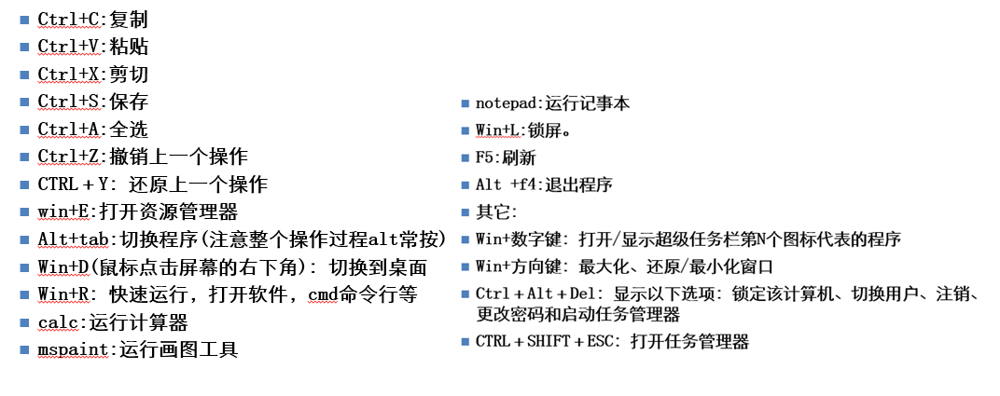
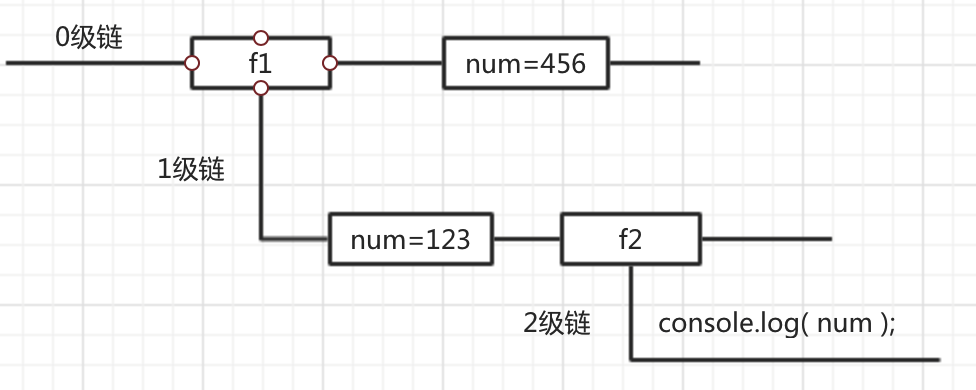

# JavaScript基础

**变量的声明及使用**
**数据类型**
**类型转换**
**运算符**

windows中的常用快捷键


## 浏览器说明
浏览器是指可以显示网页服务器或者文件系统的HTML文件内容，并让用户与这些文件交互的一种软件。
通俗的讲：可以显示页面的一个软件。

国内网民计算机上常见的网页浏览器有，QQ浏览器、Internet Explorer、Firefox、Safari，Opera、Google Chrome、百度浏览器、搜狗浏览器、猎豹浏览器、360浏览器、UC浏览器、傲游浏览器、世界之窗浏览器等，浏览器是最经常使用到的客户端程序。

常用的五大浏览器：chrome，firefox，Safari，ie，opera。


## 网页、网站和应用程序

网页：单独的一个页面。

网站：一些列相关的页面组成到一起。

应用程序：可以和用户产生交互，并实现某种功能。


## JavaScript介绍

### JavaScript是什么

JavaScript 编程语言  流程控制

Netscape在最初将其脚本语言命名为LiveScript，后来Netscape在与Sun合作之后将其改名为JavaScript。JavaScript最初受Java启发而开始设计的，目的之一就是“看上去像Java”，因此语法上有类似之处，一些名称和命名规范也借自Java。JavaScript与Java名称上的近似，是当时Netscape为了营销考虑与Sun微系统达成协议的结果。Java和JavaScript的关系就像张雨和张雨生的关系，只是名字很像。

Java  服务器端的编程语言

JavaScript  运行在客户端(浏览器)的编程语言

> JavaScript是一种运行在***客户端*** 的***脚本语言*** 
> JavaScript的解释器被称为JavaScript引擎，为浏览器的一部分，广泛用于客户端的脚本语言，最早是在HTML（标准通用标记语言下的一个应用）网页上使用，用来给HTML网页增加动态功能。


### JavaScript最初的目的

最初的目的是为了处理表单的验证操作。

### JavaScript现在的意义(应用场景)

JavaScript 发展到现在几乎无所不能。

1. 网页特效
2. 服务端开发(Node.js)
3. 命令行工具(Node.js)
4. 桌面程序(Electron)
5. App(Cordova)
6. 控制硬件-物联网(Ruff)
7. 游戏开发(cocos2d-js)

### JavaScript和HTML、CSS的区别

1. HTML:  提供网页的结构，提供网页中的内容
2. CSS:  用来美化网页
3. JavaScript:  可以用来控制网页内容，给网页增加动态的效果

## JavaScript的组成


### ECMAScript - JavaScript的核心 

ECMA 欧洲计算机制造联合会，定义了JavaScript的语法规范  

网景：JavaScript

微软：JScript

JavaScript的核心，描述了语言的基本语法和数据类型，ECMAScript是一套标准，定义了一种语言的标准，与具体实现无关。

### BOM - 浏览器对象模型

一套操作浏览器功能的API

通过BOM可以操作浏览器窗口，比如：弹出框、控制浏览器跳转、获取分辨率等

### DOM - 文档对象模型

一套操作页面元素的API

DOM可以把HTML看做是文档树，通过DOM提供的API可以对树上的节点进行操作


## JavaScript的书写位置 

### 写在行内 ###

```html
<input type="button" value="按钮" onclick="alert('Hello World')" />
```

### 写在script标签中 ###

```html
<head>
  <script>
    alert('Hello World!');
  </script>
</head>
```

### 外部js文件 ###

写在外部js文件中，在页面引入

```html
<script src="main.js"></script>
```

- 注意

  引用外部 js 文件的 script 标签中不可以写 JavaScript 代码。


## 计算机组成

### 软件

- 应用软件：浏览器(Chrome/IE/Firefox)、Sublime
- 系统软件：Windows、Linux、mac OSX

### 硬件

- 三大件：CPU、内存、硬盘    -- 主板
- 输入设备：鼠标、键盘、手写板、摄像头等
- 输出设备：显示器、打印机、投影仪等


## 变量

### 什么是变量

- 变量

  变量是计算机内存中存储数据的标识符，根据变量名称可以获取到内存中存储的数据

- 为什么要使用变量

  使用变量可以方便的获取或者修改内存中的数据

### 如何使用变量

#### var声明变量 ####

```javascript
var age;
```

#### 变量初始化(赋值) ####

```javascript
var age;
age = 17;
```

####  同时声明多个变量 ####

多个变量之间以英文逗号分隔，仅在最后一个变量后面使用英文分号。

```javascript
var age, name, sex;
age = 17;
name = 'miaosong';
```

#### 同时声明多个变量并赋值 ####


```javascript
var age = 17, name = 'miaosong';
```

### 变量在内存中的存储

变量存储在栈中。

```javascript
var age = 18;
```


### 变量的命名规则和规范

- 规则 - 必须遵守的，不遵守会报错

  - 由字母、数字、下划线、$符号组成，不能以数字开头

  - 不能是关键字和保留字，例如：for、while。

  - 区分大小写

- 规范 - 建议遵守的，不遵守不会报错

  - 变量名必须有意义
  - 遵守驼峰命名法。首字母小写，后面单词的首字母需要大写。例如：userName、userPassword

- 下面哪些变量名不合法

  ```
  a	    
  1
  age18
  18age
  name
  $name
  _sex
  &sex
  theworld  
  theWorld
  ```

### 测试

1. 交换两个变量的值
2. 不使用临时变量，交换两个数值变量的值


## 数据类型

### 简单数据类型

简单数据类型包括：Number、String、Boolean、Undefined、Null

#### Number类型

`javascript`是一种弱类型语言，只有一个单一的数字类型。
它在内部被表示为64位浮点数

- 数值字面量：数值的固定值的表示法

  110 1024  60.5

- 进制

  十进制
  ​	进行算数计算时，八进制和十六进制表示的数值最终都将被转换成十进制数值。
  十六进制
  ​	var num = 0xA;
  ​	数字序列范围：0~9 以及 A~F
  八进制
  ​    数字序列范围：0~7
  ​    如果字面值中的数值超出了范围，那么前导零将被忽略，后面的数值将被当作十进制数值解析

  ```
   var num1 = 07;   // 对应十进制的7
   var num2 = 019;  // 对应十进制的19
   var num3 = 08;   // 对应十进制的8
  ```

- 浮点数

  - 浮点数的精度

    浮点数值的最高精度是 17 位小数，但在进行算术计算时其精确度远远不如整数

    在JavaScript中，不要判断两个浮点数是否相等，也不要用浮点数进行数学计算，在开发中，尤其涉及到金融方面的一定不要进行浮点数运算

```
// 浮点数
var n = 5e-324;   // 科学计数法  5乘以10的-324次方  

// 浮点数值的最高精度是 17 位小数，但在进行算术计算时其精确度远远不如整数
 var result = 0.1 + 0.2;    // 结果不是 0.3，而是：0.30000000000000004
 
```

- 数值范围

  最小值：Number.MIN_VALUE，这个值为： 5e-324
  最大值：Number.MAX_VALUE，这个值为： 1.7976931348623157e+308
  无穷大：Infinity
  无穷小：-Infinity

`isFinite()` 函数： 确定一个数值是不是有穷的

```javascript
// 将ECMAscript的最大数值与最小数值相加如下
var result = Number.MAX_VALUE + Number.MIN_VALUE;
console.log(isFinite(result)); //true
```

- `NaN`

表示一个本来要返回数值的操作数未返回值的情况，这样就不会抛出错误了。

- `NaN`：not a number

- `NaN` 与任何值都不相等，包括 `NaN` 本身

- `typeof NaN` 返回 number

- `undefined` 和任何数值计算的结果都是 `NaN`

- `isNaN()` 函数:  

  接收一个参数，会尝试将参数转换为数值

  作用：判断这个参数是否 不是数值，是就返回 true，否则返回 false

#### String类型

`javascript`在被创建的时候，Unicode是一个16位的字符集，所以`javascript`中所有的字符都是16位的

- 字符串字面量

  '程序猿'，'程序媛', "abc12"

- 转义符

  

- 字符串长度

  length 属性用来获取字符串的长度

  ```javascript
  var str = 'Hello World';
  console.log(str.length);
  ```

- 字符串拼接

  字符串拼接使用 + 连接

  ```javascript
  console.log(11 + 11);
  console.log('hello' + ' world');
  console.log('100' + '100');
  console.log('11' + 11);
  console.log('male:' + true);
  ```

  1. 两边只要有一个是字符串，那么 + 就是字符串拼接功能
  2. 两边如果都是数字，那么就是算术功能。

- 字符串是不可变的，一旦被创建，就永远无法改变它，但能通过 + 操作符去连接其他
  的字符从而得到一个新的字符串

  ```javascript
  "miao" + "song" === "miaosong";  // true
  ```

#### Boolean类型

- Boolean字面量：  true和false，区分大小写
- 计算机内部存储：true为1，false为0

#### Undefined

使用`var`声明变量，却没有初始化时，变量的值就是 undefined。

```
var  message;
console.log(message == undefined); // true
```

#### Null

null 表示一个空对象指针。

变量的值如果想为 null，必须手动设置

```javascript
var a = null;
```

#### Object类型 ####

`javascript`中的对象是可变的键控集合。

- 创建 Object 实例的方式有2种
  1、使用 new 操作符后跟 Object构造函数

  ```
  var person = new Object();
  person.name = 'miaosong';
  person.age = 17;
  ```

  2、使用对象字面表示法

  ```
  var person = {
  	name : "miaosong", // 使用逗号分隔不同的属性
  	age : 17  // 在最后一个属性值后不添加添加逗号，可以类比数组
  };
  ```

- 字面量是向函数传递大量!可选!参数的首选方式
   最好的做法是，对那些必须值使用命名参数，而使用对象字面量来封装多个可选参数。
- 访问对象中的属性
     1、点访问法
    ​     person.name
    ​    2、方括号语法
    ​     person["name"]，属性要以字符串方式放在括号中

```
var obj = {
    mame: 'miaosong',
    age: 17
}
// 访问对象中的属性
var name = obj["name"];
var age = obj.age;
```

- 对象中的值可以通过赋值语句来更新，如果属性名已经存在于对象中，那么这个属性的值就被替换。

### 获取变量的数据类型

### typeof ###

`typeof`：检测一个操作数的数据类型

通过`typeof`操作符可以区分函数和其他对象
`typeof`是检测`string、boolean、number、undefined、function`的最佳工具。
`typeof`无法区分object 和 null，它检测 null 和 对象时，都会返回 object，因为从逻辑上讲，null是一个空对象指针。

返回值： 返回数据类型的字符串，如检测一个变量是Number数据类型的，就返回 ”number“。

```javascript
// typeof检测数据类型
console.log(typeof 17);     // number
console.log(typeof "12ab"); // string
console.log(typeof true);   // boolean
console.log(typeof false);  // boolean
console.log(typeof undefined); // undefined
console.log(typeof null);              // object
console.log(typeof {name: "miaosong"}); // object

// 使用typeof检测是否是函数
function foo() {
  // 函数体  
}
console.log(typeof foo); // function
```

### instanceof ###

`instanceof`：检测是什么类型的对象，只针对于对象的检测。
语法：`result = variable instanceof constructor`
用`instanceof` 方法检测基本数据类型始终返回 false，因为基本类型不是对象

```
var person = new Object();
console.log(person instancof Object);  // true
```

### 字面量

在源代码中一个固定值的表示法。

数值字面量：8, 9, 10

字符串字面量：'程序员', "大前端"

布尔字面量：true，false

## 注释

### 单行注释

用来描述下面一个或多行代码的作用

```javascript
// 这是一个变量
var name = 'hm';
```

### 多行注释

用来注释多条代码

```javascript
/*
var age = 18;
var name = 'zs';
console.log(name, age);
*/
```

## 数据类型转换

字符串的颜色是黑色的，数值类型是蓝色的，布尔类型也是蓝色的，undefined和null是灰色的

### 转String类型

转换字符串，通常用 `toString()`方法，只有null 和 undefined没有该方法。
参数，可以传递一个基数，以改变输出的进制，默认为十进制。
在不知道需要做转换的值是 null 还是 undefined 时，还可以使用 `String()` 转型函数。

- `toString()` 

  返回值：返回一个表示该对象的字符串

  参数：可以传递一个基数，作为转换时的进制，默认为十进制

  **注意** :  在 `ECMAScript 5`中，null 、undefined 没有`toString()`方法。从 JavaScript1.8.5开始`toString()`调用 [`null`](https://developer.mozilla.org/zh-CN/docs/Web/JavaScript/Reference/Global_Objects/null)返回`[object Null]`，[`undefined`](https://developer.mozilla.org/zh-CN/docs/Web/JavaScript/Reference/Global_Objects/undefined) 返回`[object Undefined]`

  ```
  var num = 5;
  console.log(num.toString());
  ```

  **tips** : 可以利用 `toString()` 方法检测一个对象的类型，当然还需要借助于 call 或者 apply 方法将 this 指向当前需要检测的对象，如下

  ```
  var arr = [1, 2, 3, 4, 5];
  Object.prototype.toString.call(arr) // "[object Array]"
  ```

- `String()`

  ```
  String()函数存在的意义：有些值没有toString()，这个时候可以使用String()。比如：undefined和null
  ```

- 其他方法转换为字符串类型

  `num  +  ''`，当 + 两边，有一个是字符串类型，一个是其它类型的时候，会先把其它类型转换成字符串再进行字符串拼接，返回拼接后的字符串。一句话总结就是： 只要 + 两侧有一个是字符串类型，就进行字符串拼接

  因此，可以用 + 和 ' ' 将一个数据转换为字符串

  ```
  var num = 123;
  var str = num + ''
  console.log(str); // 123
  console.log(typeof str); // string
  ```

### 转Number类型

- **Number()**

  作用：Number( ) 可以把任意值转换成数值，一元操作符 + 有相同作用

  返回值：尽可能返回一个数字，但有2种情况如下

  ​    -1-  如果参数是 Date 对象，Number() 返回从 1970 年 1 月 1 日至今的毫秒数。

  ​    -2-  如果要转换的字符串中，存在不是数值的字符，返回 `NaN`。

  Number() 会忽略前导0， 例如 ‘020’ 就会忽略第一个0。

  主要分以下几种情况

  - **Boolean类型 转 Number**

    true 返回 1 

    false 返回 0

    注意： 不是字符串的形式 'true'，’false'

    ```
    var res = Number(true);
    console.log(res);  // 1
    
    var res2 = Number(false);
    console.log(res2); // 0
    ```

  - **null、undefined 转 Number**

  1. null，返回 0

     ```
     var res = Number(null);
     console.log(res)
     ```

  2. undefined，返回 `NaN`

     ```
     var res2 = Number(undefined);
     console.log(res2); // NaN
     ```

  - **String 转 Number**

  1. 纯数字的字符串，直接转换为数字

     ```
     var str = '123';
     var num = Number(str);
     console.log(num); // 123
     typeof num; // "number"
     ```

  2. 字符串中含有非数字，返回 `NaN`

     ```
     var str2 = '123a45bcd55';
     var num2 = Number(str2);
     console.log(num2); // NaN
     typeof num2; // "number"
     ```

  3. 空字符串，返回 0

     ```
     var str3 = '';
     var num3 = Number(str3);
     console.log(num3); // 0
     typeof num3; // "number"
     ```

     - +0，-0 ；+，- 运算

       -1-  对一个数字字符串进行 + 或 -  或 +0 操作，也可以将其转为Number类型

       -2-  对Boolean类型的数据进行 + 或者 - 操作，+0 或者 -0操作，也可以将其转为Number类型

     ```
     // 对纯数值字符串进行 + - 操作
     var str = '500';
     console.log(+str);		// 取正 500
     console.log(-str);		// 取负 -500
     
     // 对纯数值字符串进行 +0 和 -0 操作
     console.log(str - 0);   // 500
     console.log('500' + 0); // 5000 字符串拼接
     
     // 对Boolean进行 + - 操作
     var bl1 = true;
     var bl2 = false;
     console.log(+bl1);   // 1
     console.log(-bl1);   // -1
     console.log(+bl2);   // 0
     console.log(-bl2);   // -0
     
     // 对Boolean进行 +0 和 -0 操作
     console.log(bl1 + 0); // 1
     console.log(bl1 - 0); // 1
     console.log(bl2 + 0); // 0
     console.log(bl2 - 0); // 0
     ```

- **parseInt()**

  作用： 专门用于字符串，将字符串转换为**整数** 。

  参数： 

  -1-  参数1： 要转换的对象

  -2-  参数2：数值的进制，不传递则默认为十进制

  主要分以下几种情况

  -1-  如果第一个字符是数字 或者 第一个有意义的字符是数字(比如数字前面都是空格)，m./继续往后解析，直到遇到第一个非数字就结束。

  -2-  第一个字符不是数字，直接返回 `NaN`。

  -3-  空字符串返回 `NaN`，而Number()会将空字符串解析为 0

  -4- null 、undefined、布尔值， 返回 `NaN`

  ```javascript
  var num11jhv = parseInt("12.3abc");  // 12，第一个字符是数字，会解析至遇到非数字结束
  var num22 = parseInt("abc123");   // NaN，如果第一个字符不是数字或者符号，返回NaN
  
  // 更多例子细细体会
  var num1 = parseInt(''); // NaN，而Number()返回0
  var num2 = parseInt(undefined); // NaN
  var num3  = parseInt(null);  // NaN，而Number()是返回0
  var num4 = parseInt('blue'); // NaN
  var num5 = parseInt(22.58686); // 22，解析到.就不是有效的数字字符,就终止解析
  var num6 = parseInt('070'); // 70，因为没有传递第二个参数，所有不会按照8进制解析，默认十进制
  var num7 = parseInt('07',8); // 56，按照给出的第二个参数进行8进制解析
  var num8 = parseInt('0xA'); // 10，十六进制
  var num9 = parseInt('A',16); // 10，若给出参数16,0x可以忽略不写
  var num10 = parseInt('   46 kakd k565jii5566'); //46，当遇到非数字的字符时就停止继续解析了
  var num11 = parseInt(true); // NaN
  ```

- **parseFloat()**

  作用：只针对字符串，将字符串转为**浮点数**。

  参数： 

  -1-  参数1： 要转换的对象

  **tips** :

  1. 只解析十进制值

  2. 会忽略第二个小数点
  3. 始终忽略前导 0，因此十六进制会始终解析为 0(十六进制是以 ‘ox' 开头的)
  4. 如果字符串以解析为整数，就会返回整数，而不是返回 123.0 这样的数字

  主要分以下几种情况

  -1-  如果第一个字符是数字 或者 第一个有意义的字符是数字(比如数字前面都是空格)，继续往后解析，直到遇到第一个非数字就结束。

  -2-  第一个字符不是数字，直接返回 `NaN`。

  -3-  空字符串返回 `NaN`，而Number()会将空字符串解析为 0

  -4- null 、undefined、布尔值， 返回 `NaN`

  ```
  // 细细体会
  var num1 = parseFloat('12345blue'); // 12345，整数
  var num2 = parseFloat('0xA'); // 0，十六进制数始终返回0
  var num3 = parseFloat('22.5'); // 22.5
  var num4 = parseFloat('22.34.5'); // 22.34
  var num5 = parseFloat('0908.5'); // 908.5
  var num6 = parseFloat('3.125e7'); // 31250000
  var num7 = parseFloat('blue'); // NaN
  var num8 = parseFloat(undefined); // NaN
  var num9 = parseFloat(null); // NaN
  var num10 = parseFloat("");  // NaN
  var num11 = parseFloat(true); // NaN
  ```

  - 对非字符串使用 `parseInt()` 或 `parseFloat()`，会**先将其转换为 String** 然后再操作。

### 转Boolean类型

- Boolean()

0 、 " "(空字符串)、 null、 undefined、 NaN 会转换成false ，其它都会转换成true


## 运算符

###  运算符   ###

运算符也叫操作符operator。通过运算符可以对一个或多个值进行运算，并获取运算结果。

- 一元运算符：只有一个操作数的运算符，如 `typeof`、+ 、-、自增、自减、！(取反)

- 二元运算符 : 有两个操作数的运算符 ，如 5+ 6

- 三元运算符：三元运算符只有一个，即条件元素符 `？：`

  `variable = boolean_expression ? true_value : false_value;`

### 算术运算符

##### 加减乘除余

常见的： +  -  *  /  %  ( )

#####  自增 自减 #####

自增： 一个变量自增以后，变量的值会**立即**自增1。

自减： 一个变量自减以后，变量的值会**立即**自减1。

自增 和 自减**原理相通**。

- 前置++

  ```javascript
  var num1 = 5;
  ++ num1; 
  
  var num2 = 6;
  console.log(num1 + ++ num2);
  ```

- 后置++

  ```javascript
  var num1 = 5;
  num1 ++;    
  var num2 = 6 
  console.log(num1 + num2 ++);
  ```

- 前置++ 与 后置++ 的相同 和 不同

  相同：一个变量自增以后，变量的值会**立即**自增1。因此，无论是 `i++` 还是 `++i`，都会让变量`i`的值立即自增1。

  不同：`i++` 和 `++i`这两个表达式的值不同

  - `i++` 的值等于变量`i`自增前的值
  - `++i` 的值等于变量`i`自增后的新值

- 猜猜看

  ```javascript
  var a = 1; 
  var b = ++a + ++a; 
  console.log(b);   // 5
  
  var a = 1; 
  var b = a++ + ++a; 
  console.log(b);   // 4
  
  var a = 1; 
  var b = a++ + a++; 
  console.log(b);  // 3
  
  var a = 1; 
  var b = ++a + a++; 
  console.log(b);  // 4
  ```

### 逻辑运算符(布尔运算符)

#### && 与  ####
两个操作数同时为true，结果为true，否则都是false。

它是短路与，只要第一个操作数为false，则返回false，就不会看第二个的值。

#### || 或  ####
两个操作数有一个为true，结果为true，否则为false。

它是短路或，如果第一个操作数为true，返回true，就不会继续看第二个的值。

#### !  非  ####
取反操作

- **tips**： 

  对非布尔值进行逻辑运算，底层会先将其转换为Boolean类型的值，再做逻辑运算，然后将满足条件的值返回，返回值分以下几种情况

  - 非布尔值 && 运算

    如果第一个操作数转布尔值为 false，则返回第一个操作数的值。

    如果第一个操作数转布尔值为 true，则返回第二个操作数的值，无论第二个操作数是 false 还是 true。

    一句话总结： && 与运算就是找 false，遇到false就返回，没有false 就返回最后一个操作数的值。

  - 非布尔值 || 运算

    如果第一个操作数转布尔值为 false，则返回第二个操作数的值，无论第二个操作数是 false 还是 true。

    如果第一个操作数转布尔值为 true，则返回第一个操作数的值。

    一句话总结：|| 或运算就是找 true，遇到 true就返回，没有true 就返回最后一个操作数的值。

### 关系运算符(比较运算符)

**tips**：

字符串的比较，比较的是Unicode字符编码

任何值和`NaN`做比较，都是false

	<  >  >=  <= == != === !==
- **== 、!= 与 ===、 !== 的区别**：
    ==、!= 只进行值的比较，这两个操作符都会先转换操作数(称为强制转型)，再比较相等性

  ```
  NaN == NaN // false
  NaN != NaN  // true
  null == undefined // true
  undefined == 0 // false
  null == 0 // false
  var result = '55' == 55; // true
  ```

   === 类型和值同时相等，则相等

```javascript
var result = '55' === 55; 	// false 值相等，类型不相等
var result = 55 === 55; 	// true
```

### 赋值运算符

=   +=   -=   *=   /=   %=

```javascript
例如：
var num = 0;
num += 5;	//相当于  num = num + 5;
```


### 运算符的优先级
	优先级从高到底
		1. ( )       优先级最高
		2. 一元运算符  ++   --   !
		3. 算数运算符  先 * / % 后 +  -
		4. 关系运算符  >   >=   <   <=
		5. 相等运算符  ==  !=   ===   !==
		6. 逻辑运算符  先 && 后 ||
		7. 赋值运算符  a = 1

```	javascript
// 练习1：
4 >= 6 || '人' != '阿凡达' && !(12 * 2 == 144) && true； // true

// 练习2：
var num = 10;
5 == num / 2 && (2 + 2 * num).toString() === '22'; // true
```
## 表达式和语句 

### 表达式

>一个表达式可以产生一个值，有可能是运算、函数调用、有可能是字面量。表达式可以放在任何需要值的地方。

### 语句

>语句可以理解为一个行为，循环语句和判断语句就是典型的语句。一个程序有很多个语句组成，一般情况下，分割一个一个的语句
## 流程控制

>程序的三种基本结构

### 顺序结构

 从上到下执行的代码就是顺序结构

**程序默认就是由上到下顺序执行的**

### 分支结构	

根据不同的情况，执行对应代码

### 循环结构

循环结构：重复做一件事情


## 分支结构

### if 语句

语法结构

```javascript
if (/* 条件表达式 */) {
  // 执行语句
}

if (/* 条件表达式 */){
  // 成立执行语句
} else {
  // 否则执行语句
}

if (/* 条件1 */){
  // 成立执行语句
} else if (/* 条件2 */){
  // 成立执行语句
} else if (/* 条件3 */){
  // 成立执行语句
} else {
  // 最后默认执行语句
}
```
案例：
​    求两个数的最大数
​    判断一个数是偶数还是奇数
​    分数转换，把百分制转换成ABCDE   <60  E  60-70 D  70-80 C  80-90 B  90 - 100 A
作业：
​    判断一个年份是闰年还是平年
​      闰年：能被4整除，但不能被100整除的年份 或者 能被400整除的年份
​    判断一个人的年龄是否满18岁(是否成年)

### 三元运算符
	表达式1 ? 表达式2 : 表达式3
	是对if……else语句的一种简化写法

案例：
​	是否年满18岁
​	从两个数中找最大值

### switch语句

语法格式:
```javascript
switch (expression) {
  case 常量1:
    语句;
    break;
  case 常量2:
    语句;
    break;
  case 常量3:
    语句;
    break;
  …
  case 常量n:
    语句;
    break;
  default:
    语句;
    break;
}
```
- switch语句的执行流程

1. 先计算出expression的值，然后和case后的紧跟的值从上向下进行比对。
2. 如果匹配到相等的值，就会执行case后面的语句，执行完成后break跳出流程。

3. 没有匹配成功，就执行default后面的语句，然后退出流程。

	break可以省略，如果省略，代码会继续执行下一个case
	switch 语句在比较值时使用的是全等操作符, 因此不会发生类型转换（例如，字符串'10' 不等于数值 10）

案例：
​	显示星期几
​	素质教育（把分数变成ABCDE）千万不要写100个case哟

### 布尔类型的隐式转换

流程控制语句会把需要进行判断的值隐式转换成布尔类型

转换为 true 的情况：   非空字符串 、非0数字 、true、任何对象
转换成 false 的情况：  空字符串 、0 、false 、null 、undefined

```javascript
// 结果是什么？
var a = !!'123'; // true
```

### 案例

```javascript
var message;
// 会自动把message转换成false
if (message) {     
  // todo...
}
```


## 循环结构

> 在`javascript`中，循环语句有三种，while、do..while、for 循环。

### while语句

基本语法：

```javascript
// 当循环条件为true时，执行循环体，
// 当循环条件为false时，结束循环。
while (循环条件) {
  // 循环体
}
```

代码示例：

```javascript
// 计算1-100之间所有数的和
// 初始化变量
var i = 1;
var sum = 0;
// 判断条件
while (i <= 100) {
  // 循环体
  sum += i;
  // 自增
  i++;
}
console.log(sum);
```

案例：
​    打印100以内 7的倍数
​    打印100以内所有偶数
​    打印100以内所有偶数的和
作业：
​    打印100以内的奇数
​    打印100以内的奇数的和

### do...while语句

> do..while 循环和 while 循环非常像，二者经常可以相互替代，但是 do..while 的特点是不管条件成不成立，都会至少执行一次。

基础语法：

```javascript
do {
  // 循环体;
} while (循环条件);
```

代码示例：

```javascript
// 初始化变量
var i = 1;
var sum = 0;
do {
  sum += i;// 循环体
  i++;//自增
} while (i <= 100);// 循环条件
```

案例：

```
求100以内所有3的倍数的和
使用do-while循环：输出询问“我爱你，嫁给我吧？”，选择“你喜欢我吗？(y/n):"，如果输入为y则打印”我们形影不离“，若输入为n,则继续询问 
```

### for 语句

>  while 和 do...while 一般用来解决无法确认次数的循环。for 循环一般在循环次数确定的时候比较方便

for循环语法：

```javascript
// for循环的表达式之间用的是;号分隔的，千万不要写成,
for (初始化表达式1; 判断表达式2; 更新表达式3) {
  // 循环体4
}
```

执行顺序：1243  ---->  243   ----> 243 ( 直到循环条件变成 false )

1. 初始化表达式，只会执行一次
2. 判断表达式
3. 更新表达式
4. 循环体

案例：

```javascript
// 打印正方形 外层循环控制高 内层循环控制宽
var start = '';
for (var i = 0; i < 10; i++) {
  for (var j = 0; j < 10; j++) {
    start += '* ';
  }
  start += '\n';
}
console.log(start);

// 打印直角三角形
var start = '';
for (var i = 0; i < 10; i++) {
  for (var j = i; j < 10; j++) {
    start += '* ';
  }
  start += '\n';
}
console.log(start);

// 打印9*9乘法表
var str = '';
for (var i = 1; i <= 9; i++) {
  for (var j = i; j <=9; j++) {
    str += i + ' * ' + j + ' = ' + i * j + '\t';
  }
  str += '\n';
}
console.log(str);
```


```
求1-100之间所有数的乘积
求1-100之间所有奇数的和
计算1-100之间能3整除的数的和
计算1-100之间不能被7整除的数的和
本金10000元存入银行，年利率是千分之三，每过1年，将本金和利息相加作为新的本金。计算5年后，获得的本金是多少？
有个人想知道，一年之内一对兔子能繁殖多少对？于是就筑了一道围墙把一对兔子关在里面。已知一对兔子每个月可以生一对小兔子，而一对兔子从出生后第3个月起每月生一对小兔子。假如一年内没有发生死亡现象，那么，一对兔子一年内（12个月）能繁殖成多少对？（兔子的规律为数列，1，1，2，3，5，8，13，21）
```


### continue和break

> break:  立即跳出整个循环，即循环结束，开始执行循环后面的内容（直接跳到大括号）
>
> continue:  立即跳出当前循环，继续下一次循环（跳到 i++ 的地方）
>
> if 语句中不能使用 break 和 continue

案例：

```javascript
求整数1～100的累加值，但要求碰到个位为3的数则停止累加
求整数1～100的累加值，但要求跳过所有个位为3的数
```

作业：

求1-100之间不能被7整除的整数的和（用continue）
求200-300之间所有的奇数的和（用continue）
求200-300之间第一个能被7整数的数（break）


### 调试

- 过去调试JavaScript的方式
  - alert()
  - console.log()
- 断点调试

>断点调试是指自己在程序的某一行设置一个断点，调试时，程序运行到这一行就会停住，然后你可以一步一步往下调试，调试过程中可以看各个变量当前的值，出错的话，调试到出错的代码行即显示错误，停下。

- 调试步骤

```javascript
浏览器中按F12-->sources-->找到需要调试的文件-->在程序的某一行设置断点
```

- 调试中的相关操作

```javascript
Watch: 监视，通过watch可以监视变量的值的变化，非常的常用。
F10: 程序单步执行，让程序一行一行的执行，这个时候，观察watch中变量的值的变化。
F8：跳到下一个断点处，如果后面没有断点了，则程序执行结束。
```

tips: ***监视变量，不要监视表达式，因为监视了表达式，那么这个表达式也会执行。***

代码调试的能力非常重要，只有学会了代码调试，才能学会自己解决bug的能力。初学者不要觉得调试代码麻烦就不去调试，知识点花功夫肯定学的会，但是代码调试这个东西，自己不去练，永远都学不会。


## 数组

### 为什么要学习数组

> 普通的数据类型，只能存储一个值(比如：Number、String，如果想同时存储多个值，此时就需要用到数组的概念。

###  数组的概念

> 所谓数组，就是将多个元素（通常是同一类型）按一定顺序排列放到一个集合中，这个集合就称之为数组。
### 数组的定义
> 数组是一个有序的列表，可以在数组中存放任意的数据，并且数组的长度可以动态的调整。


### 创建方式

#### 数组字面量

语法：将需要存储的数据以 ` ,` 分隔的方式放入`[ ]`中，最后一个数据不需要 `,`

​           数组中可以存贮任意的数据类型，即使是对象，函数，都可以。

```javascript
// 创建一个空数组
var arr1 = []; 

// 创建一个包含3个数值的数组，多个数组项以逗号隔开
var arr2 = [1, 3, 4]; 

// 创建一个包含2个字符串的数组
var arr3 = ['a', 'c']; 

// 可以通过数组的length属性获取数组的长度
console.log(arr3.length);

// 可以设置length属性改变数组中元素的个数
// 设置 length = 0；也可以用于清空数组
arr3.length = 0;
```

#### new Array()构造函数

```javascript
// 创建一个空数组
var arr1 = new Array();

// 创建一个长度为3的数组
var arr2 = new Array(3);

// 创建了一个包含三个字符串的数组
var arr3 = new Array("red","blue","green"); 
```

- 一般我们会使用字面量的方式创建数组，更加简洁和方便。

### 访问数组元素

数组默认会有一个索引index，也称为数组下标，它对应每个数组项的位置，索引从 0 开始，最后一个数组项的索引为 length -1。

通过索引访问数组项，语法： `数组名[index]`

注： 当访问的数组的索引或下标大于最大的索引时，返回undefined。

```javascript
// 格式：数组名[下标]	下标又称索引
// 功能：获取数组对应下标的那个值，如果下标不存在，则返回undefined。
var arr = ['red',, 'green', 'blue'];
arr[0];	// red
arr[2]; // blue
arr[3]; // 这个数组的最大下标为2，因此返回undefined
```

### length

**数组的 length属性**：表示数组的长度，即数组项的个数。

**用法**：利用数组的length属性，我们可以访问数组项，添加数组项，修改数组项，清空数组 等很多操作。

```javascript
var arr = ["red","blue","green"];

// 获取数组的长度
console.log(arr.length);

// 访问数组元素
console.log(arr[1]); // 访问数组第二项

// 项数组末尾添加数组项
arr[arr.length] = 'yellow';

// 清空数组
arr.length = 0;
```


### 遍历数组
> 遍历：对数组的每一个元素都访问一次就叫遍历。

数组遍历的基本语法：

```javascript
for(var i = 0; i < arr.length; i++) {
	// 数组遍历的固定结构
}
```
### 数组中新增元素
数组的赋值

```javascript
// 格式：数组名[下标/索引] = 值;
// 如果下标有对应的值，会把原来的值覆盖，如果下标不存在，会给数组新增一个元素。
var arr = ["red", "green", "blue"];
// 把red替换成了yellow
arr[0] = "yellow";
// 给数组新增加了一个pink的值
arr[3] = "pink";
```
### 检测数组

检测一个对象是否是一个数组，可以使用以下三种方式

1.  `isArray()` 函数

​        语法： `Array.isArray(检测对象)`

​        返回值： 布尔值，如果检测的对象是数组就返回 true，否则false

2. 使用`instanceof`操作符

    语法： `检测对象 instanceof Array`

    返回值： 布尔值，如果检测的对象是数组就返回 true，否则false

3. 利用Object原型的`toString()`方法 和 改变this指向

   语法：`Object.prototype.toString.call(检测对象)`

   返回值： 字符串 ，返回该对象实际数据类的字符串，如果是数组，返回值形如 `[object Array]`

```javascript
var arr = ["red", "green", "blue"];
console.log(Array.isArray(arr));   // true
console.log(arr instanceof Array); // true
console.log(Object.prototype.toString.call(arr)); // [object Array]
```

### 其他

- 数组调用`toString()` 返回以逗号分隔数组项的字符串

- `toLocaleString()`方法返回的也是一个数组值以逗号分隔的字符串

- 数组调用`valueOf()` 返回的还是数组

  ```javascript
  var arr = ["red", "green", "blue"];
  var res1 = arr.toString();
  var res2 = arr.valueOf();
  
  console.log(res1); // red,green,blue
  console.log(res2); //  ["red", "green", "blue"]
  ```

### 案例

```
求一组数中的所有数的和和平均值
求一组数中的最大值和最小值，以及所在位置
将字符串数组用|或其他符号分割
要求将数组中的0项去掉，将不为0的值存入一个新的数组，生成新的数组
翻转数组
冒泡排序，从小到大
```

## 函数
### 什么是函数

>把一段相对独立的具有特定功能的代码块封装起来，形成一个独立实体，就是函数，起个名字（函数名），在后续开发中可以反复调用。
>
>函数的作用就是封装一段代码，将来可以重复使用。
>
>函数实际上是对象，因此函数名实际上是一个指向函数对象的指针，不会与某个函数绑定

#### 特点

函数声明的时候，函数体并不会执行，只有当函数被调用的时候才会执行。

使用 `typeof`操作符可以确定一个对象是否是函数，是函数就会返回 function字符串。

由于函数名仅仅是指向函数的指针，因此一个函数可以有多个名字。

### 函数的定义

#### 函数声明 ####

```javascript
function 函数名(){
  // 函数体
}
```

#### 函数表达式 ####

```javascript
var fn = function() {
  // 函数体
}; // 注意末尾有一个分号，就像声明变量一样
```

#### 函数声明与函数表达式的区别 ####
- 区别：

  解析器会率先读取函数声明，并使其在执行任何代码之前可以访问。
  而函数表达式则必须等到解析器执行到它所在的代码行，才会真正被解释执行。

  ```javascript
  // 使用函数声明的方式定义函数
  console.log(sum(10,10));  // 20
  function sum(num1,num2) {
  	return num1 + num2;
  }
  // 以上代码完全可以正常执行，因为在代码开始之前，解析器就已经通过一个名为函数声明提升的过程，读取并将函数声明添加到执行环境中。
  
  // 使用函数表达式的方式定义函数
  console.log(sum(10,10));        // 报错：sum is not a function
  var sum = function(num1,num2) { // 函数表达式
  	return num1 + num2;
  };
  ```

### 函数的调用

- 调用函数的语法：

```javascript
函数名();
```

- 特点：

  1. 函数体只有在调用的时候才会执行，调用需要 ( ) 进行调用。
  2. 可以调用多次(重复使用)。

  3. 函数没有重载。

-  注意

  使用不带圆括号的函数名是访问函数指针，而非调用函数。

代码示例：

```javascript
// 声明函数
function sayHi() {
  console.log("hello~~~");
}
// 调用函数
sayHi();

// 求1-100之间所有数的和
function getSum() {
  var sum = 0;
  for (var  i = 0; i < 100; i++) {
    sum += i;
  }
  console.log(sum);
}
// 调用
getSum();
```
### 函数的参数

#### 作用

函数内部是一个封闭的环境，可以通过参数的方式，把外部的值传递给函数内部。

```javascript
function getSum() {
  var sum = 0;
  for (var i = 1; i <= 100; i++) {
    sum += i;
  }
  console.log();
}
// 虽然上面代码可以重复调用，但是只能计算1-100之间的值
// 如果想要计算n-m之间所有数的和，应该怎么办呢？
```

#### 语法

```javascript
// 函数内部是一个封闭的环境，可以通过参数的方式，把外部的值传递给函数内部
// 带参数的函数声明
function 函数名(形参1, 形参2, 形参...){
  // 函数体
}

// 带参数的函数调用
函数名(实参1, 实参2, 实参3);
```

#### 形参和实参

> 1. 形式参数：在声明一个函数的时候，为了函数的功能更加灵活，有些值是固定不了的，对于这些固定不了的值。我们可以给函数设置参数。这个参数没有具体的值，仅仅起到一个占位置的作用，我们通常称之为形式参数，也叫形参。
> 2. 实际参数：如果函数在声明时，设置了形参，那么在函数调用的时候就需要传入对应的参数，我们把传入的参数叫做实际参数，也叫实参。实参可以是任意数据类型。
> 3. `ECMAscript`函数没有重载
>    通过检查传入函数中的参数的类型和数量，并作出不同的反应，可以模仿方法的重载。
> 4. 如果为函数定义了多个形参，而实际传递时，实参的个数小于形参，此时没有传递对应实参的形参的值是 undefined。

```javascript
var x = 5, y = 6;
fn(x,y); 
function fn(a, b) {
  console.log(a + b);
}
// x,y实参，有具体的值。函数执行的时候会把x,y复制一份给函数内部的a和b，也就是值传递，函数内部的值是复制的新值，无法修改外部的x,y
```

### 案例

- 求1-n之间所有数的和
- 求n-m之间所有数额和
- 圆的面积
- 求2个数中的最大值
- 求3个数中的最大值
- 判断一个数是否是素数

### 函数的返回值

>当函数执行完的时候，并不是所有时候都要把结果打印。我们期望函数给我一些反馈（比如计算的结果返回进行后续的运算），这个时候可以让函数返回一些东西。也就是返回值。函数通过return返回一个返回值

#### 返回值语法

```javascript
//声明一个带返回值的函数
function 函数名(形参1, 形参2, 形参...){
  //函数体
  return 返回值;
}

//可以通过变量来接收这个返回值
var 变量 = 函数名(实参1, 实参2, 实参3);
```

函数的调用结果就是返回值，因此我们可以直接对函数调用结果进行操作。

#### 返回值详解

1. 如果函数没有显示的使用 return语句 ，那么函数有默认的返回值：undefined。

        2. 如果函数使用 return语句，那么跟再return后面的值，就成了函数的返回值。
        3. 如果函数使用 return语句，但是return后面没有任何值，那么函数的返回值也是：undefined。
        4. 函数使用return语句后，这个函数会在执行完 return 语句之后停止并立即退出，也就是说return后面的所有其他代码都不会再执行。

    推荐的做法是要么让函数始终都返回一个值，要么永远都不要返回值。

### 函数案例

- 求阶乘
- 求1!+2!+3!+....+n!
- 求一组数中的最大值
- 求一组数中的最小值


### 函数内部属性 ###

在函数内部，有两个特殊的对象：arguments 和 this。

#### arguments ####

参数列表： JavaScript中，arguments对象是比较特别的一个对象是当前函数的一个内置属性。也就是说所有函数都内置了一个arguments对象，arguments对象中存储了传递的所有的实参。arguments是一个伪数组，因此可以进行遍历

一句话总结：arguments是一个类数组对象，包含着传入函数的所有实参。

使用 arguments.length 可以获取实参的个数

使用 arguments[index] 可以将函数的第 index 个参数的值绑定，当传递这个参数时，会被重写，**但如果不传递这个参数，该位置的值是undefined。**但在严格模式下，这种绑定会失效，依然依赖于实参的传递值。

```javascript
function fun(arg1, arg2, arg3) {
    arguments[1] = 2;  // 函数第二个参数固定为2
    return arg1 + arg2 + arg3;
}

var res = fun(10, 20, 30);
console.log(res); // 42, 函数的第二个参数固定为2，因此计算式子为10+2+30  

// 不传递绑定位置的参数
(function(a) {
    arguments[0]=100; 
    console.log(a);  // undefined
})();
```

##### argumnets.length

表示函数调用时传递的**实参**的个数。

**注**： 函数名.length 可以获取**形参**的个数。

```javascript
function fun(arg1, arg2, arg3) {
    arguments[1] = 2;  // 函数第二个参数固定为 2
    console.log(arguments.length); // 2 传递了两个实参
    return arg1 + arg2 + arg3;
}

var res = fun(10, 20);
console.log(fun.length); // 3 形参个数

```

##### arguments.callee

arguments对象还有一个属性：`callee`，该属性是一个指针，指向拥有这个arguments对象的函数。

**tips**

在使用递归时，一般建议使用 `arguments.callee` 代表函数本身，以实现解耦。因为，如果直接使用函数名，函数的执行与函数名紧紧耦合，当函数名发生变化时，函数不一定能够正常执行。而  `arguments.callee` 代表函数本身，无论函数名是否发生变化，都能正常执行函数。

严格模式下，`arguments.callee`和`arguments.caller`都是被禁用的。

```javascript
// 定义一个阶乘函数
function factorial(num) {
	if (num <=1 ) {
		return 1;
	} else {
		return num * factorial(num-1);// 这样写，函数的执行与函数名factorial紧紧耦合，当函数名发生变化时，factorial不一定能够正常执行
	}
}

// 用 arguments.callee 方法重写
function factorial(num) {
	if (num<=1) {
		return 1;
	} else {
		return num * arguments.callee(num-1);  // 这样无论引用函数使用的是什么名字，都可以保证正常完成调用
	}
}

// 改变函数名
var trueFactorial = factorial;
factorial = function() {
	return 0;
}

console.log(trueFactorial(5)); // 120
console.log(factorial(5));    // 0
```

####  this ####
this 引用的是函数据以执行的环境对象，或者也可以说是this值。当在网页的全局作用域中调用函数时，this引用的就是window。

**this的特点**

函数内部的this有以下几个特点

 	1. 函数在定义的时候this是不确定的，只有在调用的时候才可以确定
 	2. 普通函数直接执行，内部this指向全局window
 	3. 定时器内部的 this 默认指向window
	4. 函数作为一个对象的方法，被该对象所调用，那么this指向的是该对象
	5. 构造函数中的this是一个隐式对象，类似一个初始化的模型，所有方法和属性都挂载到了这个隐式对象身上，后续通过new关键字来调用，从而实现实例化。构造函数中的this指向创建的实例对象。
	6. this的指向是可以手动改变的，可以通过 call、apply、bind方法改变

#### caller属性 ####
该属性保存着调用当前函数的函数的引用，如果在全局作用域中调用当前函数，它的值是null。

```javascript
function outer(){
	inner();
}

function inner() {
	console.log(arguments.callee.caller);
}

outer();  // 返回outer()的源代码：function outer() {inner();}，因为outer调用了inner
```


- 案例
```javascript
求任意个数的最大值
求任意个数的和
```

### 案例

求斐波那契数列Fibonacci中的第n个数是多少？      1 1 2 3 5 8 13 21...
翻转数组，返回一个新数组
对数组排序，从小到大
输入一个年份，判断是否是闰年[闰年：能被4整数并且不能被100整数，或者能被400整数]
输入某年某月某日，判断这一天是这一年的第几天？


### 函数的属性和方法 ###

### 属性 ###

每个函数都包含两个属性：`length` 和 `prtotype`

#### length ####
length属性表示函数希望接收的命名参数的个数，即形参的个数

```javascript
// 例子
function sum(num1,num2) {
	return num1+num2;
}

console.log(sum.length)  // 2，如果没有参数就返回0
```

**tips**

1. `函数名.length` 表示函数的形参个数
2. `arguments.length` 表示向函数传递的实参个数

#### prototype ####

每个函数被创建时，其内部都有一个prototype原型属性，该属性指向函数的原型对象。

prototype原型属性是一个指针，指向一个对象，这个对象的用途：包含可以有特定类型的所有实例共享的属性和方法。

### 方法

每个函数都包含两个非继承而来的方法： apply()、call()
这两个方法的用途都是在特定的作用域中调用函数，实际上等于设置函数体内this对象的值。

#### apply()方法
接收2个参数：

参数1 ：运行函数的作用域

参数2 ： 参数数组( 可以是Array实例，也可以是arguments对象 )

```
function sum(num1, num2) {
	return num1 + num2;
}

function callSum1(num1, num2) {
	return sum.apply(this, arguments);  // 传入arguments对象
}

function callSum2(num1, num2) {
	return sum.apply(this, [num1,num2]); // 传入数组
}

console.log(callSum1(10, 10));  // 20
console.log(callSum2(10, 10));  // 20
```

#### call()方法

和apply()方法作用相同，区别是参数的接收方式不同。
call()方法：第一个参数是this
区别在于第二个参数，call方法传递给函数的参数必须一一列举

```
function sum(num1, num2) {
	return num1 + num2;
}

function callSum(num1, num2) {
	return sum.call(this, num1, num2);
}
console.log(callSum(10,10));  // 20
```

apply()和call()方法最强大的地方在于：能够扩充函数赖以运行的作用域

```
例子：
window.color = "red";
var o = {color:"blue"};
function sayColor() {
	console.log(this.color);
}
sayColor();            //red
sayColor.call(this);   //red
sayColor.call(window); //red
sayColor.call(o);      //blue
```

#### bind() 
这个方法会创建一个函数的实例，实例的this值会被绑定到传给bind()函数的值

```
例子：
window.color = "red";
var o = {color:"blue"};
function sayColor() {
	console.log(this.color);
}

// sayColor()调用bind()并传入对象o,创建了objectSayColor()函数
// objectSayColor()函数的this值等于o
var objectSayColor = sayColor.bind(o);
objectSayColor();  // blue
```


## 函数其它

### 匿名函数

> 匿名函数：没有名字的函数

匿名函数如何使用：

	将匿名函数赋值给一个变量，这样就可以通过变量进行调用，比如函数表达式
	匿名函数自调用

关于自执行函数 IIFE（匿名函数自调用）的作用：防止全局变量污染。
### 自调用函数IIFE
>匿名函数不能通过直接调用来执行，因此可以通过匿名函数的自调用的方式来执行。
>
>自调用函数也叫立即执行函数表达式IIFE（Immediately-invoked function expression）。
```javascript
(function () {
  alert(123);
})();
```
#### IIFE的优点

1. 避免命名冲突

   创建块级（私有）作用域，避免了向全局作用域中添加变量和函数，因此也避免了多人协作开发时，全局变量和函数的命名冲突。

2. IIFE中定义的任何变量和函数，都会在执行结束后立即被销毁。这种做法可以减少内存占用的问题，因为没有指向匿名函数的引用，只要函数执行完毕，就可以立即销毁其作用域链了


### 函数是一种数据类型

```javascript
function fn() {}
console.log(typeof fn);
```

- 函数作为参数

​       函数也是一种类型，可以把函数作为另一个函数的参数，在另一个函数中调用，比如回调函数。

- 函数做为返回值

​       函数是一种类型，可以把函数可以作为返回值从函数内部返回，比如闭包。

```javascript
function fn(b) {
  var a = 10;
  return function () {
    alert(a+b);
  }
}
fn(15)();
```

### 代码规范
```javascript
1.命名规范	
2.变量规范   
	var name = 'miaosong';	
3.注释规范
	// 这里是注释
4.空格规范
    
5.换行规范
	var arr = [1, 2, 3, 4];
	if (a > b) {
      
	}
	for(var i = 0; i < 10; i++) {
      
	}
	function fn() {
      
	}
```


## 作用域
作用域：变量可以起作用的范围

### 全局变量和局部变量

- 全局变量

  在任何地方都可以访问到的变量就是全局变量，对应全局作用域，全局变量作为windowd的属性保存

- 局部变量

  只在固定的代码片段内可访问到的变量，最常见的例如函数内部。对应局部作用域(函数作用域)

```
不使用var声明的变量是全局变量，不推荐使用。
变量退出作用域之后会销毁，全局变量关闭网页或浏览器才会销毁
```

### 块级作用域

任何一对花括号｛｝中的语句集都属于一个块，在这之中定义的所有变量在代码块外都是不可见的，我们称之为块级作用域。但是，**在ES5之前没有块级作用域的的概念,只有函数作用域**，在ES6之前，可以理解为JavaScript没有块级作用域

### 词法作用域
变量的作用域是在定义时决定而不是执行时决定，也就是说词法作用域取决于源码，通过静态分析就能确定，因此词法作用域也叫做静态作用域。

**在 js 中词法作用域规则 :**

- 函数允许访问函数外的数据.
- 整个代码结构中只有函数可以限定作用域.
- 作用域规则首先使用提升规则分析
- 如果当前作用规则中有名字了, 就不考虑外面的名字

```javascript
var num = 123;
function foo() {
  console.log( num ); // 123
}
foo();

if ( false ) {
    var num = 123;
}
console.log( num ); // 123
```

### 作用域链
	只有函数可以制造作用域结构。
	只要是代码，就至少有一个作用域，即全局作用域。凡是代码中有函数，那么这个函数就构成另一个作用域。如果函数中还有函数，那么在这个作用域中就又可以诞生一个作用域。
	将这样的所有的作用域列出来，可以有一个结构: 函数内指向函数外的链式结构，就称为作用域链。
```javascript
// 案例1：
function f1() {
    function f2() {
    }
}

var num = 456;
function f3() {
    function f4() {    
    }
}
```


```javascript
// 案例2
function f1() {
    var num = 123;
    function f2() {
        console.log( num );
    }
    f2();
}
var num = 456;
f1();
```



## 预解析

> JavaScript代码的执行是由浏览器中的JavaScript解析器来执行的。JavaScript解析器执行JavaScript代码的时候，分为两个过程：预解析过程和代码执行过程

预解析过程：

1. 把变量的声明提升到当前作用域的最前面，只会提升声明，不会提升赋值。
2. 把函数的声明提升到当前作用域的最前面，只会提升声明，不会提升调用。
3. 先提升var，再提升function


- JavaScript的执行过程

```javascript
var a = 25;
function abc (){
  alert(a);//undefined
  var a = 10;
}
abc();
// 如果变量和函数同名的话，函数优先
console.log(a);
function a() {
  console.log('aaaaa');
}
var a = 1;
console.log(a);
```


### 全局解析规则
### 函数内部解析规则
### 变量提升

- 变量提升

  使用 `var` 定义变量的时候，变量的声明会被提升到作用域的最上面，变量的赋值不会提升。

- 函数提升

  使用function函数声明的方式定义函数时，JavaScript解析器首先会把当前作用域的函数声明提前到整个作用域的最前面

```javascript
// 1、-----------------------------------
var num = 10;
fun();
function fun() {
  console.log(num);
  var num = 20;
}
// 2、-----------------------------------
var a = 18;
f1();
function f1() {
  var b = 9;
  console.log(a);
  console.log(b);
  var a = '123';
}
// 3、-----------------------------------
f1();
console.log(c);
console.log(b);
console.log(a);
function f1() {
  var a = b = c = 9;
  console.log(a);
  console.log(b);
  console.log(c);
}
```

## 对象

```javascript
function printPerson(name, age, sex....) {
}
// 函数的参数如果特别多的话，可以使用对象简化
function printPerson(person) {
  console.log(person.name);
  ……
}
```

### 什么是对象

```
现实生活中：万物皆对象，对象是一个具体的事物，一个具体的事物就会有行为和特征。
举例： 一部车，一个手机
车是一类事物，门口停的那辆车才是对象
	特征：红色、四个轮子
	行为：驾驶、刹车
```

### JavaScript中的对象

定义：JavaScript中的对象是一系列无序属性的集合。每个属性都有一个**字符串key**和对应的value。它是对生活中的对象的一个抽象。

属性：对象的属性可以包含基本值、对象或函数，它可以是任意数据类型，但在底层都会将这些数据转为String类型。对象的属性是动态的，可以动态的添加或删除。

值： 我们可以把JavaScript中的对象想象成键值对，其中值可以是任意数据类型。

对象的行为和特征：特征 ---> 属性，行为 ---> 方法

+ 事物的特征在对象中用属性来表示。
+ 事物的行为在对象中用方法来表示。

### 对象字面量
> 字面量：11 'abc'  true  [] {}等

```javascript
var o = {
  name: 'zs,
  age: 18,
  sex: true,
  sayHi: function () {
    console.log(this.name);
  }
};
```

### 对象创建方式

#### 对象字面量

以键值对的方式创建

```javascript
var o = {
  name: 'miaosong',
  age: 17,
  sex: true,
  sayHi: function () {
    console.log(this.name);
  }
};   
```

#### 使用new Object()创建对象

```javascript
var person = new Object();
  person.name = 'miaosong';
  person.age = 17;
  person.sayHi = function(){
  console.log('Hello,everyBody');
}
```
#### Object构造函数和字面量方式创建的对象缺点

使用同一个接口创建很多对象，会产生大量重复代码，且对象都是相似的

#### 工厂模式创建对象

可以大批量的创建对象

```javascript
function createPerson(name, age, job) {
  var person = new Object();
  person.name = name;
  person.age = age;
  person.job = job;
  person.sayHi = function(){
    console.log('Hello,everyBody');
  }
  return person;
}
var p1 = createPerson('miaosong', 17, 'Software Engineer');
```
工厂模式虽然解决了创建多个相似对象的问题，但却没有解决对象识别的问题，即怎样知道一个对象的类型

#### 自定义构造函数

`ECMAscript`中的构造函数可以用来创建特定类型的对象，除了原生的像Array、Object这样的构造函数之外，我们也可以创建自定义的构造函数，从而自定义对象类型的属性和方法。

```javascript
function Person(name,age,job){
  this.name = name;
  this.age = age;
  this.job = job;
  this.sayHi = function(){
  	console.log('Hello,everyBody');
  }
}
var person1 = new Person("miaosong", 17, "Software Engineer");
var person1 = new Person("Ge", 29, "Doctor");

// 检测对象类型
// 所有的对象均继承自Object
console.log(person1 instanceof Object);  // true 因为所有的对象均继承自Object
console.log(person1 instanceof Person);  // true 说明是Person的实例
console.log(person2 instanceof Object);  // true
console.log(person2 instanceof Person);  // true
```
##### 自定义构造函数和工厂模式的区别

以 Person() 和 createPerson() 为例

Person()构造函数

1. 没有显示创建对象
2. 直接将属性和方法赋给了this对象
3. 没有return语句

此外，应该注意函数名Person()首字母使用的大写字母P
按照惯例，构造函数始终都以一个大写字母开头，而非构造函数则应该以小写字母开头
要创建Person对象的新实例，必须使用new操作符
例子最后，person1和person2都有一个constructor构造函数属性，该属性指向Person

以这种方式定义的构造函数是定义在Global对象中的

##### 将构造函数当做函数
任何函数，只要通过new操作符来调用，那它就可以作为构造函数，不使用new 操作符时，它就是普通函数。

##### 使用构造函数的缺点

每个方法都要在实例上重新创建一遍，所以每个实例都包含一个不同的Function实例，不同实例上的同名函数是不等的，也就是说它们没有共享一个方法。

```javascript
// 例子：
console.log(person1.sayName == person2.sayName);  // false，每个实例中的同名函数都不一样
```

要解决这个问题，我们需要使用原型对象。


## prototype原型

### 原型理解 

每创建一个函数时，函数内部都有一个prototype原型属性，这个属性是一个指针，指向一个对象。

prototype就是通过调用构造函数而创建的实例的原型对象。

### 作用 

**包含**可以有特定类型的，所有**实例共享的属性和方**法。

**使用原型对象的优点**：

可以让所有的实例共享它所包含的属性和方法，因此不必在构造函数中定义对象实例的信息，而是可以将这些信息直接添加到原型对象中。

**缺点**： 所有实例对象中的属性都是一样的。尤其当原型的属性中存在引用类型值时，会带来很多问题。

**tips**：所有对象的原型，最终的指向都是 Object.prototype原型对象，因为所有对象都是Object 的实例。

​           而Object 的 prototype原型对象中的原型属性指向为 null。即 `Object.prototype.__proto__ === null`

​           Object.prototype 指向 Object 的构造函数。

```javascript
// 例子：
function Person() {

}

// 将所有实例共享的属性和方法直接添加在Person的prototype属性中
Person.prototype.name = "miaosong";
Person.prototype.age = 17;
Person.prototype.job = "Software Engineer";
Person.prototype.sayName = function() {
		console.log(this.name);
	};
	
var person1 = new Person();
person1.sayName();       // miaosong

var person2 = new Person();
person2.sayName();       // miaosong

console.log(person1.sayName == person2.sayName);  // true，说明person1和person2共享同一个方法
```

### 原型指向

- 在默认情况下，所有原型对象都会自动获得一个constructor(构造函数)属性，这个属性包含一个指向
  prototype属性所在函数的指针。即原型对象中的 `constrcutor ` 属性指向构造函数。

- 创建了自定义构造函数后，其原型对象默认只会取得constructor属性，其他方法则都从Object继承而来的。

- 当调用构造函数创建新实例后，该实例内部将包含一个指针，指向构造函数的原型对象。理解如下，
  在每个实例对象上都有一个属性` __proto__` ，它指向其构造函数指向的prototype原型对象。
  重要的一点：这个连接存在于实例和构造函数的原型对象之间，不存在与实例和构造函数之间。

  总结：构造函数的`prototype`属性  ------> 原型对象prototype <-------   实例的`__prototype__`属性
  ​                                            构造函数  <------ 原型对象的`constructor`属性

### 原型属性不可变

虽然可以通过对象实例访问原型中的属性和方法，但不能通过对象实例重写原型中的值。
如果在实例中添加了一个属性与原型中的一个属性同名，那么我们就在实例中创建了该属性，会屏蔽原型中的同名属性，但不会修改原型中的那个属性。

**删除实例属性**：使用delete操作符能够完全删除实例属性，从而我们能够访问原型中的属性。删除成功，返回true。

语法： `delete 实例对象.属性`

```javascript
// 例子
function Person() {
}

Person.prototype.name = "miao";
Person.prototype.age = 17;
Person.prototype.job = "Software Engineer";
Person.prototype.sayName = function() {
	console.log(this.name);
}

var person1 = new Person();
var person2 = new Person();

// 实例中定义一个原型中存在的同名属性
person1.name = "song";
console.log(person1.name);  //song  来自实例
console.log(person2.name);  //miao  来自原型

// 使用delete操作符能够完全删除实例属性，从而我们能够访问原型中的属性
delete person1.name;
console.log(person1.name);  // miao

```

### hasOwnProperty()

**作用**：该方法用于实例属性，用于检测实例本身是否具有某个属性，而不是在原型中。

**返回值**： 当实例上存在某个属性时，返回 true

通过该方法就可以知道什么时候访问的是实例上的属性，什么时候访问的是原型对象上的属性。

```javascript
function Person() {
}

Person.prototype.name = "miao";
Person.prototype.age = 17;
Person.prototype.job = "Software Engineer";
Person.prototype.sayName = function() {
	console.log(this.name);
}

var person1 = new Person();
var person2 = new Person();

console.log(person1.hasOwnProperty("name"));  //false

// 向person1 实例对象中添加属性 name
person1.name = "song";

console.log(person1.hasOwnProperty("name"));  //true
console.log(person2.hasOwnProperty("name"));  //false

// 删除实例中属性
delete person1.name;
console.log(person1.hasOwnProperty("name"));  //false
```

### 原型与in操作符

**有2种方式使用in操作符**

- 单独使用 in，对象能够访问给定属性时，返回true，无论该属性存在于实例中还是原型中。

  因此，单独使用 in 操作符，无法判断属性是实例对象本身的，还是原型中的。

- 同时使用 in 和 `hasOwnProperty()` ，就可以确定属性存在于原型对象还是实例对象。

```javascript
// 定义一个方法，确定对象的属性是在原型中
function hasPrototypeProperty(object, name) {
	return !object.hasOwnProperty(name) && (name in object);
	//只有in返回true，hasOwnProperty()返回false，才能说明属性是在原型中
}
```

- 在 for-in 循环中使用，遍历对象

使用for-in循环时，返回的是所有能够通过对象访问、可枚举的属性（enumerable为true），既包括实例中的属性，也包括原型中的属性( enumerable为true )。

注意：for in遍历时，顺序是不确定的，依赖于浏览器引擎的实现

原型中默认不可枚举的属性和方法有

方法： `hasOwnProperty()、propertyIsEnumerable()、toLocaleString()、toString()、valueOf()`

属性： `ECMAscript`也将constructor 和 prototype属性的[[Enumerable]]特性设置为false，即不可枚举。


**Object.keys()**

**作用**： 取得对象上所有可枚举的实例属性和方法。

**参数**： 接收一个对象作为参数

**返回值**： 一个数组，包含了所有可枚举属性的字符串

**注意**：对象是实例对象时，只返回实例本身的可枚举的属性和方法，不包含原型中的。

```javascript
function Person() {	
}

Person.prototype.name = "miaosong";
Person.prototype.age = 17;
Person.prototype.job = "Engineer";
Person.prototype.sayName = function() {
	console.log(this.name);
};

// 遍历原型中的属性和方法
var keys = Object.keys(Person.prototype);
console.log(keys);     //  ["name", "age", "job", "sayName"]

// 遍历实例对象中的属性和方法
var p1 = new Person();
p1.name = "Rob";
p1.age = 18;
p1.sayName = function() {
    console.log(this.name)
}
var p1keys = Object.keys(p1);
console.log(p1keys);   // ["name", "age", "sayName"]	
    
```

如果想得到实例对象的所有属性和方法，无论是否枚举，可以使用`Object.getOwnPropertyNames()`

**Object.getOwnPropertyNames()**

**作用**： 获取所有实例属性和方法，无论是否枚举

```javascript
var keys = Object.getOwnPropertyNames(Person.prototype);

console.log(keys);  //constructor,name,age,job,sayName
```


`Object.getOwnPropertyNames() `和 `Object.keys()`都可以代替 `for in`循环。


### 重写原型对象

为了减少不必要的输入和更好的封装原型的功能，可以用一个字面量包含所有属性和方法，来重写原型对象。

**弊端**：

constructor不再指向 Person构造函数，如果constructor属性很重要，则需要我们手动指定构造函数。

理解： 用字面封装原型的属性和方法，相当于完全重写了默认的原型对象，因此constructor也就变成了新对象的constructor属性(指向Object构造函数)，而不再指向Person构造函数。

```javascript
// 例子：
function Person(){
}
// 用字面量封装原型对象的属性和方法
Person.prototype = {
    constructor：Person, // 手动指定构造函数
	name: "miaosong",
	age: 17,
	job: "Engineer",
	sayName: function() {
		console.log(this.name);
	}
};
```

**注**：

以这种方式重设constructor属性，会导致它的[[Enumerable]]特性被设置为true， 而默认情况下，原生的constructor属性是不可枚举的。

因此，使用`Object.defineProperty()`来改善这个情况。

```
Object.defineProperty(Person.prototype, "constructor",{
	enumerable: false,
	value: Person
});
```

### 原型动态性

由于在原型中查找值的过程是一次搜索，因此对原型对象所做的任何修改，都能够立即从实例上反映出来，即使先创建了实例后修改原型。

```javascript
function Person(){
}
// 先重写原型 后创建实例
Person.prototype = {
	name: "Ni",
	age: 28,
	job: "Engineer",
	sayName: function() {
		console.log(this.name);
	}
};

Object.defineProperty(Person.prototype,"constructor",{
	enumeranle: false,
	value: Person
})

var friend = new Person(); // 先创建实例
Person.prototype.sayHi = function() { // 后在原型上添加一个方法
	console.log("hey");
};

friend.sayHi(); // hey
```


尽管可以随时为原型添加属性和方法，并且修改能够立即在所有对象实例中反应出来，但如果在实例创建后，重写整个原型对象，就等于将原型修改为另一个对象了，就切断了构造函数和最初原型之间的联系，而实例却还是指向最初的原型。

```javascript
// 先创建实例，后重写原型对象
function Person() {
}

var friend = new Person(); // 先创建实例

Person.prototype = {      // 后重写了整个原型对象
	constructor: Person,
	name: "Ni",
	age: 28,
	job: "Engineer",
	sayName:function() {
		alert(this.name);
	}
};

friend.sayName();  // 报错，因为最初的原型里面根本没有这个方法

```

### 原生对象的原型

也可以在原生对象的原型上随时添加方法，但这样做可能会导致命名冲突，或者可能会意外重写原生方法，因此不推荐修改原生对象的原型。

### 原型带来的问题

由共享属性所导致的问题，原型中存在引用类型的数据时，这个问题尤为明显。

当同时创建多个实例对象时，原型中的引用类型数据在各个实例之间，引用的是同一个地址，这会导致其中某个实例修改了引用类型的值，其他所有的实例的引用数据都会发生改变。

```javascript
function Person(){
}

Person.prototype = {
	constructor: Person,
	name: "Ni",
	age: 28,
	job: "Engineer",
	friends: ["a","b"],     // 引用类型属性放在了原型中
	sayName: function() {
		console.log(this.name);
	}
};

var person1 = new Person(); 
var person2 = new Person(); 

// 修改实例 person1
person1.friends.push("c");  

console.log(person1.friends); // a,b,c
console.log(person2.friends); // a,b,c
console.log(person1.friends == person2.friends); // true
```

为避免这个问题，建议组合使用 构造函数 和 原型。

- 构造函数模式：用于定义实例的属性
- 原型模式：用于定义共享的 方法和属性

这种混杂模式还支持向构造函数传递参数。最终，每个实例都会有一份实例属性的副本，同时又共享着方法的引用。

```javascript
// 使用构造函数定义属性
function Person(name,age,job) {
	this.name = name;
	this.job = job;
	this.age = age;
	this.friends = ["a","b"]; // 把引用类型属性放在构造函数中，这样每个实例就会有一个实例属性副本，不同实例间互不影响
}
// 使用原型定义方法
Person.prototype = {
	constructor:Person,
	sayName:function() {
		console.log(this.name);
	}
}

var person1 = new Person("miaosong", 17, "Engineer");
var person2 = new Person("Ge", 27, "Doctor");

person1.friends.push("c");

console.log(person1.friends);  //a,b,c
console.log(person2.friends);  //a,b
console.log(person1.friends == person2.friends);  //false
console.log(person1.sayName == person2.sayName);  //true
```

- 这种模式是创建自定义类型认同度很高的做法。

### 原型链

原型对象也是对象，所以它也有原型，当我们使用一个对象的属性或方法时，会遵循以下的规则

1. 先在该对象本身搜索，如果自身有对应的属性或方法，就直接使用。
2. 自身没有，则去原型对象中搜索，如果原型对象中有，则使用原型中的属性或方法。
3. 如果没有，则去继续向原型的原型中搜索，这样层层查找，如果最终在Object对象的原型中依然没有找到，就返回undefined。

## 继承

许多OOP语言都支持两种继承方式

1. 接口继承：只继承方法签名
2. 实现继承：继承实际的方法

`ECMAscript`只支持实现继承，主要依靠原型链来实现

### 原型链实现继承

实现原型链的基本模式：将子类的原型指向父类的实例对象

```javascript
// 父类
function SuperType() {
	this.property = true;
}
SuperType.prototype.getSuperValue = function() {
	return this.property;
};
// 子类
function SubType() {
	this.subproperty = false;
}

// 子类原型指向父类的实例，实现继承
SubType.prototype = new SuperType(); 

SubType.prototype.getSubValue = function() {
	return this.subproperty;
};
// 创建一个子类实例
var instance = new SubType();
console.log(instance.getSuperValue()); // true
// 以上可以理解为：instance继承自SubType，SubType继承自SuperType，SuperType继承自Object
```


子类型有时候需要重写父类型中的某个方法，或者需要添加父类型中不存在的某个方法，给原型添加方法的代码一定要放在替换原型(继承)之后。

```javascript
function SuperType() {
	this.property = true;
}
SuperType.prototype.getSuperValue = function() {
	return this.property;
};

function SubType() {
	this.subproperty = false;
}

SubType.prototype = new SuperType(); // 实现继承

// 继承之后再添加新方法
SubType.prototype.getSubValue = function() {
	return this.subproperty;
};
// 重写父类型中的方法
SuperType.prototype.getSuperValue = function() {
	return false;
};

var instance = new SubType();
alert(instance.getSuperValue()); // false
```


**注意**：在通过原型链实现继承时，不能使用对象字面量创建原型方法，会导致继承无效，因为这样会重写原型链。

理解：此时相当于切断了子类原型和父类实例的链接关系，子类不再继承原先的父类实例的属性和方法。

```javascript
function SuperType() {
	this.property = true;
}
SuperType.prototype.getSuperValue = function() {
	return this.property;
};

function SubType() {
	this.subproperty = false;
}

SubType.prototype = new SuperType(); //实现继承

// 使用字面量添加新方法，会导致继承无效
SubType.prototype = {
	getSubValue:function() {
		return this.property;
	},
	someOtherMethod:function() {
		return false;
	}
};
var instance = new SubType();
alert(instance.getSuperValue()); //报错
```

#### 原型链实现继承的缺点

第一个问题：
所有父类实例的属性和方法会被子类实例共享，当父类属性中有引用类型，此时又存在引用类型值引起的问题。

第二个问题：
创建子类的实例时，没有办法像父类构造函数传递参数。

```javascript
function SuperType() {
	this.colors = ["red","green","blue"];
}
function SubType() {
}

SubType.prototype = new SuperType(); //继承

var instance1 = new SubType();
var instance2 = new SubType();

// instance1 修改了所有实例共享的属性
instance1.colors.push("black");
// 导致所有实例中的引用类型值都发生了变化
alert(instance1.colors);   //red,green,blue,black
alert(instance2.colors);   //red,green,blue,black
```

为解决存在的问题，诞生了借用构造函数实现继承的方式


### 借用构造函数(constructor stealing)

即在子类型的构造函数的内部调用超类型的构造函数，通过使用apply()和call()方法可以在(将来)新创建的对象上执行构造函数。

优势： 可以在子类型构造函数中，向父类型构造函数传递参数

缺点： 无法继承父类的方法

```javascript
function SuperType(name, age) {
	this.colors = ["red","green","blue"];
    this.name = name;
    this.age = age;       
}

function SubType(name, age, gender) {
	SuperType.call(this, name, age); //实现继承，这样每个实例就会具有自己的属性的副本了
    this.gender = gender;
}

var instance1 = new SubType('miao', 17, 'female');
var instance2 = new SubType('song', 18, '女');

console.log(instance1.name); // miao
console.log(instance2.name); // song
```

为解决存在的问题，诞生了组合继承方式

### 组合继承

将原型链 和 借用构造函数的技术组合到一起，发挥二者之长的一种继承模式。

- 使用原型链：继承原型方法
- 借用构造函数：继承父类实例属性

```JavaScript
function SuperType(name) {
	// 实例属性
	this.name = name;
	this.colors = ["red","green","blue"];
}
// 在原型上定义方法
SuperType.prototype.sayName = function() {
	console.log(this.name);
};

function SubType(name,age) {
	SuperType.call(this,name);  // 继承属性
	this.age = age;
}
// 继承方法
SubType.prototype = new SuperType();
SubType.prototype.constructor = SubType;

// 子类原型中添加方法
SubType.prototype.sayAge = function() {
	console.log(this.age);
};

var instance1 = new SubType("miaosong", 17);
var instance2 = new SubType("Ge",27);

// instance1 修改继承的属性
instance1.colors.push("black"); 

console.log(instance1.colors); //red,green,blue,black
instance1.sayName();   //miaosong 
instance1.sayAge();    //17

console.log(instance2.colors);  //red,green,blue
instance2.sayName();   //Ge
instance2.sayAge();    //27
```

组合继承是JavaScript中常用的继承模式

### 原型式继承

借助原型可以基于已有的对象创建新对象，同时还不必因此创建自定义类型。

使用 Object.create() 方法实现继承

接收两个参数：

1. 用作新对象原型的对象
2. 可选的，一个对象，用于为新对象定义额外的属性，参数格式：属性通过描述符定义。

在只想让一个对象与另一个对象保持类似的情况下，原型继承模式是完全可以胜任的。

注意： 包含引用类型值的属性始终都会共享相应的值。

```JavaScript
// 没有第二个参数
var person = {
    	name :"miaosong",
    	friends:["a","b","c"]
   };							
                             
var anotherPerson = Object.create(person);
anotherPerson.name = "Ge";
anotherPerson.friends.push("d");

var yetAnotherPerson = Object.create(person);
yetAnotherPerson.name = "Lin";
yetAnotherPerson.friends.push("e");

console.log(person.friends);  // a,b,c,d,e 因为包含引用类型值的属性始终都会共享相应的值

// 有第二个参数
var person = {
	name :"miaosong",
	friends:["a","b","c"]
};		

var anotherPerson = Object.create(person,{
	name:{ value:"Ge" }
});

console.log(anotherPerson.name); // Ge
```

在只想让一个对象与另一个对象保持类似的情况下，原型继承模式是完全可以胜任的。
不过别忘了，包含引用类型值的属性始终都会共享相应的值。

### 寄生式继承

### 组合寄生式继承

### 对象的属性和方法

	如果一个变量属于一个对象所有，那么该变量就可以称之为该对象的一个属性，属性一般是名词，用来描述事物的特征
	如果一个函数属于一个对象所有，那么该函数就可以称之为该对象的一个方法，方法是动词，描述事物的行为和功能
所有对象都具有` toLocalString()、toString()、valueOf() `方法。

### new关键字

> 构造函数 ，是一种特殊的函数。主要用来在创建对象时初始化对象， 即为对象成员变量赋初始值，总与new运算符一起使用在创建对象的语句中。

1. 构造函数用于创建一类对象，首字母要大写。
2. 构造函数要和new一起使用才有意义。

new在执行时会做四件事情

```
1. 在内存中申请一块空间，用于存放当前创建的新的空对象

2. 让this指向这个新实例对象

3. 执行构造函数，目的：给这个新实例对象加属性和方法

4. 返回这个新实例对象
```
## 对象的使用

### 遍历对象的属性
> 通过`for in`语法可以遍历一个对象

```javascript
var obj = {};
for (var i = 0; i < 10; i++) {
  obj[i] = i * 2;
}
for(var key in obj) {
  console.log(key + "==" + obj[key]);
}
```
### 删除对象的属性

语法： `delete 对象.属性`

```javascript
function fun() { 
  this.name = 'mm';
}
var obj = new fun(); 
console.log(obj.name); // mm 

// 删除对象的属性
delete obj.name;
console.log(obj.name); // undefined
```

### 简单类型和复杂类型的区别
>基本类型又叫做值类型，复杂类型又叫做引用类型
>
>值类型：简单数据类型，基本数据类型，在存储时，变量中存储的是值本身，因此叫做值类型。
>
>引用类型：复杂数据类型，在存储是，变量中存储的仅仅是地址（引用），因此叫做引用数据类型。

- 堆和栈

  ```
  堆栈空间分配区别：
  　　1、栈（操作系统）：由操作系统自动分配释放 ，存放函数的参数值，局部变量的值等。其操作方式类似于数据结构中的栈；
  　　2、堆（操作系统）： 存储复杂类型(对象)，一般由程序员分配释放， 若程序员不释放，由垃圾回收机制回收，分配方式倒是类似于链表。
  ```

- 注意：JavaScript中没有堆和栈的概念，此处我们用堆和栈来讲解，目的方便理解和方便以后的学习。


#### 基本类型在内存中的存储


#### 复杂类型在内存中的存储


#### 基本类型作为函数的参数


#### 复杂类型作为函数的参数


```javascript
// 下面代码输出的结果
function Person(name,age,salary) {
  this.name = name;
  this.age = age;
  this.salary = salary;
}
function f1(person) {
  person.name = "ls";
  person = new Person("aa",18,10);
}

var p = new Person("zs",18,1000);
console.log(p.name); // zs
f1(p);
console.log(p.name); // ls
```

思考：

```javascript
// 1. 
var num1 = 10;
var num2 = num1;
num1 = 20;
console.log(num1); // 20
console.log(num2); // 10

// 2. 
var num = 50;
function f1(num) {
    num = 60;
    console.log(num);
}
f1(num); // 60
console.log(num); // 50

// 3. 
var num1 = 55;
var num2 = 66;
function f1(num, num1) {
  num = 100;
  num1 = 100;
  num2 = 100;
  console.log(num);
  console.log(num1);
  console.log(num2);
}

f1(num1, num2);  // 100 100 100
console.log(num1); // 55
console.log(num2); // 100
console.log(num); // 报错 num is not defined
```


### Window对象

在全局作用域中声明的变量和函数，都成为window对象的属性。

#### this

在函数没有明确指定this值的情况下，this值等于全局对象window

## 内置对象

JavaScript中的对象分为3种：内置对象、浏览器对象、自定义对象

JavaScript 提供多个内置对象：Math/Array/Number/String/Boolean...

对象只是带有**属性**和**方法**的特殊数据类型。

### MDN

Mozilla 开发者网络（MDN）提供有关开放网络技术（Open Web）的信息，包括 HTML、CSS 和万维网及 HTML5 应用的 API。

- [MDN](https://developer.mozilla.org/zh-CN/)
- 通过查询MDN学习Math对象的random()方法的使用


### 如何学习一个方法

1. 方法的功能
2. 参数的意义和**类型**
3. 返回值意义和**类型**
4. demo进行测试

### 单体内置对象

ECMA-262定义了两个单体内置对象：Global、Math

#### Global对象
##### URI编码方法
Global对象的 `encodeURI() `和`encodeURIComponent()`方法，可以对URI(通用资源标识符)进行编码，以便发送给浏览器。

`encodeURI()`: 主要用于整个URI
`encodeURIComponent()`: 主要用于对URI中的某一段进行编码

**主要区别**：`encodeURI()`不会对本身属于URI的特殊字符进行编码(/ ? # :)。
​                   `encodeURIComponent()`会对所有非标准字符进行编码。		 

```javascript
例子：
var uri = "http://www.wrox.com/illegal value.html#start";

console.log(encodeURI(uri));                   //http://www.wrox.com/illegal%20value.html#start

console.log(encodeURIComponent(uri)); //http%3A%2F%2Fwww.wrox.com%2Fillegal%20value.html%23start
```

##### URI解码方法

与`encodeURI()、encodeURIComponent()`方法分别对应的解码方法如下

1. `decodeURI()`： 只能对使用`encodeURI()`替换的字符进行解码
2. `decodeURIComponent()`: 同理，只能对使用`encodeURIComponent()`替换的字符进行解码

```javascript
var uri = "http%3A%2F%2Fwww.wrox.com%2Fillegal%20value.html%23start";

console.log(decodeURI(uri));                  
//http%3A%2F%2Fwww.wrox.com%2Fillegal value.html%23start

console.log(decodeURIComponent(uri)); 
//http://www.wrox.com/illegal value.html#start
```


### Math对象

Math对象**不是构造函数**，它具有数学常数和函数的属性和方法，都是以静态成员的方式提供数学相关的运算来找Math中的成员（求绝对值，取整）。

[Math](https://developer.mozilla.org/zh-CN/docs/Web/JavaScript/Reference/Global_Objects/Math)

演示：Math.PI、Math.random()、Math.floor()/Math.ceil()、Math.round()、Math.abs()	、Math.max()

```javascript
Math.PI						// 圆周率
Math.random()				// 生成随机数
Math.floor()/Math.ceil()    // 向下取整/向上取整
Math.round()				// 取整，四舍五入
Math.abs()					// 绝对值
Math.max()/Math.min()	    // 求最大和最小值

Math.sin()/Math.cos()	    // 正弦/余弦
Math.power()/Math.sqrt()    // 求指数次幂/求平方根
```

#### 案例

- 求10-20之间的随机数
- 随机生成颜色RGB
- 模拟实现max()/min()

### Date对象

创建 `Date` 实例用来处理日期和时间。Date 对象基于1970年1月1日（世界标准时间）起的毫秒数。

#### 创建日期对象

创建日期实例对象的方式：`var dt =  new Date();`

不给Date()构造函数传参的话，新创建的日期对象自动获取当前日期和时间，传递参数则解析当前时间的毫秒数。

**Date构造函数的参数**

1. 可以传递一个毫秒数 1498099000356		new Date(1498099000356)
2. 可传递一个日期格式的字符串  '2015-5-1'	        new Date('2015-5-1')
3. 年、月、日……				                         new Date(2015, 4, 1)   // 月份从0开始

~~~javascript
// 获取当前时间，UTC世界时间，距1970年1月1日（世界标准时间）起的毫秒数
var now = new Date();
console.log(now.valueOf());	// 获取距1970年1月1日（世界标准时间）起的毫秒数
~~~

#### Date.now()

返回： 调用这个方法时的日期和时间的毫秒数

```javascript
var now = new Date();
// valueOf用于获取对象的原始值
console.log(date.valueOf())	

// HTML5中提供的方法，有兼容性问题
var now = Date.now();	

// 不支持HTML5的浏览器，可以用下面这种方式
var now = + new Date();			// 调用 Date对象的valueOf() 

// 可以用来获取时间差
// 取得开始时间
var start =Date.now();
// 调用函数
do something();
// 取得停止时间
var stop = Date.now()
// 求取时间差
var result = stop - start;
```

#### 日期格式化方法

```javascript
toString()		// 转换成字符串
valueOf()		// 获取毫秒值
// 下面格式化日期的方法，在不同浏览器可能表现不一致，一般不用
toDateString()
toTimeString()
toLocaleDateString()
toLocaleTimeString()
```

####  获取日期指定部分

```javascript
getTime()  	  // 返回毫秒数和valueOf()结果一样，valueOf()内部调用的getTime()
getMilliseconds() 
getSeconds()  // 返回0-59
getMinutes()  // 返回0-59
getHours()    // 返回0-23
getDay()      // 返回星期几 0周日   6周6
getDate()     // 返回当前月的第几天
getMonth()    // 返回月份，***从0开始***
getFullYear() // 返回4位的年份  如 2016
```

#### 其他

Date类型也重写了 `toLocalString()、toString()、valueOf()`
这些方法的返回值与其他类型中的方法不同

1. `toLocalString()`：会按照与浏览器设置的时区相适应的格式返回日期和时间，意味着时间格式会包含AM或PM。
2. `toString()`： 通常返回带时区信息的日期和时间。
3. `valueOf()`： 不返回字符串，而是返回日期的毫秒表示。因此可以用比较操作符来比较日期值。

```javascript
var date1 = new Date("2007,0,1"); //2017年1月1日
var date2 = new Date("2007,1,1"); //2017年2月1日

console.log(date1 < date2);  // true
console.log(date1 > date2);  // false
```


#### 案例

- 写一个函数，格式化日期对象，返回 yyyy-MM-dd HH:mm:ss 的形式

```javascript
function formatDate(d) {
  //如果date不是日期对象，返回
  if (!date instanceof Date) {
    return;
  }
  var year = d.getFullYear(),
      month = d.getMonth() + 1, 
      date = d.getDate(), 
      hour = d.getHours(), 
      minute = d.getMinutes(), 
      second = d.getSeconds();
  month = month < 10 ? '0' + month : month;
  date = date < 10 ? '0' + date : date;
  hour = hour < 10 ? '0' + hour : hour;
  minute = minute < 10 ? '0' + minute:minute;
  second = second < 10 ? '0' + second:second;
  return year + '-' + month + '-' + date + ' ' + hour + ':' + minute + ':' + second;
}
```

- 计算时间差，返回相差的天/时/分/秒

```javascript
function getInterval(start, end) {
  var day, hour, minute, second, interval;
  interval = end - start;
  interval /= 1000;
  day = Math.round(interval / 60 /60 / 24);
  hour = Math.round(interval / 60 /60 % 24);
  minute = Math.round(interval / 60 % 60);
  second = Math.round(interval % 60);
  return {
    day: day,
    hour: hour,
    minute: minute,
    second: second
  }
}
```


### Array对象

#### 创建数组对象的两种方式

1. 字面量方式

2. new Array()构造函数

```javascript
// 1. 使用构造函数创建数组对象
// 创建了一个空数组
var arr = new Array();

// 创建了一个数组，里面存放了3个字符串
var arr = new Array('miao', 'song', 'xixi');

// 创建了一个数组，里面存放了4个数字
var arr = new Array(1, 2, 3, 4);

// 2. 使用字面量创建数组对象
var arr = [1, 2, 3];

// 获取数组中元素的个数，即数组长度
console.log(arr.length);
```

#### 检测一个对象是否是数组

- `instanceof`

- `Array.isArray() `    HTML5中提供的方法，有兼容性问题

  函数的参数，如果要求是一个数组的话，可以用这种方式来进行判断

- `Object.prototype.toString.call()`

#### toString()

#### valueOf()

- `toString()`	 把数组转换成字符串，逗号分隔每一项
- `toLocaleString()` 返回的也是一个字符串，数组值以逗号分隔
- `valueOf()`    返回数组对象本身

#### 数组常用方法

##### 栈方法(LIFO)后进先出
从列表末尾添加项，也从末尾移除项

##### push()

push : 推入，该方法向数组末尾添加数组项

参数： 接收任意数量的参数 ，这些参数作为数组项逐个添加在数组末尾

返回值： 返回修改后的数组长度

##### pop()

pop: 弹出，该方法从数组末尾移除最后一项，并返回移除的项

##### 队列方法(FIFO)先进先出
在列表末尾添加项，在前端移除

##### shift()
移除数组第一项并返回该项，数组长度减一

使用`shift() `和 `push()`方法：实现前端移除末尾插入

##### unshift()

该方法与 shift() 用途相反
在数组前端添加任意个项，并返回新的数组长度

同时使用 `unshift()` 和 `pop()`：实现前端插入末尾删除

```
var colors = new Array();
// 向数组头部添加元素
var count = colors.unshift("red","green");
cosole.log(count);  // 2

count = colors.unshift("black"); // "black"被添加到数组前端
console.log(count);  // 3
console.log(colors); // black,red,green

// 删除数组末尾项
var item = colors.pop();
console.log(item);   // green
console.log(colors.length);  // 2
```

##### 数组排序

##### reverse()

作用： 反转数组顺序

```javascript
var values = [1,2,3,4,5];
values.reverse();
console.log(values);   // 5,4,3,2,1
```

##### sort()
该方法按升序排列数组，但它排列的方式是以Unicode编码的顺序排列的，因此对于数字排列时可能并不会按照我们以为的大小顺序排列。

参数： sort() 方法可以接受一个比较函数作为参数，以便确定值的排列规则

**排序执行过程**

1. sort()会首先调用`toString()`转型方法

2. 然后根据Unicode编码，比较得到的字符串，然后排序

   即使数组中的每一项都是数值，比较的也是字符串编码

   ```javascript
   var values = [0,1,5,10,15];
   values.sort();
   console.log(values);  // 0,1,10,15,5
   ```

**向sort中传递比较函数**

```javascript
// 下面定义一个简单的比较函数，用于升序排列
function compare(value1,value2) {
	if (value1 < value2) {
		return -1; // 如果return 1;降序排列
	}
	if (value1 > value2) {
		return 1; // 如果return -1;降序排列
	} else {
	return 0;
	}
}
// 将比较函数作为参数传给sort()
var values = [0,1,5,10,15];
values.sort(compare);
console.log(values);   // 0,1,5,10,15，得到正确的升序

// 对于数值类型或者通过valueof()方法返回的是数值的对象类型，我们可以用一个更简单的比较函数
function compare(value1,value2) {
	return value1 - value2;  //return value2-value1;就会降序排列
}
var values = [0,1,5,10,15];
values.sort(compare);
console.log(values);   //0,1,5,10,15
```

##### 数组操作方法

##### concat()

基于当前数组创建一个新数组，不会影响原数组

```javascript
var colors = ["red","blue","green"];
var colors2 = colors.concat("yellow",["black","grey"]);
console.log(colors);   //red,blue,green
console.log(colors2); //red,blue,green,yellow,black,grey
```

##### slice()
基于当前数组中的一个或多个项创建一个新数组，不会影响原数组。
**参数**：

1. 可以接收1或者2个参数，2个参数时，表示从起始索引到结束索引，不包含结束索引，前闭后开区间

2. 如果传入的参数是负数，就用length加上负数

   例如：length = 5，那么 slice(-2, -1) 与调用 slice(3, 4) 结果相同，如果结束位置小于
   起始位置，例如slice(3, 2)，则返回空数组

```javascript
var colors = ["red","blue","green","pink","purple"];

var colors2 = colors.slice(1); 
console.log(colors2); // blue,green,pink,purple

var colors3 = colors.slice(1,4); 
console.log(colors3); // blue,green,pink

var color4 = colors.slice(3,2);  
console.log(color4);  // 返回一个空数组

var color5 = colors.slice(-3,-1); 
var color6 = colors.slice(2,4);   
console.log(color5);  // green,pink
console.log(color6); // green,pink
```

##### splice()
可以实现数组的增删改
该方法始终返回一个新数组，数组包含从原数组删除的项，没有删除就是空数组

**1、删除**
只需指定两个参数
删除的起始位置 和 删除的项数
返回： 删除项组成的数组

```javascript
var colors = ["red","blue","green","pink","purple"];

// 从索引0开始删除，连续删2项
var res = colors.splice(0, 2);
console.log(res); //  ["red", "blue"]
console.log(colors); // ["green", "pink", "purple"]
```

**2、插入**
提供三个参数
起始插入位置、0、插入的项(插入一个或任意多个都可以)

```javascript
var colors = ["red","blue","green","pink","purple"];

// 从索引2开始插入"red","green","33"
var res = colors.splice(2, 0, "red"," green","33");
console.log(res); // []，因为没有删除数组元素
console.log(colors); // ["red", "blue", "red", " green", "33", "green", "pink", "purple"]
```

**3、替换**
3个参数
起始位置、删除项数、插入的项(插入一个或任意多个都可以)
**删除项和插入项数量不一定要相等**

```javascript
var colors = ["red","blue","green","pink","purple"];

// 从索引1开始删除2项，并在1索引出连续插入"red","green","yellow"
var colors = ["red","green","blue"];
var removed = colors.splice(0,1); //从索引0开始删除1项
alert(colors);     //green,blue 
alert(removed); //red

removed = colors.splice(1,0,"yellow","orange");//从索引1开始插入"yellow","orange"
alert(colors); //green,yellow,orange,blue
alert(removed); //空数组

removed = colors.splice(1,1,"red","purple");//从索引1开始删除一项，再插入"yellow","orange"
alert(colors);      //green,red,purple,orange,blue
alert(removed); //yellow
```

**以上总结**：splice(操作的起始位索引，删除的项数，在起始索引连续添加的项)

##### join()

作用： 将数组项以指定的符号连接，成为一个字符串，返回连接后的字符串。

参数： 只接收一个，用作连接符的字符串，不传递则以逗号连接。

```javascript
var colors = ["red", "green", "blue"];
// 不传递参数
console.log(colors.join());  // red,green,blue  

console.log(colors.join("||")); // red||green||blue
```

**注**： 如果数组的某项是 null 或 undefined，在`jion()、toLocalString()、toString()、valueOf()`方法
中返回的结果以空字符串表示

##### 数组位置方法
##### indexOf() 

从数组开头向后查找

##### lastIndexOf() 

从数组末尾向前查找
`indexof()、lastIndexOf()` 都接收两个参数

**参数**：

参数1： 要查找的项

参数2： 查找的起始位置索引(可选的)

**返回值**：都返回要查找的项在数组中的位置索引，在没有找到的情况下返回 -1

```javascript
// 例子1
var numbers = [1,2,3,4,5,4,3,2,1];

console.log(numbers.indexOf(4)); // 3
console.log(numbers.lastIndexOf(4)); // 5

console.log(numbers.indexOf(4, 4)); // 5
console.log(numbers.lastIndexOf(4, 4)); // 3
console.log(numbers.lastIndexOf(6)); // -1

// 例子2
var person = {name : "miaosong"};
var people = [ {name : "miaosong"} ];
var morepeole = [ person ];

console.log(people.indexOf(person)); // -1，说明people里面没有person，因为people数组中的对象和person是两个完全独立的对象，各自存在于不同的堆内存中，只是它们其中的属性和数值值相同罢了
console.log(morepeole.indexOf(person)); // 0
```


##### 数组迭代方法
##### every()

对数组的每一项运行给定的函数，如果该函数对每一项都返回true，则返回true

##### some()

对数组的每一项运行给定的函数，只要该函数对某一项返回true，就返回true

##### filter()

对数组的每一项运行给定的函数，返回(函数会返回true的数组项)组成的数组
filter：有过滤的意思
​	   该方法对查询(符合某些条件的所有项)非常有用

##### map()

对数组的每一项运行给定的函数，返回(函数调用每一项的返回结果)组成的数组

map：有映射的意思
该方法适合创建(包含的项与另一个数组一一对应)的数组

##### forEach()

对数组的每一项运行给定的函数，无返回值，相当于用 for 循环迭代数组

**以上方法的使用**

**参数**

以上这些方法都接受两个参数：

参数1： 在数组每一项上运行的函数（callback）

参数2： (可选的)运行函数的作用域对象

 **callback函数的参数**

- 接收3个参数，即 (item, index, array)
  1. 数组项的值
  2. 该项在数组的索引
  3. 数组对象本身


```javascript
var numbers = [1,2,3,4,5,4,3,2,1];

// 如果数组的每一项都大于 2，则返回true
var everyResult = numbers.every(function(item, index, array){
	return (item > 2);
});
console.log(everyResult); //false

// 只要数组中存在大于2的数组项，就返回true
var someResult = numbers.some(function(item, index, array) {
	return (item > 2);
});
console.log(someResult); //true

// 返回数组中 大于2 的数组项
var filterResult = numbers.filter(function(item, index, array) {
	return (item > 2);
});
console.log(filterResult);  //3,4,5,4,3

// 数组中的每一项 都乘以2，并将计算后的数组项组成的新数组返回
var mapResult = numbers.map(function(item, index, array) {
	return (item * 2);
});
console.log(mapResult); //2,4,6,8,10,8,6,4,2

// 遍历数组，相当于 for循环
number.forEach(function(item, index, array) {
	// 执行某些操作
}); 
```


##### 数组归并方法
##### reduce()

从数组最第一项向后遍历

##### reduceRight()

从数组最后一项向前遍历

**以上两个方法的使用**

**作用**：这两个方法都会迭代数组的所有项，然后构建一个最终返回的值

**参数**：

参数1： 在每一项上调用的函数（callback）

参数2： (可选的)作为归并基础的初始值

**callback函数的参数**

接受4个参数：
前一个值、当前值、项的索引、数组对象

**注**：第一次迭代发生在数组的第二项上，第一个参数是第一项，第二个参数就是数组第二项

```javascript
// 例子：求数组所有项之和

var values = [1,2,3,4,5];
var sum = values.reduce(function(prev,cur,index,array){
	return prev + cur;
});
console.log(sum); //15

var sum1 = values.reduceRight(function(prev,cur,index,array){
	return prev + cur;
});
console.log(sum1); //15
```

##### 演示

`push()、shift()、unshift()、reverse()、sort()、splice()、indexOf()`

```javascript
// 1 栈操作(先进后出)
push()
pop() 		//取出数组中的最后一项，修改length属性
// 2 队列操作(先进先出)
push()
shift()		//取出数组中的第一个元素，修改length属性
unshift() 	//在数组最前面插入项，返回数组的长度
// 3 排序方法
reverse()	//翻转数组
sort(); 	//即使是数组sort也是根据字符，从小到大排序
// 带参数的sort是如何实现的？
// 4 操作方法
concat()  	//把参数拼接到当前数组
slice(start, end) 	//从当前数组中截取一个新的数组，不影响原来的数组，参数start从0开始,end结束
splice()	//删除或替换当前数组的某些项目，参数start, deleteCount, options(要替换的项目)
// 5 位置方法
indexOf()、lastIndexOf()   //如果没找到返回-1
// 6 迭代方法 不会修改原数组(可选)
every()、filter()、forEach()、map()、some()
// 7 方法将数组的所有元素连接到一个字符串中。
join()
```

#### 清空数组

```javascript
// 方式1 推荐 
arr = [];
// 方式2 
arr.length = 0;
// 方式3
arr.splice(0, arr.length);
```

#### 案例

- 将一个字符串数组输出为|分割的形式，比如“刘备|张飞|关羽”。使用两种方式实现

```javascript
function myJoin(array, seperator) {
  seperator = seperator || ',';
  array = array || [];
  if (array.length == 0){
    return '';
  }
  var str = array[0];
  for (var i = 1; i < array.length; i++) {
    str += seperator + array[i];
  }
  return str;
}
var array = [6, 3, 5, 6, 7, 8, 0];
console.log(myJoin(array, '-'));

console.log(array.join('-'))
```

- 将一个字符串数组的元素的顺序进行反转。["a", "b", "c", "d"] -> [ "d","c","b","a"]。使用两种种方式实现。提示：第i个和第length-i-1个进行交换

```javascript
function myReverse(arr) {
  if (!arr || arr.length == 0) {
    return [];
  }
  for (var i = 0; i < arr.length / 2; i++) {
    var tmp = arr[i];
    arr[i] = arr[this.length - i - 1];
    arr[arr.length - i - 1] = tmp;
  }
  return arr;
}

var array = ['a', 'b', 'c'];
console.log(myReverse(array));

console.log(array.reverse());
```

- 工资的数组[1500, 1200, 2000, 2100, 1800],把工资超过2000的删除

```javascript
// 方式1
var array =  [1500,1200,2000,2100,1800];
var tmpArray = [];
for (var i = 0; i < array.length; i++) {
  if(array[i] < 2000) {
    tmpArray.push(array[i]);
  }
}
console.log(tmpArray);
// 方式2
var array =  [1500, 1200, 2000, 2100, 1800];
array = array.filter(function (item, index) {
  if (item < 2000) {
    return true;
  }
  return false;
});
console.log(array);
```

- ["c", "a", "z", "a", "x", "a"]找到数组中每一个a出现的位置

```javascript
var array =  ['c', 'a', 'z', 'a', 'x', 'a'];
do {
  var index = array.indexOf('a',index + 1);
  if (index != -1){
    console.log(index);
  }
} while (index > 0);
```

- 编写一个方法去掉一个数组的重复元素

```javascript
var array =  ['c', 'a', 'z', 'a', 'x', 'a'];
function clear() {
  var o = {};
  for (var i = 0; i < array.length; i++) {
    var item = array[i];
    if (o[item]) {
      o[item]++;
    }else{
      o[item] = 1;
    }
  }
  var tmpArray = [];
  for(var key in o) {
    if (o[key] == 1) {
      tmpArray.push(key);
    }else{
      if(tmpArray.indexOf(key) == -1){
        tmpArray.push(key);
      }
    }
  }
  returm tmpArray;
}

console.log(clear(array));
```


### 基本包装类型

为了方便操作基本数据类型，JavaScript还提供了三个特殊的引用类型：String/Number/Boolean

```javascript
// 下面代码的问题？
// s1是基本类型，基本类型是没有方法的
var s1 = 'zhangsan';
var s2 = s1.substring(5);

// 当调用s1.substring(5)的时候，先把s1包装成String类型的临时对象，再调用substring方法，最后销毁临时对象, 相当于：
var s1 = new String('zhangsan');
var s2 = s1.substring(5);
s1 = null;
```

```javascript
// 创建基本包装类型的对象
var num = 18;  				//数值，基本类型
var num = Number('18'); 	//类型转换
var num = new Number(18); 	//基本包装类型，对象
// Number和Boolean基本包装类型基本不用，使用的话可能会引起歧义。例如：
var b1 = new Boolean(false);
var b2 = b1 && true;		// 结果是什么
```

### String对象

#### 创建字符串对象

字符串的对象包装类型，可以用 String() 构造函数来创建

```javascript
var str = new String('Hello World');

// 获取字符串中字符的个数
console.log(str.length);
```

#### 字符串的不可变

字符串具有不可变性。

- 重新给字符串赋值，会重新在内存中开辟空间，这个特点就是字符串的不可变。
- 由于字符串的不可变，在大量拼接字符串的时候会有效率问题。

```javascript
var str = 'abc';

str = 'hello';
// 当重新给str赋值的时候，常量'abc'不会被修改，依然在内存中
```

#### length属性

表示字符串包含多少个字符。

```javascript
var str = "hello world";

console.log(str.length);  // 11
```


#### 字符串对象的常用方法

字符串所有的方法，都不会修改字符串本身(字符串是不可变的)，操作完成，会返回一个新的字符串。

##### 字符方法

##### charAt()

##### charCodeAt()

**作用**：用于访问字符串中特定的字符

**参数**：两个方法都接收一个参数：基于 0 的字符位置的索引。

**区别**：`charAt()` 返回索引处的字符，而`charCodeAt()`返回索引处的字符的Unicode编码

```JavaScript
var str = "hello world";
console.log(str.charAt(3));  // "l"

// 如果想得到的是字符编码，就用charCodeAt()
var str = "hello world";
console.log(str.charCodeAt(3)); // 108，即小写字母l的字符编码
```

##### 字符串操作方法

##### concat()

**作用**：用于将一个或多个字符串拼接，返回拼接得到的新字符串。

**参数**：`concat()` 可以接受任意多个参数，即可以通过它拼接任意多个字符串。

**tips**：实际中，更多的使用 + 操作符。

```javascript
var str = "hello ";
var result = str.concat("world");

console.log(result); //"hello world"
console.log(str);   //"hello"，原来的字符串保持不变
```

`ECMAscript`还提供了三个基于字符串，创建新字符串的方法。

##### slice()

##### substr()

##### substring()

substring 表示子链的意思，slice 表示切割的意思。

**作用**： 用于截取字符串，根据指定的位置索引截取字符串。

**返回值**：这三个方法都会返回被操作字符串的一个新的子字符串。

**参数**： 都接收1或2个参数

1. 参数1：指定子字符串开始的位置索引

2. 参数2：可选参数

   ​              在 `slice()、substring()  `中，表示子字符串到哪里结束，不包含结束位。  

   ​              而`substr()`中，第二个参数表示返回的字符个数。 

这三个方法也不会修改字符串本身的值，不影响原始字符串。

**tips**：

在传入参数是负数的情况下

- slice()： 负值和字符串长度相加
- substring()：负值都转换为 0
- substr()：第一个参数 + 字符串长度，第二个参数转换为 0

```javascript
var str = "hello world";

// 传递一个参数
console.log(str.slice(3));      // "lo world" 
console.log(str.substring(3));  // "lo world" 
console.log(str.substr(3));     // "lo world" 

// 传递2个参数
console.log(str.slice(3, 7));    // "lo w" 
console.log(str.substring(3, 7));// "lo w" 
console.log(str.substr(3, 7));   // "lo worl" 

// 参数为负数
var str = "hello world";
console.log(str.slice(-3));      // "rld" ，相当于slice(8)
console.log(str.substring(-3));  // "hello world" ，相当于substring(0)
console.log(str.substr(-3));     // "rld" ，相当于substr(8)

console.log(str.slice(3,-4));          // "lo w" ,相当于slice(3,7)
console.log(str.substring(3,-4));  // "hel" ，相当于substring(3,0)，而这个方法会将较小的数作为开始，较大的作为结束，最后调用的是substring(0,3)

console.log(str.substr(3,-4));      // "" ,相当于substr(3,0)，从3开始返回0个字符串
```


##### 字符串位置方法

##### indeOf()

##### lastIndexOf()

**作用**：这两个方法都是从一个字符串中搜索给定的子字符串，然后返回子字符串的位置索引，如果没有找到该子字符串就返回 -1。

参数： 可以接受2个参数

1. 需要查找的字符
2. 可选参数，从何处开始查找的索引，即字符串开始搜索的位置

**区别**：`indexOf()`，向后查找
​           ` lastIndexOf()`，向前查找

**tips**： 在使用第二个参数的情况下，可以通过循环调用`indexOf()`或者`lastIndexOf()`，找到所有匹配的子字符串

```javascript
var str = "hello world";

// 一个参数
console.log(str.indexOf("o"));     //4
console.log(str.lastIndexOf("o")); //7

// 2个参数
var str = "hello world";
console.log(str.indexOf("o",6));     //7
console.log(str.lastIndexOf("o",6)); //4

// 通过循环调用indexOf()或者lastIndexOf()，找到所有匹配的子字符串
var str = "Lorem ipsum dolor sit amet, consectetur adipisicing elit";
var positions = [];
var posIndex = str.indexOf("e");
while(posIndex > -1) {
	positions.push(pos);
	posIndex = str.indexOf("e",posIndex + 1);
}
console.log(positions);    // 3, 24, 32, 35, 52
```


##### 去除空白

##### trim()

**作用**：创建一个字符串副本，删除前置及后缀所有空格，返回结果。
trim：有修剪的意思
不影响原始字符串

```javascript
var str = "    hello world     ";

var trimedstr = str.trim();

console.log(str);        //"    hello world     "
console.log(trimedstr); // "hello world"
```


##### 字符串大小写转换方法

##### toLowerCase()

字符串转小写字母

`toLocaleLowerCase()` ：针对特定地区的实现

##### toUpperCase()

字符串转大写字母

`toLocaleUpperCase()` ：针对特定地区的实现

```javascript
var str = "Hello WOrlD";

// 转小写
console.log(str.toLowerCase());       // hello world
console.log(str.toLocaleLowerCase()); // hello world

// 转大写
console.log(str.toUpperCase());       // HELLO WORLD
console.log(str.toLocaleUpperCase()); // HELLO WORLD
```

**tips** ：一般来说，在不知道自己的代码将在哪种语言环境中运行时，使用针对地区的方法更为稳妥。


##### 字符串的模式匹配方法

String类型定义了几个用于在字符串中匹配模式的方法：match()、search()、replace()、split(()

##### match()

**参数**：接收一个参数：正则表达式或者是一个`RegExp`对象。

返回值： 返回匹配到的字符的具体信息

```javascript
var text = "cat, bat, sat, fat";

var pattern = /.at/;

// 与 pttern.exec(text) 相同
var matches = text.match(pattern);

console.log(matches)； // ["cat", index: 0, input: "cat, bat, sat, fat", groups: undefined]
console.log(matches.index);     //0
console.log(matches[0]);        //cat
console.log(pattern.lastIndex); //0
```


##### search()

**参数**：接收一个参数，正则表达式或者是一个`RegExp`对象
**返回值**： 返回字符串中第一个匹配项的索引，没有找到匹配项就返回-1
**tips**：`searh()`方法始终是从字符串开头向后查找模式

```javascript
var text = "cat, bat, sat, fat";
var pos = text.search(/at/);
console.log(pos); // 1
```


##### replace()

为了简化替换子字符串的操作，`ECMAscript`提供了`replace()`方法。
**参数**：接收2个参数

​             参数1：一个`RegExp`对象 或者 一个字符串(不会被转换成正则表达式)
​             参数2：一个字符串或一个函数
**tips**：

1. 如果replace()第一个参数是字符串，那么只会替换第一个子字符串，要想替换所有，需要提供一个正则表达式，且要指向全局g标志

```javascript
var text = "cat, bat, sat, fat";

// 将字符串中的 at 替换为 ond
// 默认只替换第一个匹配到的
var result = text.replace("at", "ond")
console.log(result);    // cond, bat, sat, fat

// 使用正则，全局匹配，将所有的 at 替换为 ond
var result1 = text.replace(/at/g, "ond");
console.log(result1)   //cond, bond, sond, fond
console.log(text);     //cat, bat, sat, fat
```

2. 如果replace()第二个参数是字符串，那么还可以使用特殊字符序列，将正则表达式得到的值插入到结果字符串中。

3. 如果replace()第二个参数是一个函数，在只有一个匹配项的情况下，会向这个函数传递三个参数：模式的匹配项、匹配项在字符串中的位置、原始字符串。


##### 其他方法

##### split()

split：分裂、分开的意思
**作用**：基于指定的分隔符，将一个字符串分割成多个子字符串，并将结果放在一个数组中返回。

**返回值**：分割后的子字符作为数组项，构成的一个数组

**分隔符**：可以是字符串，也可以是一个`RegExp`对象

**参数**：参数1：分隔符

​           参数2： 可选参数，用于指定数组的大小

```javascript
var colorText = "red,blue,green,yellow";

var colors1 = colorText.split(",");      // ["red","blue","green","yellow"]

// 传递2个参数
var colors2 = colorText.split(",", 2);   // ["red","blue"]

// 用正则对象做分隔符
var colors3 = colorText.split(/[^\,]+/); // ["",",",",",",",""]
```


##### localeCompare()

**作用**： 比较两个字符串，并返回下列值中的一个

1. 如果字符串在字母表中排在参数前，返回一个负数，一般是-1，具体视情况而定
2. 如果字符串 等于 字符串参数，返回0
3. 如果字符串在字母表中排在字符串参数后，返回一个正数，一般是1，具体视情况而定

```javascript
var stringValue = "yellow";

console.log(stringValue.localeCompare("blue"));  //1
console.log(stringValue.localeCompare("yelz"));  //-1
console.log(stringValue.localeCompare("yellow"));//0
console.log(stringValue.localeCompare("zoo"));   //-1
```

**tips**：因为`LocaleCompare()`返回的数值取决于具体实现，所以最好还是像下面这样

```javascript
var stringValue = "yellow";

function determineOrder(value) {
	var result = stringValue.localeCompare(value);
	if (result < 0) {
		alert("the string 'yellow' comes before the ' "+ value + " '.");
	}
	if (result > 0) {
		alert("the string 'yellow' comes after the ' " + value + " '.");
	} else {
		alert("the string 'yellow' is equal to the ' " + value + " '.");
	}
}

determineOrder("blue");   // the string 'yellow' comes after the ' blue '.
determineOrder("yellow"); // the string 'yellow' is equal to the ' yellow '.
determineOrder("zoo");    // the string 'yellow' comes before the ' zoo '
```


##### fromCharCode()

String构造函数本身的一个静态方法。
**作用**：该方法接收一或多个字符编码，然后将它们转换成一个字符串。从本质上看，与`charCodeAt()`执行相反的操作。

```javascript
console.log(String.fromCharCode(104,101,108,108,111));  // hello
```


#### 字符串常用方法总结

```javascript
// 1 字符方法
charAt()    	//获取指定位置处字符
charCodeAt()  	//获取指定位置处字符的ASCII码
str[0]   		//HTML5，IE8+支持 和charAt()等效

// 2 字符串操作方法
concat()   		//拼接字符串，等效于+，+更常用
slice()    		//从start位置开始，截取到end位置，end取不到
substring() 	//从start位置开始，截取到end位置，end取不到
substr(start, length) //从start位置开始，截取length个字符

// 3 位置方法
indexOf()   	//返回指定内容在元字符串中的位置
lastIndexOf() 	//从后往前找，只找第一个匹配的

// 4 去除空白   
trim()  		//只能去除字符串前后的空白

// 5 大小写转换方法
to(Locale)UpperCase() 	//转换大写
to(Locale)LowerCase() 	//转换小写

// 6 匹配模式
match()
search()
replace()

// 7 其他
split()         //根据指定的分隔符，分隔字符串
fromCharCode()  //把ASCII码转换成字符串
```

#### 案例

- 截取字符串"我爱中华人民共和国"，中的"中华"

```javascript
var s = "我爱中华人民共和国";
s = s.substr(2,2);
console.log(s);
```

- "abcoefoxyozzopp"查找字符串中所有o出现的位置

```javascript
var s = 'abcoefoxyozzopp';
var array = [];
do {
  var index = s.indexOf('o', index + 1);
  if (index != -1) {
    array.push(index);
  }
} while (index > -1);
console.log(array);
```

- 把字符串中所有的o替换成!

```javascript
var s = 'abcoefoxyozzopp';
do {
  s = s.replace('o', '!');
} while (s.indexOf('o') > -1);
console.log(s);

console.log(s.replace(/o/ig, '!'));
```

- 判断一个字符串中出现次数最多的字符，统计这个次数

```javascript
var s = 'abcoefoxyozzopp';
var o = {};

for (var i = 0; i < s.length; i++) {
  var item = s.charAt(i);
  if (o[item]) {
    o[item] ++;
  }else{
    o[item] = 1;
  }
}

var max = 0;
var char ;
for(var key in o) {
  if (max < o[key]) {
    max = o[key];
    char = key;
  }
}

console.log(max);
console.log(char);
```


