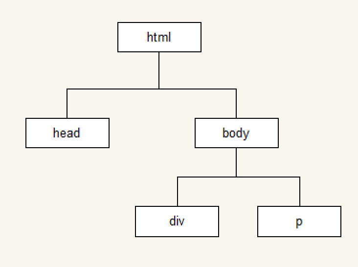

---
学习目标:
  - 掌握API和Web API的概念
  - 掌握常见的浏览器提供的API的调用方式
  - 能通过API开发常见的页面交互功能
  - 能够利用搜索引擎解决问题
---

# Web API

## Web API介绍

### API的概念

API（Application Programming Interface,应用程序编程接口）是一些预先定义的函数，目的是提供应用程序与开发人员基于某软件或硬件得以访问一组例程的能力，而又无需访问源码，或理解内部工作机制的细节。

- 任何开发语言都有自己的API
- API的特征输入和输出(I/O)
- API的使用方法

### Web API的概念

浏览器提供的一套操作浏览器功能和页面元素的API(BOM和DOM)

此处的Web API特指浏览器提供的API(一组方法)，Web API在后面的课程中有其它含义


### 掌握常见的浏览器提供的API的调用方式
[MDN-Web API](https://developer.mozilla.org/zh-CN/docs/Web/API)


### JavaScript的组成


#### ECMAScript - JavaScript的核心 

定义了javascript的语法规范

JavaScript的核心，描述了语言的基本语法和数据类型，ECMAScript是一套标准，定义了一种语言的标准与具体实现无关

#### BOM - 浏览器对象模型

一套操作浏览器功能的API

通过BOM可以操作浏览器窗口，比如：弹出框、控制浏览器跳转、获取分辨率等


#### DOM - 文档对象模型

一套操作页面元素的API

DOM可以把HTML看做是文档树，通过DOM提供的API可以对树上的节点进行操作

## BOM

### BOM的概念

BOM(Browser Object Model) 是指浏览器对象模型，浏览器对象模型提供了独立于内容的、可以与浏览器窗口进行互动的对象结构。BOM由多个对象组成，其中代表浏览器窗口的Window对象是BOM的顶层对象，其他对象都是该对象的子对象。

BOM的核心对象：window,它表示浏览器的一个实例。

在浏览器中，window对象有双重角色，它既是通过JavaScript访问浏览器的一个接口，也是`ECMAScript`规定的全局对象。

我们在浏览器中的一些操作都可以使用BOM的方式进行编程处理，比如：刷新浏览器、后退、前进、在浏览器中输入URL等

### BOM的顶级对象window

window是浏览器的顶级对象，当调用window下的属性和方法时，可以省略window
注意：window下有一个特殊的属性 window.name，该属性是只读的。

### 窗口关系及框架

如果页面中包含框架，则每个框架都拥有自己的window对象，并且保存在frames集合中。

在frames集合中，可以通过数值索引值或者框架名称来访问相应的window对象，每个window对象
都有一个name属性，包含框架的名称。

```html
<html>
    <head>
	    <title>Frameset Example</title>
	</head>
	<frameset rows="160,*">
	    <frame src="frame.htm" name="topFrame">
		    <frameset clos="50%,50%">
			    <frame src="anotherframe.htm" name="leftFrame">
				<frame src="yetanotherframe.htm" name="rightFrame">
			</frameset>
	</frameset>
</html>
```

**top对象**

top始终指向最外层框架，也就是浏览器窗口，使用它可以确保在一个框架中正确的访问另一个框架。因为对于在一个框架中编写的任何代码来说，其中的window对象指向的都是那个框架的特定实例，而非最高层框架。

引用上方框架：window.frames[0]或者window.frames["框架名"]，最好使用top.frames[0]

**parent对象**

与top相对的另一个window对象是parent，parent父对象始终指向当前框架的直接上层框架。

**self对象**
与框架有关的最后一个对象是self，它始终指向window，实际上，self和window对象可以互换使用

所有这些对象都是window对象的属性，因此可以通过window.parent、window.top等形式来访问，不同层次的window对象可以连缀，例如：window.parent.parent.frames[0]

在使用框架的情况下，浏览器中会存在多个Global对象，在每个框架中定义的全局变量会自动成为框架中window的属性。

每个window对象都包含原生类型的构造函数，因此每个框架都有一套自己的构造函数，这些
函数一一对应，但并不相等。


### 窗口位置

用来确定和修改window对象位置的属性和方法有很多，IE、Safari、Opera、Chrome提供了`screenLeft` 和`screenTop`属性，分别表示窗口相对于屏幕左边和上边的位置。
Firefox：提供`screenX`、`screenY`，Safari和Chrome同时也支持这两个属性。

使用下列代码可以跨浏览器取得窗口左边和上边的位置

```javascript
var leftPos = (typeof window.screenLeft == "number") ? window.screenLeft : window.screenX;

var topPos = (typeof window.screenTop == "number") ? window.screenTop : window.screenY;
```

### 窗口大小

跨浏览器确定窗口大小不是一件简单的事情，IE、Safari、Firefox、Opera、Chrome均为此提供了以下四个属性

`innerWidth innerHeight  outerWidth  outerHeight`

IE、Safari、Firefox中，`outerWidth  outerHeight`返回浏览器窗口本身的尺寸。Opera中，这两个属性返回视图容器大小，`innerWidth innerHeight`则表示该容器中页面视图区的大小。Chrome中，4个属性返回相同的值，视口大小。

DOM提供的页面可见区域信息
`document.documentElement.clientWidth`
`document.documentElement.clientHeight`
标准模式下以上这两个属性才有效
混杂模式下
`document.body.clientWidth`
`document.body.clientHeight`

```javascript
// 取得可视区窗口大小
取得可视区窗口大小
var pageWidth = window.innerWidth,
    pageHeight = window.innerHeight;

if (typeof pageWidth != "number") {
	if (document.compatMode == "CSS1Compat") { //确定网页是否处于标准模式，即是否有DTD
	pageWidth = document.documentElement.clientWidth;
	pageHeight = document.documentElement.clientHeight;
} else {
	pageWidth = document.body.clientWidth;
	pageHeight = document.body.clientHeight;
  }
}
```


### 系统对话框

- alert()
- prompt()
- confirm()


### 页面加载事件

- onload

```javascript
window.onload = function () {
  // 当页面加载完成执行
  // 当页面完全加载所有内容（包括图像、脚本文件、CSS 文件等）执行
}
```

- onunload

```javascript
window.onunload = function () {
  // 当用户退出页面时执行
}
```

### 定时器

间歇调用和超时调用：JavaScript是单线程语言，但允许通过设置超时值和间歇超时值来调度代码在特定的时刻执行。

#### setTimeout()

#### clearTimeout()

**超时调用`setTimeout()`**：在指定的毫秒数到达之后执行指定的函数，只执行一次。

**参数**： 接收2个参数，要执行的代码，以毫秒表示的时间

**注意**：第一个参数可以是字符串(不推荐)，也可以是一个函数。

​           第二个参数表示等待多长时间的毫秒数，但经过该时间后指定的代码不一定会执行。

**返回值**： 调用`setTimeout()`后会返回有一个ID，表示超时调用，可以通过它来取消超时调用。

**`clearTimeout()`**：取消尚未执行的超时调用计划

只要在指定的时间尚未过去之前调用`clearTimeout()`，就可以完全取消超时调用。

**this指向**： 超时调用的代码都是在全局作用域中执行的，因此this在非严格模式下指向window，严格模式
下是undefined。

```javascript
// 创建一个定时器，1000毫秒后执行，返回定时器的标示
var timerId = setTimeout(function () {
  console.log('Hello World');
}, 1000);

// 取消定时器的执行
clearTimeout(timerId);
```


#### setInterval()

#### clearInterval()

**间歇调用`setInterval()`**： 按照指定的时间间隔，重复执行代码，直至间歇调用被取消或者页面被卸载。

**参数**：接收参数与`setTimeout()`相同。

**返回值**： 调用该方法同样也会返回一个间歇调用ID，该ID可以用来在将来某个时刻取消间歇调用。

```javascript
// 创建一个定时器，每隔1秒调用一次
var timerId = setInterval(function () {
  var date = new Date();
  console.log(date.toLocaleTimeString());
}, 1000);

// 取消定时器的执行
clearInterval(timerId);
```

**tips**：**一般认为，使用超时模式模拟间歇调用是一种最佳模式**

```javascript
// 每隔半秒执行递增一次，当递增到最大值就取消间歇调用
var num = 0;
var max = 10;
var intervalID = null;
function increamentNumber() {
	num++;
	if (num == max) {
		clearInterval(intervalID);
	}
}
intervalID = setInterval(increamentNumber, 500);

// 用超时setTimeout()模式实现间隙调用
var num = 0;
var max = 10;

function increamentNumber() {
	num++;
	if (num < max){ 
	setTimeout(increamentNumber,500);
	} else {
		console.log("Done");
	}
}
setTimeout(increamentNumber, 500);
```


### location对象

**作用**： location对象提供了与当前窗口中加载的文档有关的信息，还提供了一些导航功能。

location对象是window对象下的一个属性，使用时可以省略window对象。

location可以获取或者设置浏览器地址栏的URL。

**tips**：它既是window对象的属性，也是document对象的属性，也就是说 window.location 与 document.location 引用的是同一个对象。

#### URL

统一资源定位符 (Uniform Resource Locator, URL)

- URL的组成

```
scheme://host:port/path?query#fragment
scheme:通信协议
	常用的http,ftp,maito等
host:主机
	服务器(计算机)域名系统 (DNS) 主机名或 IP 地址。
port:端口号
	整数，可选，省略时使用方案的默认端口，如http的默认端口为80。
path:路径
	由零或多个'/'符号隔开的字符串，一般用来表示主机上的一个目录或文件地址。
query:查询
	可选，用于给动态网页传递参数，可有多个参数，用'&'符号隔开，每个参数的名和值用'='符号隔开。例如：name=zs
fragment:信息片断
	字符串，锚点.
```

#### location的成员

- 使用chrome的控制台查看，在控制台键入 window.location

- 查MDN

  [MDN](https://developer.mozilla.org/zh-CN/)

  assign()/reload()/replace()

  hash/host/hostname/search/href……

##### location的属性

location对象的所有属性如下：

1. hash： 返回url中的hash(#后跟零或多个字符)，如果url不包含散列，则返回空字符串
2. host： 服务器名称和端口号
3. hostname： 不带端口号的服务器名称
4. href： 当前加载页面的完整url
5. pathname： url中的目录或文件名
6. port： 端口号，如果URL中不包含端口号，则返回空字符串
7. protocol： 页面使用协议，通常是http: 或 https:
8. search： url的查询字符串，这个字符串以问号开头

##### location的方法

##### location.assign()

**作用**： 根据传入的地址，跳转到对应的页面，会生成历史记录。

**参数**： 一个`url`地址

```javascript
location.assign("http://www.wrox.com");

//等价于
window.location = "http://www.wrox.com";
location.href = "http://www.wrox.com"; // 比较常用
```

##### replace()

**作用**： 根据传入的`url`替换当前页面。

**参数**： 接收一个参数，即要导航到的URL。

**注意**： 不会生成新历史记录，因此使用replace()方法后不能回到前一个页面。

```javascript
setTimeout(function(){
	location.replace("http://www.wrox.com/");
}, 1000);
```

##### reload()

**作用**： 重新加载当前显示的页面

location.reload();  重新加载(页面会以最有效的方式加载，有可能从缓存中加载)。

location.reload(true);  重新加载(从服务器重新加载)。

**注意**： 位于reload()方法之后的代码可能会，也可能不会执行，因此，最好将reload()放在代码最后一行。

#### 案例

解析URL中的query，并返回对象的形式

```javascript
function getQuery(urlStr) {
  var query = {};
  if (urlStr.indexOf('?') > -1) {
    var index = urlStr.indexOf('?');
    urlStr = urlStr.substr(index + 1);
    var array = urlStr.split('&');
    for (var i = 0; i < array.length; i++) {
      var tmpArr = array[i].split('=');
      if (tmpArr.length === 2) {
        query[tmpArr[0]] = tmpArr[1];
      }
    }
  }
  return query;
}
console.log(getQuery(location.search)); // {name: "miaosong", age: "17"}
console.log(getQuery(location.href));
```

### history对象

history对象保存着用户上网的历史记录，是window对象的属性。

#### history对象的方法

##### back()

**作用**：后退一页，history.back()。

##### forward()

**作用**：前进一页，history.forward()。

##### go()

**作用**：该方法可以在用户历史记录中任意跳转。
**参数**：接收一个参数

另外，back()、forward()可以代替go()。

```javascript
//后退一页
history.go(-1); // 相当于单击浏览器的“后退”按钮 或者 history.back()

//前进一页
history.go(1); // 相当于 history.forward()

//前进2页
history.go(2);
```

**注意**： 也可以给go()方法传递一个字符串参数，此时浏览器会跳转到包含该字符串的最近的一个页面，如果历史记录中不包含该字符串，那么这个方法什么也不做。

```javascript
// 跳转到最近的wrox.com页面
history.go("wrox.com");
```


#### history对象的length属性

history对象有一个length属性，保存着历史记录的数量。

对于加载到窗口、标签页或框架中的第一个页面而言，history.length = 0。

可以通过检查该属性的值，确定用户是否一开始就打开了页面，也可以用来检测当前页面是不是用户历史记录中的第一个页面。

```
if (history.length == 0) {
	
}
```


### navigator对象

navigator代表浏览器。

#### navigator对象的属性

##### userAgent

通过userAgent可以判断用户浏览器的类型。

##### platform

通过platform可以判断浏览器所在的系统平台类型。


## DOM

### DOM的概念

文档对象模型（Document Object Model，简称DOM），是[W3C](http://baike.baidu.com/item/W3C)组织推荐的处理可扩展标志语言的标准编程接口。在网页上，组织页面（或文档）的对象被组织在一个树形结构中，用来表示文档中对象的标准模型就称为DOM。Document Object Model的历史可以追溯至1990年代后期微软与[Netscape](http://baike.baidu.com/item/Netscape)的“浏览器大战”，双方为了在[JavaScript](http://baike.baidu.com/item/JavaScript)与[JScript](http://baike.baidu.com/item/JScript)j较量中一决生死，于是大规模的赋予浏览器强大的功能。微软在网页技术上加入了不少专属事物，既有[VBScript](http://baike.baidu.com/item/VBScript)、[ActiveX](http://baike.baidu.com/item/ActiveX)、以及微软自家的[DHTML](http://baike.baidu.com/item/DHTML)格式等，使不少网页使用非微软平台及浏览器无法正常显示。DOM即是当时蕴酿出来的杰作。

DOM又称为文档树模型。DOM描绘了一个层次化的节点树。
**注意**：IE中的DOM都是以COM的形式实现的，这意味着IE中的DOM对象与原生JavaScript对象的的行为或活动特点不一致。


- 文档：一个网页可以称为文档
- 节点：网页中的所有内容都是节点（标签、属性、文本、注释等）
- 元素：网页中的标签
- 属性：标签的属性

### 模拟文档树结构



```javascript
function Element(option) {
  this.id = option.id || '';
  this.nodeName = option.nodeName || '';
  this.nodeValue = option.nodeValue || '';
  this.nodeType = 1;
  this.children = option.children || [];
}

var doc = new Element({
  nodeName: 'html'
});
var head = new Element({
  nodeName: 'head'
});
var body = new Element({
  nodeName: 'body'
})
doc.children.push(head);
doc.children.push(body);

var div = new Element({
  nodeName: 'div',
  nodeValue: 'haha',
});

var p = new Element({
  nodeName: 'p',
  nodeValue: '段落'
})
body.children.push(div);
body.children.push(p);

function getChildren(ele) {
  for(var i = 0; i < ele.children.length; i++) {
    var child = ele.children[i];
    console.log(child.nodeName);
    getChildren(child);
  }
}
getChildren(doc);
```

### DOM经常进行的操作

- 获取元素
- 动态创建元素
- 对元素进行操作(设置其属性或调用其方法)
- 事件(什么时机做相应的操作)

### 节点

##### nodeType

nodeType属性：用于表明节点的类型

文档节点是每个文档的根节点。总共有12种节点类型，常用的是元素节点，属性节点，文本节点。

##### nodeName、nodeValue

对于元素节点，nodeName始终保存的是元素的标签名，一般是大写的，而nodeValue的值则始终是null。

##### childNodes属性

每个节点都有一个`childNodes`属性，其中保存着`NodeList`对象，它存放了当前节点的所有子节点，包含空白文本节点。

`NodeList`并不是一个数组，也有length属性。

访问`NodeList`中的节点的方式如下

1、方括号方法：
`var firstChild = someNode.childNodes[0];`

2、item()方法：
`var secondChild = someNode.childNodes.item(1);`

一般使用方法一。

对`argumengts`对象使用 `Array.prototype.slice()`方法可以将其转换为数组，类似的方法也可以将`NodeList`对象转换为数组。

```JavaScript
function convertToArray(nodes) {
	var array = null;
	try{
		array = Array.prototype.slice.call(nodes,0);
	} catch (ex){
		array = new Array();  // 在IE中的方法
		for(var i = 0; i < nodes.length; i++) {
			array.push(nodes[i]);
		}
	}
	return array;
}
```


##### parentNode属性

该属性指向当前节点的父节点，每个节点都有一个`parentNode`属性。

##### previousSibling、nextSibling

该属性指向当前节点的兄弟节点。

`previousSibling`：当前节点的前一个兄弟节点

`nextSibling`：当前节点的后一个兄弟节点

注意：第一个节点的`previousSibling`和最后一个节点的`nextSibling`属性值都为null。

```javascript
// 判断是否是第一个或着最后一个节点
if (someNode.previousSibling == null) {
	console.log("first node in the parent's childNodes list.");
} else if (someNode.nextSibling == null) {
	console.log("last node in the parent's childNodes list.");
}
```


##### 元素节点

利用以下这些DOM属性，不用担心空白文本节点

`childElementCount`   返回子元素的个数，不包括文本节点和注释
`firstElementChild`   指向第一个子元素，`firstChild`的元素版
`lastElementChild`     指向最后一个子元素，`lastChild`的元素版
`previousElementSibling`   指向前一个同辈元素，`previousSibling`的元素版
`nextElementSibling`            指向后一个同辈元素，`nextSibling`的元素版

##### hasChildNodes()方法

该方法在节点包含一或多个子节点的情况下返回true。

所有节点的最后一个属性是`ownerDocument`，该属性指向表示整个文档的文档节点。


### 操作节点的方法

#### appendChild()

**作用**：用于向`childNodes`列表的末尾添加一个节点，即在当前节点的父节点中添加节点。返回新增的节点。

**注意**：如果传入到`appendChild()`中的节点已经是文档的一部分了，那么就会将该节点从原来的位置转移到新位置。

```javascript
var returnedNode = parentNode.appendChild(newNode);

console.log(returnedNode == newNode);          //true
console.log(parentNode.lastChild == newNode);  //true
```

#### insertBefore()

**作用**： 在父节点的某个子节点前插入节点。

**参数**：接收两个参数，要插入的节点，参照的子节点。

注意：如果第二个参数，参照节点为 null，则表示在父节点的最末端插入，成为最后一个子元素。

```javascript
//插入成为最后一个子节点，和appendChild()效果相同
var returnedNode = parentNode.insertBefore(newNode, null);

//插入成为第一个子节点
var returnedNode = parentNode.insertBefore(newNode, parentNode.firstChild)
```

#### repaceChild()

参数：接收2个参数，要插入的节点，要替换的节点
返回：返回要替换的节点，并从文档树中移除替换的节点，同时新插入的节点占据其位置。

例如：替换第一个子节点
`var returnedNode = parentNode.replaceChild(newNode, parentNode.firstChild);`

如果只想移除而非替换节点，使用`removeChild()`方法。

#### removeChild()

参数：接收一个参数，要移除的节点。
返回：移除的节点

#### cloneNode()

所有类型都有的方法，用于克隆节点。

**参数**：接收一个布尔值参数，表示是否执行深复制
参数为true：执行深复制，即复制节点及整个子节点树
参数为false ：浅复制，只复制节点本身

#### normalize()

该方法的作用：处理文档树中的文本节点


## Document类型

### document

document对象表示整个HTML页面，Documet节点具有以下属性
nodeType的值为9
nodeName的值为"#document"
nodeValue的值为null
parentNode的值为null
ownerDocument的值为null

Document类型可以表示HTML页面或者其他基于XML的文档，也作为HTMLDocument的实例。

### documentElement

`documentElement`是文档的子节点

`documentElement`属性：始终指向HTML页面中的<html>元素

`var html = document.documentElement;  // 取得对<html>的引用`

### document.body

document对象的body属性，直接指向<body>元素。

`var body = document.body;  //取得对<body>元素的引用`

### documentType

`documentType`属性指向 <!DOCTYPE> 的引用。

`var doctype = document.doctype;  // 取得<!DOCTYPE>的引用`


## Element类型

### 元素节点

nodeType的值为1
nodeName的值为元素的标签名
nodeValue的值为null
parentNode可能是Document或Element

要访问元素的标签名，可以使用`nodeName`，也可以使用`tagName`

```javascript
var div = document.getElementById("myDiv");

div.tagName;  //'DIV'
div.tagName == div.nodeName; //true

// 在HTML中，`tagName`返回值始终是大写形式，而xml或者xhtml返回与源码一致。
// 所以最好如下进行比较，或者进行大小写转换
div.tagName.toLowerCase() == "div";
```

### HTML元素

所有HTML元素都由`HTMLElement`类型表示。

#### 元素属性相关方法

##### getAttribute()

取得元素的属性

```javascript
var div1 = document.getElementById("div1");

div1.getAttribute("class");
```


##### setAttribute()

设置元素属性

例子：设置类名
`div.setAttribute("class", "ft");`

##### removeAttribute()

彻底删除元素的特性

`div.removeAtribute('class');`

#### attributes属性

```javascript
// 遍历元素特性，返回元素的特性
function outputAttributes(element) {
      var pairs = new Array();
      attrName;
      attrValue;
      for (var i = 0; i < element.attributes.length; i++) {
        attrName = element.attributes[i].nodeName;
        attrValue = element.attributes[i].nodeValue;
        if (element.attribute[i].specified) {
          pairs.push(attrName + "=\'" + attrValue + "\"");
        }
      }
      return pairs.join(" ");
    }
```


#### 创建元素

##### document.createElememt()

**参数**： 接收一个字符串参数，要创建元素的标签名字符串。

该方法通常和 `appenChild()` 搭配使用

```javascript
// 创建一个div元素，并为其添加一些属性,并将其添加到文档的<body>中
var div = document.createElement("div");
div.id = "myDiv";
div.className = "box";
document.body.appendChild(div);

// 在IE中可以使用另外一种方式
var div = document.ceateElement("<div id=\"myDiv\" class=\"box\"></div>");
```


#### 元素的子节点childNodes

元素的`childNodes`中包含了元素的所有子节点，包含空白文本节点。

注意：IE与其他浏览器返回的字节点的数目不同，其他的浏览器会把元素间的空白表示为文本节点，所以一般执行某些操作前都会先检查一下nodeType属性，以确定不是空白节点。

```javascript
for (var i=0;i<element.childNodes.length;i++) {
	//判断子元素是不是元素节点
	if (element.childNodes[i].nodeType == 1) {
		//执行某些操作
	}
}
```


**元素也支持getElementsByTagName()方法**

```javascript
// 取得ul元素中包含的所有li元素
var ul = document.getElementById("myList");
var items = ul.getElementsByTagName("li");
```


## Text类型

### 文本节点

nodeType的值为3
nodeName的值"#text"
nodeValue的值为节点所包含的文本
parentNode是一个Element
没有子节点

可以通过nodeValue或data属性访问Text节点中包含的文本

#### 操作节点中的文本的方法

appendData(text)： 将text添加到节点的末尾
deleteDate(offset, count)： 从offset指定的位置开始删除count个字符
insertDate(offset,text)： 从offset指定的位置插入text
replaceDate(offset,count ,text)： 用text替换从offset指定的位置开始到offset+count位置处的文本
splitText(offset)：从offset指定的位置将当期文本节点分成两个文本节点
substringDate()：提取从offset指定的位置到offset+count为止处的字符串

#### length属性

文本节点的length属性：节点中字符串的数目

```javascript
// 访问文本子节点
var textNode = div.firstChild;
var textNode = div.childNodes[0];
```

#### 创建文本节点

##### document.createTextNode()

接收一个参数：要插入节点中的文本值
`var textNode = document.createTextNode("<strong>hello world!</strong>");`

##### normalize()

规范化文本节点，如果在一个包含多个文本节点的父元素上调用normalize()方法，则会将所有的文本节点合并为一个文本节点。

```javascript
var element = document.createElement("div");
element.className = "message";

var textNode = document.createTextNode("hello world!");
element.appendChild(textNode);

var anotherTextNode = document.createTextNode("yippee!");
element.appendChild(anotherTextNode);

document.body.appendChild(element);

alert(element.childNodes.length); //2

element.normalize();  
alert(element.childNodes.length); //1
alert(element.childNodes[0].nodeValue); //hello world!yippee!
```


##### splitText()

分隔文本节点

该方法会将一个文本分成两个文本节点，原来的文本节点将包含从开始到指定位置之前的内容，新文本节点将包含剩下的文本。

```javascript
var element = document.createElement("div");
element.className = "message";

var textNode = document.createTextNode("hello world!");
element.appendChild(textNode);

document.body.appendChild(element);

var newNode = element.firstChild.splitText(5);
alert(element.firstChild.nodeValue);  //hello
alert(newNode.nodeValue);  // world
alert(element.childNodes.length);  //2
```


## Attr类型

### 属性节点

nodeType的值为2
nodeName的值是特性的名称
nodeValue的值是特性的值
parentNode是null

**注意**：尽管属性也是节点，但属性却**不是DOM文档树的一部分**。
Attr对象有3个属性：name、value、specified
specified是一个布尔值，用于区别属性是在代码中指定的，还是默认的。


### classList属性

add(value)  将给定的字符串值添加到列表中，如果值已经存在，就不添加了
contains(value)  列表中是否存在给定的值，存在就返回true,否则就返回false
remove(value)  从列表中删除给定的字符串
toggle(value)   如果列表中已经存在给定的值，删除它，不存在，就添加它

```javascript
//删除user类
div.classList.remove("user");

//添加"current"类
div.classList.add("current");

//切换"user"类
div.classList.toggle("user");

//确定元素中是否包含既定的类名
if (div.classList.contains("bd") && !div.classList.contains("disabled")) {
	
}

//迭代类名
for (var i=0;i<div.classList.length;i++) {
	doSomething(div.classList[i]);
}
```


## 获取页面元素

**取得文档中所有元素**

```javascript
var allElements = document.getElementsByTagName("*");`
```

**getElementsByName()**

返回所有带有给定name特性的所有元素。

常用该方法取得单选按钮，因为单选按钮的name属性都相同。

**选择符API**
**selectors API**
让开发人员可以基于CSS选择符从DOM中取得元素

**querySelector()**

参数：接收一个CSS选择符

返回与该模式匹配的第一个元素，如果没有找到匹配的元素，返回null。

```
//取得body元素
var body = document.querySelector("body");

//取得ID为"myDiv"的元素
var myDiv = document.querySelector("#myDiv");

//取得类为"selected"的第一个元素
var selected = document.querySelector(".selected");

//取得类为"button"的第一个图像元素
var img  = querySelector("img.button");
```


querySelectorAll()方法

参数：接收一个css选择符。

返回与该模式匹配的所有元素，该方法返回的是一个NodeList的实例

能够调用querySelectorAll()方法的类型：Document、DocumentFragment、Element

```javascript
//取得某<div>中的所有<em>元素
var ems = document.getElementById("myDiv").querySelectorAll("em");

//取得类为"selected"的所有元素
var slelcteds = document.querySelectorAll(".selected");

//取得所有<p>元素中的所有<strong>元素
var strongs = document.querySelectorAll("p strong");

// 要取得NodeList中的每一个元素，可以使用item()方法，也可以使用[]语法
// 例子：
var i,len,strong;
var len = strongs.length
for (i=0; i < len; i++) {
	strong = strongs[i];  //或者strongs.item(i);
	strong.className = "important";
}
```


**特殊集合**
document.anchors 包含文档中所有带name特性的a元素
document.forms 包含文档中所有的<form>元素
document.images 包含文档中所有的元素
document.links 包含文档中所有带href特性的<a>元素

##案例
1.点击按钮弹出对话框
2.点击按钮修改超链接的地址和热点文字
3.点击(每个)图片弹出对话框
4.点击图片设置自身宽和高
5.点击按钮修改每个图片的title属性
6.点击按钮显示哈哈(排他功能)
7.点击按钮显示和隐藏div
8.显示和隐藏二维码
9.点击按钮修改所有p标签内容
10.点击按钮修改所有文本框内容
11.点击按钮切换图片
12.点击超链接停止跳转页面
13.点击小图显示大图
14.美女相册
15点击按钮选中性别和兴趣


### 为什么要获取页面元素

例如：我们想要操作页面上的某部分(显示/隐藏，动画)，需要先获取到该部分对应的元素，才能进行后续操作

### 根据id获取元素

```javascript
var div = document.getElementById('main');
console.log(div);

// 获取到的数据类型 HTMLDivElement，对象都是有类型的
// HTMLDivElement <-- HTMLElement <-- Element  <-- Node  <-- EventTarget
```

注意：由于id名具有唯一性，部分浏览器支持直接使用id名访问元素，但不是标准方式，不推荐使用。

### 根据标签名获取元素

```javascript
var divs = document.getElementsByTagName('div');
for (var i = 0; i < divs.length; i++) {
  var div = divs[i];
  console.log(div);
}
```

### 根据name获取元素*

```javascript
var inputs = document.getElementsByName('hobby');
for (var i = 0; i < inputs.length; i++) {
  var input = inputs[i];
  console.log(input);
}
```

### 根据类名获取元素

```javascript
var mains = document.getElementsByClassName('main');
for (var i = 0; i < mains.length; i++) {
  var main = mains[i];
  console.log(main);
}
```

### 根据选择器获取元素

```javascript
var text = document.querySelector('#text');
console.log(text);

var boxes = document.querySelectorAll('.box');
for (var i = 0; i < boxes.length; i++) {
  var box = boxes[i];
  console.log(box);
}
```

- 总结

```
掌握
	getElementById()
	getElementsByTagName()
	getElementsByName()
	getElementsByClassName()
	querySelector()
	querySelectorAll()
```

## 事件

事件：触发-响应机制

event接口表示在DOM中发生的任何事件，一些是由用户生成的（例如鼠标或键盘事件），还有一些由API生成。

### 事件三要素

- 事件源:  触发(被)事件的元素
- 事件类型:  事件的触发方式( 例如鼠标点击 或 键盘点击 )
- 事件处理程序: 事件触发后要执行的代码( 函数形式 )

### 事件的基本使用

```javascript
var box = document.getElementById('box');
box.onclick = function() {
  console.log('代码会在box被点击后执行');  
};
```

### 案例
- 点击按钮弹出提示框
- 点击按钮修改元素的样式

## 属性操作

### 非表单元素的属性

href、title、id、src、className

```javascript
var link = document.getElementById('link');
console.log(link.href);
console.log(link.title);

var pic = document.getElementById('pic');
console.log(pic.src);
```

案例：

​	点击按钮，切换img标签里的图片

​	点击按钮显示隐藏div

- `innerHTML` 和 `innerText`

```javascript
var box = document.getElementById('box');
box.innerHTML = '我是文本<p> p会生成为标签</p>';
console.log(box.innerHTML);
box.innerText = '我是文本<p> p不会生成为标签</p>';
console.log(box.innerText);
```
- HTML转义符

```
"		&quot;
‘		&apos;
&		&amp;
<		&lt;    // less than  小于
>		&gt;    // greater than  大于
空格	   &nbsp;
©		&copy;
```

- `innerHTML` 和 `innerText` 的区别

- `innerText` 的兼容性处理


### 表单元素属性

- value 用于大部分表单元素的内容获取 ( option除外 )
- type 可以获取 input 标签的类型( 输入框或复选框等 )
- disabled 禁用属性
- checked 复选框选中属性
- selected 下拉菜单选中属性

### 案例

- 给文本框赋值，获取文本框的值
- 点击按钮禁用文本框
- 搜索文本框
- 检测用户名是否是3-6位，密码是否是6-8位，如果不满足要求高亮显示文本框
- 设置下拉框中的选中项
- 全选反选

### 自定义属性操作

- `getAttribute()` 获取标签行内属性
- `setAttribute()` 设置标签行内属性
- `removeAttribute()` 移除标签行内属性
- 与 `element.属性` 的区别: 上述三个方法用于获取任意的行内属性。

### 样式操作

- 使用style方式设置的样式显示在标签行内
```javascript
var box = document.getElementById('box');
box.style.width = '100px';
box.style.height = '100px';
box.style.backgroundColor = 'red';
```

- 注意

  通过样式属性设置宽高、位置的属性类型是字符串，需要加上px

### 类名操作

- 修改标签的`className`属性相当于直接修改标签的类名
```javascript
var box = document.getElementById('box');
box.className = 'clearfix';
```

### 案例

- 开关灯
- 点击按钮变色
- 图片切换二维码案例
- 当前输入的文本框高亮显示
- 点击按钮改变div的大小和位置
- 列表隔行变色、高亮显示
- 京东商品展示
- tab选项卡切换


## 创建元素的三种方式

### document.write()

```javascript
document.write('新设置的内容<p>标签也可以生成</p>');
```

### innerHTML

```javascript
var box = document.getElementById('box');
box.innerHTML = '新内容<p>新标签</p>';
```

### document.createElement()

```javascript
var div = document.createElement('div');
document.body.appendChild(div);
```

### 性能问题

- innerHTML方法由于会对字符串进行解析，需要避免在循环内多次使用。
- 可以借助字符串或数组的方式进行替换，再设置给 `innerHTML`
- 优化后与 `document.createElement`  性能相近


### 案例

- 动态创建列表，高亮显示
- 根据数据动态创建表格
- 模拟百度搜索文本框

## 节点操作

```javascript
var body = document.body;
var div = document.createElement('div');
body.appendChild(div);

var firstEle = body.children[0];
body.insertBefore(div,firstEle);

body.removeChild(firstEle);

var text = document.createElement('p');
body.replaceChild(text, div);
```

案例：

​	权限选择

### 节点层级

父子，兄弟

```javascript
var box = document.getElementById('box');
console.log(box.parentNode);
console.log(box.childNodes);
console.log(box.children);
console.log(box.nextSibling);
console.log(box.previousSibling);
console.log(box.firstChild);
console.log(box.lastChild);
```

- 注意

  `childNodes` 和 `children `的区别，`childNodes` 获取的是所有子节点，包含空白文本节点，`children` 获取的是子元素。

  `nextSibling` 和 `previousSibling` 获取的是兄弟节点，获取兄弟元素节点是 `nextElementSibling` 和`previousElementSibling`。

  `nextElementSibling` 和 `previousElementSibling`有兼容性问题，IE9以后才支持。

- 总结

```
节点操作，方法
	appendChild()
	insertBefore()
	removeChild()
	replaceChild()
节点层次，属性
	parentNode
	childNodes
	children
	nextSibling/previousSibling
	firstChild/lastChild
```

## 事件详解

### 注册/移除事件的三种方式

```javascript
var box = document.getElementById('box');
box.onclick = function () {
  console.log('点击后执行');
};
box.onclick = null;

box.addEventListener('click', eventCode, false);
box.removeEventListener('click', eventCode, false);

box.attachEvent('onclick', eventCode);
box.detachEvent('onclick', eventCode);

function eventCode() {
  console.log('点击后执行');
}
```

### 兼容代码

```javascript
function addEventListener(element, type, fn) {
  if (element.addEventListener) {
    element.addEventListener(type, fn, false);
  } else if (element.attachEvent){
    element.attachEvent('on' + type,fn);
  } else {
    element['on'+type] = fn;
  }
}

function removeEventListener(element, type, fn) {
  if (element.removeEventListener) {
    element.removeEventListener(type, fn, false);
  } else if (element.detachEvent) {
    element.detachEvent('on' + type, fn);
  } else {
    element['on'+type] = null;
  }
}
```

### 事件的三个阶段

1. 捕获阶段

2. 当前目标阶段

3. 冒泡阶段

   `事件对象.eventPhase` 属性可以查看事件触发时所处的阶段

### 事件对象的属性和方法

- event.type  获取事件类型
- `clientX` 、 `clientY `    所有浏览器都支持，窗口位置
- `pageX` 、`pageY`    IE8以前不支持，页面位置
- `event.target` 、 `event.srcElement`   获取触发事件的目标元素
- `event.preventDefault()`  取消默认行为

#### 案例

- 跟着鼠标飞的天使
- 鼠标点哪图片飞到哪里
- 获取鼠标在div内的坐标

### 阻止事件传播的方式 (冒泡)

- 标准方式 `event.stopPropagation()`
- IE低版本 `event.cancelBubble = true` 标准中已废弃

### 常用的鼠标和键盘事件

- `onmouseup` 鼠标按键放开时触发
- `onmousedown` 鼠标按键按下触发
- `onmousemove` 鼠标移动触发
- `onkeyup` 键盘按键抬起触发
- `onkeydown` 键盘按键按下触发


## 特效

### 偏移量

- `offsetParent` 用于获取定位元素的父级元素
- `offsetParent` 和 `parentNode` 的区别

```javascript
var box = document.getElementById('box');
console.log(box.offsetParent);
console.log(box.offsetLeft);
console.log(box.offsetTop);
console.log(box.offsetWidth);
console.log(box.offsetHeight);
```


### 客户区大小

`clientWidth  `和 `clientHeight`

```javascript
var box = document.getElementById('box');
console.log(box.clientLeft);
console.log(box.clientTop);
console.log(box.clientWidth);
console.log(box.clientHeight);
```


### 滚动偏移

`scrollTop `和 `scrollLeft`

```javascript
var box = document.getElementById('box');
console.log(box.scrollLeft)
console.log(box.scrollTop)
console.log(box.scrollWidth)
console.log(box.scrollHeight)
```


### 案例 

- 匀速动画函数
- 变速动画函数
- 回到顶部
- 无缝轮播图
- 模拟滚动条
- 拖拽案例
- 放大镜案例


## 附录

### 元素的类型

