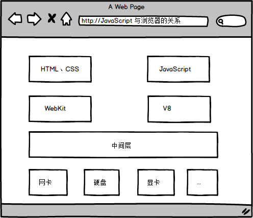
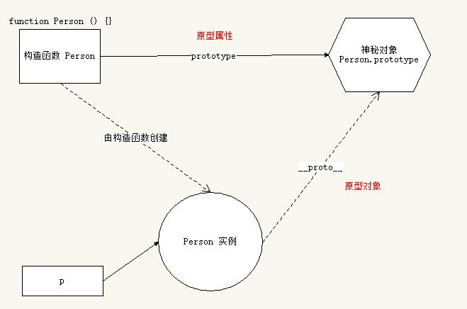

---
目标:
  - 理解面向对象开发思想
  - 掌握 JavaScript 面向对象开发相关模式
  - 掌握在 JavaScript 中使用正则表达式
---

# JavaScript 高级


## 

在线地址：[JavaScript 高级](http://naotu.baidu.com/file/5bcd79bc4f1eaf83f96d1ad23baab345?token=d22135c63546f5ee)


### 目标

- 理解面向对象开发思想
- 掌握 JavaScript 面向对象开发相关模式
- 掌握在 JavaScript 中使用正则表达式

### 案例演示

- [贪吃蛇](https://lipengzhou.github.io/new-snake/)

---

## 基本概念复习

> 由于 JavaScript 高级还是针对 JavaScript 语言本身的一个进阶学习，所以在开始之前我们先对以前所学过的 JavaScript 相关知识点做一个快速复习总结。

### 重新介绍 JavaScript

#### JavaScript 是什么

- 解析执行：轻量级解释型的，或是 JIT 编译型的程序设计语言
- 语言特点：动态，头等函数 (First-class Function)
  + 又称函数是 JavaScript 中的一等公民
- 执行环境：在宿主环境（host environment）下运行，浏览器是最常见的 JavaScript 宿主环境
  + 但是在很多非浏览器环境中也使用 JavaScript ，例如 node.js
- 编程范式：基于原型、多范式的动态脚本语言，并且支持面向对象、命令式和声明式（如：函数式编程）编程风格

#### JavaScript 与浏览器的关系



#### JavaScript 的组成	

| 组成部分       | 说明                |
| ---------- | ----------------- |
| Ecmascript | 描述了该语言的语法和基本对象    |
| DOM        | 描述了处理网页内容的方法和接口   |
| BOM        | 描述了与浏览器进行交互的方法和接口 |

#### JavaScript 可以做什么

> Any application that can be written in JavaScript, will eventually be written in JavaScript.  
> 凡是能用 JavaScript 写出来的，最终都会用 JavaScript 写出来

- [知乎 - JavaScript 能做什么，该做什么？](https://www.zhihu.com/question/20796866)
- [最流行的编程语言 JavaScript 能做什么？](https://github.com/phodal/articles/issues/1)

#### JavaScript 发展历史

> [JavaScript 标准参考教程 - JavaScript 语言的历史](http://javascript.ruanyifeng.com/introduction/history.html)

- JavaScript 的诞生
- JavaScript 与 Ecmascript 的关系
- JavaScript 与 Java 的关系
- JavaScript 的版本
- JavaScript 周边大事记

### 基本概念

> 本小节快速过即可，主要是对学过的内容做知识点梳理。

- 语法
  + 区分大小写
  + 标识符
  + 注释
  + 严格模式
  + 语句
- 关键字和保留字
- 变量
- 数据类型
  + typeof 操作符
  + Undefined
  + Null
  + Boolean
  + Number
  + String
  + Object
- 操作符
- 流程控制语句
- 函数

### JavaScript 中的数据类型

JavaScript 有 5 种简单数据类型：`Undefined、Null、Boolean、Number、String` 和 1 种复杂数据类型 `Object` 。

#### 基本类型（值类型）

- Undefined
- Null
- Boolean
- Number
- String

#### 复杂类型（引用类型）

- Object
- Array
- Date
- RegExp
- Function
- 基本包装类型
  + Boolean
  + Number
  + String
- 单体内置对象
  + Global
  + Math

#### 类型检测

- `typeof`
- `instanceof`
- `Object.prototype.toString.call()`

#### 值类型和引用类型在内存中的存储方式（画图说明）

- 值类型按值存储
- 引用类型按引用存储

#### 值类型复制和引用类型复制（画图说明）

- 值类型按值复制
- 引用类型按引用复制

#### 值类型和引用类型参数传递（画图说明）

- 值类型按值传递
- 引用类型按引用传递

#### 值类型与引用类型的差别

- 基本类型在内存中占据固定大小的空间，因此被保存在栈内存中
- 从一个变量向另一个变量复制基本类型的值，复制的是值的副本
- 引用类型的值是对象，保存在堆内存
- 包含引用类型值的变量实际上包含的并不是对象本身，而是一个指向该对象的引用
- 从一个变量向另一个变量复制引用类型的值的时候，复制的是引用，因此两个变量最终都指向同一个对象

#### 小结

- 类型检测方式
- 值类型和引用类型的存储方式
- 值类型复制和引用类型复制
- 方法参数中 值类型数据传递 和 引用类型数据传递

### JavaScript 执行过程

JavaScript 运行分为两个阶段：

- 预解析
  + 全局预解析（使用`var`定义的变量和`function`定义的函数声明都会提前；同名的函数和变量，函数的优先级高）
  + 函数内部预解析（函数内部的变量、函数 和 形参都会参与预解析）
    * 函数
    * 形参
    * 普通变量
- 执行

先预解析全局作用域，然后执行全局作用域中的代码，
在执行全局代码的过程中遇到函数调用就会先进行函数预解析，然后再执行函数内代码。

#### 执行上下文

执行上下文：第一行代码执行前以及函数每次调用时，都会有一个执行环境Execution Context，即执行上下文。

对全局作用域来说，在执行第一行JavaScript代码之前，就会有一个全局执行上下文。

对于函数，在函数被调用一次或者多次时，每次都会产生一个新的函数执行上下文。

执行上下文是一个栈级的结构，全局上下文在最底层。

执行上下文：

- 全局执行上下文：变量定义、函数声明。

- 函数执行上下文：arguments、函数声明、变量定义、this、。

- 执行上下文中有一个变量对象(Variable Object，简称VO)，用于存储执行上下文中的变量、函数声明、函数参数列表arguments、this。


#### 全局执行上下文

在第一行代码执行前，会生成一个全局执行上下文，将全局作用域中的数据进行如下处理，并保存到变量对象VO中。

（1）对全局成员变量进行预处理：

1. 函数声明提升：使用function函数声明方式定义的函数，进行函数提升 ，并保存在VO对象中。

2. 变量提升：使用`var`定义的变量，进行变量声明提升初始化为undefined，将变量保存在VO对象中。

3. this 指向 window。

（2）开始执行代码，对变量进行赋值

#### 函数执行上下文

在即将调用函数时， 准备执行函数体之前，创建对应的函数执行上下文对象(虚拟的， 存在于栈中)。函数中还有一个激活对象AO，它是在函数调用时产生的，相当于就是VO对象。

（1）对局部数据进行如下的顺序处理：

1. 函数参数： 形参列表arguments，将实参的值赋给形参(未传递实参则值为undefined)，并保存在VO对象中。
2. 函数处理： 使用function函数声明方式定义的函数，进行函数声明提升，将函数保存在VO对象中，如果发生命名冲突会覆盖。
3. 变量处理： 在函数中使用`var`定义的变量，进行变量声明提升，初始化值为undefined，保存在VO对象中，如果发生命名冲突会忽略。

4. this 指向调用该函数的对象

（2）开始执行函数体代码，对变量进行赋值。

#### 执行上下文栈

1. 在全局代码执行前，JS引擎就会创建一个栈来存储管理所有的执行上下文对象

2. 在全局执行上下文(window)确定后,，将其添加到栈中(压栈)

3. 在函数执行上下文创建后，将其添加到栈中(压栈)

4. 在当前函数执行完后，将栈顶的对象移除(出栈)

5. 当所有的代码执行完后,，栈中只剩下window

---

## JavaScript 面向对象编程

### 面向对象介绍

#### 什么是对象

> Everything is object （万物皆对象）


对象到底是什么，我们可以从两次层次来理解。

**(1) 对象是单个事物的抽象。**

一本书、一辆汽车、一个人都可以是对象，一个数据库、一张网页、一个与远程服务器的连接也可以是对象。当实物被抽象成对象，实物之间的关系就变成了对象之间的关系，从而就可以模拟现实情况，针对对象进行编程。

**(2) 对象是一个容器，封装了属性（property）和方法（method）。**

属性是对象的状态，方法是对象的行为（完成某种任务）。比如，我们可以把动物抽象为animal对象，使用“属性”记录具体是那一种动物，使用“方法”表示动物的某种行为（奔跑、捕猎、休息等等）。

在实际开发中，对象是一个抽象的概念，可以将其简单理解为：**数据集或功能集**。

`ECMAScript-262` 把对象定义为： **无序属性的集合，其属性可以包含基本值、对象或者函数**。
严格来讲，这就相当于说对象是一组没有特定顺序的键值对。对象的每个属性或方法都有一个名字，而每个名字都
映射到一个值。

<p class="tip">
  提示：每个对象都是基于一个引用类型创建的，这些类型可以是系统内置的原生类型，也可以是开发人员自定义的类型。
</p>

#### 什么是面向对象

> 面向对象不是新的东西，它只是过程式代码的一种高度封装，目的在于提高代码的开发效率和可维护性。


面向对象编程 —— Object Oriented Programming，简称 OOP ，是一种编程开发思想。
它将真实世界各种复杂的关系，抽象为一个个对象，然后由对象之间的分工与合作，完成对真实世界的模拟。

在面向对象程序开发思想中，每一个对象都是功能中心，具有明确分工，可以完成接受信息、处理数据、发出信息等任务。
因此，面向对象编程具有灵活、代码可复用、高度模块化等特点，容易维护和开发，比起由一系列函数或指令组成的传统的过程式编程（procedural programming），更适合多人合作的大型软件项目。

面向对象与面向过程：

- 面向过程就是亲力亲为，事无巨细，面面俱到，步步紧跟，有条不紊
- 面向对象就是找一个对象，指挥得结果
- 面向对象将执行者转变成指挥者
- 面向对象不是面向过程的替代，而是面向过程的封装

面向对象的特性：

- 封装性
- 继承性
- [多态性]

扩展阅读：

- [维基百科 - 面向对象程序设计](https://zh.wikipedia.org/wiki/%E9%9D%A2%E5%90%91%E5%AF%B9%E8%B1%A1%E7%A8%8B%E5%BA%8F%E8%AE%BE%E8%AE%A1)
- [知乎：如何用一句话说明什么是面向对象思想？](https://www.zhihu.com/question/19854505)
- [知乎：什么是面向对象编程思想？](https://www.zhihu.com/question/31021366)

#### 程序中面向对象的基本体现

在 JavaScript 中，所有数据类型都可以视为对象，当然也可以自定义对象。
自定义的对象数据类型就是面向对象中的类（ Class ）的概念。

我们以一个例子来说明面向过程和面向对象在程序流程上的不同之处。

假设我们要处理学生的成绩表，为了表示一个学生的成绩，面向过程的程序可以用一个对象表示：

```javascript
var std1 = { name: 'Michael', score: 98 }
var std2 = { name: 'Bob', score: 81 }
```

而处理学生成绩可以通过函数实现，比如打印学生的成绩：

```javascript
function printScore (student) {
  console.log('姓名：' + student.name + '  ' + '成绩：' + student.score)
}
```

如果采用面向对象的程序设计思想，我们首选思考的不是程序的执行流程，
而是 `Student` 这种数据类型应该被视为一个对象，这个对象拥有 `name` 和 `score` 这两个属性（Property）。
如果要打印一个学生的成绩，首先必须创建出这个学生对应的对象，然后，给对象发一个 `printScore` 消息，让对象自己把自己的数据打印出来。

抽象数据行为模板（Class）：

```javascript
function Student (name, score) {
  this.name = name
  this.score = score
}

Student.prototype.printScore = function () {
  console.log('姓名：' + this.name + '  ' + '成绩：' + this.score)
}
```

根据模板创建具体实例对象（Instance）：

```javascript
var std1 = new Student('Michael', 98)
var std2 = new Student('Bob', 81)
```

实例对象具有自己的具体行为（给对象发消息）：

```javascript
std1.printScore() // => 姓名：Michael  成绩：98
std2.printScore() // => 姓名：Bob  成绩 81
```

面向对象的设计思想是从自然界中来的，因为在自然界中，类（Class）和实例（Instance）的概念是很自然的。
Class 是一种抽象概念，比如我们定义的 Class——Student ，是指学生这个概念，
而实例（Instance）则是一个个具体的 Student ，比如， Michael 和 Bob 是两个具体的 Student 。

所以，面向对象的设计思想是：

- 抽象出 Class
- 根据 Class 创建 Instance
- 指挥 Instance 得结果

面向对象的抽象程度又比函数要高，因为一个 Class 既包含数据，又包含操作数据的方法。

### 创建对象

#### 简单方式

我们可以直接通过 `new Object()` 创建：

```javascript
var person = new Object()
person.name = 'Jack'
person.age = 18

person.sayName = function () {
  console.log(this.name)
}
```

每次创建通过 `new Object()` 比较麻烦，所以可以通过它的简写形式对象字面量来创建：

```javascript
var person = {
  name: 'Jack',
  age: 18,
  sayName: function () {
    console.log(this.name)
  }
}
```

对于上面的写法固然没有问题，但是假如我们要生成两个 `person` 实例对象呢？

```javascript
var person1 = {
  name: 'Jack',
  age: 18,
  sayName: function () {
    console.log(this.name)
  }
}

var person2 = {
  name: 'Mike',
  age: 16,
  sayName: function () {
    console.log(this.name)
  }
}
```

通过上面的代码我们不难看出，这样写的代码太过冗余，重复性太高。

#### 简单方式的改进：工厂函数

我们可以写一个函数，解决代码重复问题：

```javascript
function createPerson (name, age) {
  return {
    name: name,
    age: age,
    sayName: function () {
      console.log(this.name)
    }
  }
}
```

然后生成实例对象：

```javascript
var p1 = createPerson('Jack', 18)
var p2 = createPerson('Mike', 18)
```

这样封装确实爽多了，通过工厂模式我们解决了创建多个相似对象代码冗余的问题，
但却没有解决对象识别的问题（即怎样知道一个对象的类型）。

### 构造函数

内容引导：

- 构造函数语法
- 分析构造函数
- 构造函数和实例对象的关系
  + 实例的 constructor 属性
  + instanceof 操作符
- 普通函数调用和构造函数调用的区别
- 构造函数的返回值
- 构造函数的静态成员和实例成员
  + 函数也是对象
  + 实例成员
  + 静态成员
- 构造函数的问题

#### 更优雅的工厂函数：构造函数

一种更优雅的工厂函数就是下面这样，构造函数：

```javascript
function Person (name, age) {
  this.name = name
  this.age = age
  this.sayName = function () {
    console.log(this.name)
  }
}

var p1 = new Person('Jack', 18)
p1.sayName() // => Jack

var p2 = new Person('Mike', 23)
p2.sayName() // => Mike
```

#### 解析构造函数代码的执行

在上面的示例中，`Person()` 函数取代了 `createPerson()` 函数，但是实现效果是一样的。
这是为什么呢？

我们注意到，`Person()` 中的代码与 `createPerson()` 有以下几点不同之处：

- 没有显示的创建对象
- 直接将属性和方法赋给了 `this` 对象
- 没有 `return` 语句
- 函数名使用的是大写的 `Person`

而要创建 `Person` 实例，则必须使用 `new` 操作符。
以这种方式调用构造函数会经历以下 4 个步骤：

1. 创建一个新对象
2. 将构造函数的作用域赋给新对象（因此 this 就指向了这个新对象）
3. 执行构造函数中的代码
4. 返回新对象

下面是具体的伪代码：

```javascript
function Person (name, age) {
  // 当使用 new 操作符调用 Person() 的时候，实际上这里会先创建一个对象
  // var instance = {}
  // 然后让内部的 this 指向 instance 对象
  // this = instance
  // 接下来所有针对 this 的操作实际上操作的就是 instance
  this.name = name
  this.age = age
  this.sayName = function () {
    console.log(this.name)
  }
  // 在函数的结尾处会将 this 返回，也就是 instance
  // return this
}
```

#### 构造函数和实例对象的关系

使用构造函数的好处不仅仅在于代码的简洁性，更重要的是我们可以识别对象的具体类型了。
每一个实例对象的 `__proto__` 属性中，有一个 `constructor` 属性，该属性指向创建该实例的构造函数：

```javascript
console.log(p1.constructor === Person) // => true
console.log(p2.constructor === Person) // => true
console.log(p1.constructor === p2.constructor) // => true
```

对象的 `constructor` 属性最初是用来标识对象类型的，如果要检测对象的类型，还是使用 `instanceof` 操作符更可靠一些：

```javascript
console.log(p1 instanceof Person) // => true
console.log(p2 instanceof Person) // => true
```

总结：

- 构造函数是根据具体的事物抽象出来的抽象模板
- 实例对象是根据抽象的构造函数模板得到的具体实例对象
- 每一个实例对象都具有一个 `constructor` 属性，指向创建该实例的构造函数
  + 注意： `constructor` 是实例的属性的说法不严谨，具体后面的原型会做解释
- 可以通过实例的 `constructor` 属性判断实例和构造函数之间的关系，但不推荐
  + 注意：这种方式不严谨，推荐使用 `instanceof` 操作符，`instanceof`操作符是根据原型链来判断对象的类型的。但需要注意的是，在跨`iframe`或者不同的window之间，使用`instanceof`会失效。

#### 构造函数的问题

使用构造函数带来的最大的好处就是创建对象更方便了，但是其本身也存在一个浪费内存的问题：

```javascript
function Person (name, age) {
  this.name = name
  this.age = age
  this.type = 'human'
  this.sayHello = function () {
    console.log('hello ' + this.name)
  }
}

var p1 = new Person('lpz', 18)
var p2 = new Person('Jack', 16)
```

在该示例中，从表面上好像没什么问题，但是实际上这样做，有一个很大的弊端，对于每一个实例对象，实例中都有`type` 和 `sayHello` 且内容也一样，但每个实例的 `type`、 `sayHello` 各自独立，被保存在不同的实例，因此内存地址不同。
每一次生成一个实例，重复的内容都会各自占用一个内存位置，如果实例对象很多，会造成极大的内存浪费。

```javascript
console.log(p1.sayHello === p2.sayHello) // => false
```

要避免这个问题，可以把需要共享的函数定义到构造函数外部：

```javascript
function sayHello = function () {
  console.log('hello ' + this.name)
}

function Person (name, age) {
  this.name = name
  this.age = age
  this.type = 'human'
  this.sayHello = sayHello
}

var p1 = new Person('lpz', 18)
var p2 = new Person('Jack', 16)

console.log(p1.sayHello === p2.sayHello) // => true
```

这样确实可以了，但是如果有多个需要共享的函数的话就会造成全局命名空间冲突的问题。

你肯定想到了可以把多个函数放到一个对象中用来避免全局命名空间冲突的问题：

```javascript
var fns = {
  sayHello: function () {
    console.log('hello ' + this.name)
  },
  sayAge: function () {
    console.log(this.age)
  }
}

function Person (name, age) {
  this.name = name
  this.age = age
  this.type = 'human'
  this.sayHello = fns.sayHello
  this.sayAge = fns.sayAge
}

var p1 = new Person('lpz', 18)
var p2 = new Person('Jack', 16)

console.log(p1.sayHello === p2.sayHello) // => true
console.log(p1.sayAge === p2.sayAge) // => true
```

至此，我们利用自己的方式基本上解决了构造函数的内存浪费问题。
但是代码看起来还是那么的格格不入，那有没有更好的方式呢？

#### 小结

- 构造函数语法
- 分析构造函数
- 构造函数和实例对象的关系
  + 实例的 constructor 属性
  + instanceof 操作符
- 构造函数的问题

### 原型

内容引导：

- 使用 prototype 原型对象解决构造函数的问题
- 分析 构造函数constructor、prototype 原型对象、实例对象 三者之间的关系
- 属性成员搜索原则： 原型链
- 实例对象读写原型对象中的成员
- 原型对象的简写形式
- 原生对象的原型
  + Object
  + Array
  + String
  + ...
- 原型对象的问题
- 构造的函数和原型对象使用建议

#### 更好的解决方案： `prototype`

Javascript 规定，每一个构造函数都有一个 `prototype` 属性，指向另一个对象，即原型对象。
这个对象的所有属性和方法，都会被构造函数的实例继承。

这也就意味着，我们可以把所有实例需要共享的属性和方法直接定义在 `prototype` 对象上。

```javascript
function Person (name, age) {
  this.name = name
  this.age = age
}

console.log(Person.prototype)

Person.prototype.type = 'human'

Person.prototype.sayName = function () {
  console.log(this.name)
}

var p1 = new Person(...)
var p2 = new Person(...)

console.log(p1.sayName === p2.sayName) // => true
```

这时，所有实例的 `type` 属性和 `sayName()` 方法，都是同一个内存地址，指向 `prototype` 对象，减少空间浪费，因此就提高了运行效率。

#### 构造函数、实例、原型三者之间的关系



任何函数都具有一个 `prototype` 属性，该属性是一个对象。

```javascript
function F () {}
console.log(F.prototype) // => object

F.prototype.sayHi = function () {
  console.log('hi!')
}
```

构造函数的 `prototype` 对象默认都有一个 `constructor` 属性，指向 `prototype` 对象所在构造函数。

```javascript
console.log(F.constructor === F) // => true
```

通过构造函数得到的实例对象，内部会包含一个指向构造函数的 `prototype` 对象的指针 `__proto__`。

```javascript
var instance = new F()
console.log(instance.__proto__ === F.prototype) // => true
```


  `__proto__` 是非标准属性。


实例对象可以直接访问原型对象成员。

```javascript
instance.sayHi() // => hi!
```

总结：

- 任何函数都具有一个 `prototype` 属性，该属性是一个对象
- 构造函数的 `prototype` 对象默认都有一个 `constructor` 属性，指向 `prototype` 对象所在函数
- 通过构造函数得到的实例对象内部会包含一个指向构造函数的 `prototype` 对象的指针 `__proto__`
- 所有实例都直接或间接继承了原型对象的成员

#### 属性成员的搜索原则：原型链

了解了 **构造函数-实例-原型对象** 三者之间的关系后，接下来我们来解释一下为什么实例对象可以访问原型对象中的成员。

每当代码读取某个对象的某个属性时，都会执行一次搜索，目标是具有给定名字的属性

- 搜索首先从对象实例本身开始
- 如果在实例中找到了具有给定名字的属性，则返回该属性的值
- 如果没有找到，则继续搜索指针指向的原型对象，在原型对象中查找具有给定名字的属性
- 如果在原型对象中找到了这个属性，则返回该属性的值

也就是说，在我们调用 `person1.sayName()` 的时候，会先后执行两次搜索：

- 首先，解析器会问：“实例 person1 有 sayName 属性吗？”答：“没有。
- ”然后，它继续搜索，再问：“ person1 的原型有 sayName 属性吗？”答：“有。
- ”于是，它就读取那个保存在原型对象中的函数。
- 当我们调用 person2.sayName() 时，将会重现相同的搜索过程，得到相同的结果。

而这正是多个对象实例共享原型所保存的属性和方法的基本原理。

总结：

- 先在自己身上找，找到即返回
- 自己身上找不到，则沿着原型链向上查找，找到即返回
- 如果一直到原型链的末端还没有找到，则返回 `undefined`

#### 实例对象读写原型对象成员

读取：

- 先在自己身上找，找到即返回
- 自己身上找不到，则沿着原型链向上查找，找到即返回
- 如果一直到原型链的末端还没有找到，则返回 `undefined`

值类型成员写入（`实例对象.值类型成员 = xx`）：

- 当实例期望重写原型对象中的某个普通数据成员时，实际上会把该成员添加到自己身上
- 也就是说该行为实际上会屏蔽掉对原型对象成员的访问

引用类型成员写入（`实例对象.引用类型成员 = xx`）：

- 同上

复杂类型修改（`实例对象.成员.xx = xx`）：

- 同样会先在自己身上找该成员，如果自己身上找到则直接修改
- 如果自己身上找不到，则沿着原型链继续查找，如果找到则修改
- 如果一直到原型链的末端还没有找到该成员，则报错（`实例对象.undefined.xx = xx`）

#### 更简单的原型语法

我们注意到，前面例子中每添加一个属性和方法就要敲一遍 `Person.prototype` 
为减少不必要的输入，更常见的做法是用一个包含所有属性和方法的对象字面量来重写整个原型对象：

```javascript
function Person (name, age) {
  this.name = name
  this.age = age
}

Person.prototype = {
  type: 'human',
  sayHello: function () {
    console.log('我叫' + this.name + '，我今年' + this.age + '岁了')
  }
}
```

在该示例中，我们将 `Person.prototype` 重置到了一个新的对象。
这样做的好处就是为 `Person.prototype` 添加成员简单了，但是也会带来一个问题，那就是原型对象丢失了 `constructor` 成员。

所以，我们为了保持 `constructor` 的指向正确，建议的写法是：

```javascript
function Person (name, age) {
  this.name = name
  this.age = age
}

Person.prototype = {
  constructor: Person, // => 手动将 constructor 指向正确的构造函数
  type: 'human',
  sayHello: function () {
    console.log('我叫' + this.name + '，我今年' + this.age + '岁了')
  }
}
```

#### 原生对象的原型

<p class="tip">
  所有函数都有 prototype 属性对象。
</p>

- Object.prototype
- Function.prototype
- Array.prototype
- String.prototype
- Number.prototype
- Date.prototype
- ...

练习：为数组对象和字符串对象扩展原型方法。

#### 原型对象的问题

- 共享数组
- 共享对象

如果真的希望可以被实例对象之间共享和修改这些共享数据那就不是问题。但是如果不希望实例之间共享和修改这些共享数据则就是问题。

一个更好的建议是，最好不要让实例之间互相共享这些数组或者对象成员，一旦修改的话会导致数据的走向很不明确而且难以维护。

#### 原型对象使用建议

- 私有成员（一般就是非函数成员）放到构造函数中
- 共享成员（一般就是函数）放到原型对象中
- 如果重置了 `prototype` 记得修正 `constructor` 的指向

### 案例：随机方块

---

## 面向对象游戏案例：贪吃蛇

### 案例介绍

#### 游戏演示

在线演示地址：[贪吃蛇](https://lipengzhou.github.io/new-snake/)

#### 案例目标

游戏的目的是用来体会js高级语法的使用 不需要具备抽象对象的能力，使用面向对象的方式分析问题，需要一个漫长的过程。

### 功能实现

#### 搭建页面

放一个容器盛放游戏场景 div#map，设置样式

```css
#map {
  width: 800px;
  height: 600px;
  background-color: #ccc;
  position: relative;
}
```

#### 分析对象

- 游戏对象
- 蛇对象
- 食物对象

#### 创建食物对象

- Food

  - 属性

    - x       
    - y
    - width
    - height
    - color       

  - 方法

    - render       随机创建一个食物对象，并输出到map上

- 创建Food的构造函数，并设置属性

```js
var position = 'absolute';
var elements = [];
function Food(x, y, width, height, color) {
  this.x = x || 0;
  this.y = y || 0;
  // 食物的宽度和高度(像素)
  this.width = width || 20;
  this.height = height || 20;
  // 食物的颜色
  this.color = color || 'green';
}
```

- 通过原型设置render方法，实现随机产生食物对象，并渲染到map上

```js
Food.prototype.render = function (map) {
  // 随机食物的位置，map.宽度/food.宽度，总共有多少分food的宽度，随机一下。然后再乘以food的宽度
  this.x = parseInt(Math.random() * map.offsetWidth / this.width) * this.width;
  this.y = parseInt(Math.random() * map.offsetHeight / this.height) * this.height;

  // 动态创建食物对应的div
  var div = document.createElement('div');
  map.appendChild(div);
  div.style.position = position;
  div.style.left = this.x + 'px';
  div.style.top = this.y + 'px';
  div.style.width = this.width + 'px';
  div.style.height = this.height + 'px';
  div.style.backgroundColor = this.color;
  elements.push(div);
}
```

- 通过自调用函数，进行封装，通过window暴露Food对象

```js
window.Food = Food;
```

#### 创建蛇对象


- Snake

- 属性

  - width    蛇节的宽度 默认20
  - height   蛇节的高度 默认20
  - body     数组，蛇的头部和身体，第一个位置是蛇头
  - direction    蛇运动的方向  默认right  可以是 left  top bottom

- 方法

  - render  把蛇渲染到map上

- Snake构造函数

```js
var position = 'absolute';
var elements = [];
function Snake(width, height, direction) {
  // 设置每一个蛇节的宽度
  this.width = width || 20;
  this.height = height || 20;
  // 蛇的每一部分, 第一部分是蛇头
  this.body = [
    {x: 3, y: 2, color: 'red'},
    {x: 2, y: 2, color: 'red'},
    {x: 1, y: 2, color: 'red'}
  ];
  this.direction = direction || 'right';
}
```

- render方法

```js
Snake.prototype.render = function(map) {
  for(var i = 0; i < this.body.length; i++) {
    var obj = this.body[i];
    var div = document.createElement('div');
    map.appendChild(div);
    div.style.left = obj.x * this.width + 'px';
    div.style.top = obj.y * this.height + 'px';
    div.style.position = position;
    div.style.backgroundColor = obj.color;
    div.style.width = this.width + 'px';
    div.style.height = this.height + 'px';
  }
}
```

- 在自调用函数中暴露Snake对象

```js
window.Snake = Snake;
```

#### 创建游戏对象

游戏对象，用来管理游戏中的所有对象和开始游戏

- Game

  - 属性

    - food

    - snake

    - map

  - 方法

    - start            开始游戏（绘制所有游戏对象）


- 构造函数

```js
function Game(map) {
  this.food = new Food();
  this.snake = new Snake();
  this.map = map;
}
```

- 开始游戏，渲染食物对象和蛇对象

```js
Game.prototype.start = function () {
  this.food.render(this.map);
  this.snake.render(this.map);
}
```

### 游戏的逻辑

#### 写蛇的move方法

- 在蛇对象(snake.js)中，在Snake的原型上新增move方法

1. 让蛇移动起来，把蛇身体的每一部分往前移动一下
2. 蛇头部分根据不同的方向决定 往哪里移动

```js
Snake.prototype.move = function (food, map) {
  // 让蛇身体的每一部分往前移动一下
  var i = this.body.length - 1;
  for(; i > 0; i--) {
    this.body[i].x = this.body[i - 1].x;
    this.body[i].y = this.body[i - 1].y;
  }
  // 根据移动的方向，决定蛇头如何处理
  switch(this.direction) {
    case 'left': 
      this.body[0].x -= 1;
      break;
    case 'right':
      this.body[0].x += 1;
      break;
    case 'top':
      this.body[0].y -= 1;
      break;
    case 'bottom':
      this.body[0].y += 1;
      break;
  }
}
```

- 在game中测试

```js
this.snake.move(this.food, this.map);
this.snake.render(this.map);
```

#### 让蛇自己动起来

- 私有方法

    ```
    什么是私有方法？
      不能被外部访问的方法
    如何创建私有方法？
      使用自调用函数包裹
    ```

- 在game.js中 添加runSnake的私有方法，开启定时器调用蛇的move和render方法，让蛇动起来
- 判断蛇是否撞墙

```js
function runSnake() {
  var timerId = setInterval(function() {
    this.snake.move(this.food, this.map);
    // 在渲染前，删除之前的蛇
    this.snake.render(this.map);

    // 判断蛇是否撞墙
    var maxX = this.map.offsetWidth / this.snake.width;
    var maxY = this.map.offsetHeight / this.snake.height;
    var headX = this.snake.body[0].x;
    var headY = this.snake.body[0].y;
    if (headX < 0 || headX >= maxX) {
      clearInterval(timerId);
      alert('Game Over');
    }

    if (headY < 0 || headY >= maxY) {
      clearInterval(timerId);
      alert('Game Over');
    }

  }.bind(that), 150);
}
```

- 在snake中添加删除蛇的私有方法，在render中调用

```js
function remove() {
  // 删除渲染的蛇
  var i = elements.length - 1;
  for(; i >= 0; i--) {
    // 删除页面上渲染的蛇
    elements[i].parentNode.removeChild(elements[i]);
    // 删除elements数组中的元素
    elements.splice(i, 1);
  }
}
```

- 在game中通过键盘控制蛇的移动方向

```js
function bindKey() {
  document.addEventListener('keydown', function(e) {
    switch (e.keyCode) {
      case 37:
        // left
        this.snake.direction = 'left';
        break;
      case 38:
        // top
        this.snake.direction = 'top';
        break;
      case 39:
        // right
        this.snake.direction = 'right';
        break;
      case 40:
        // bottom
        this.snake.direction = 'bottom';
        break;
    }
  }.bind(that), false);
}
```

- 在start方法中调用

```js
bindKey();
```

#### 判断蛇是否吃到食物

```js
// 在Snake的move方法中

// 在移动的过程中判断蛇是否吃到食物
// 如果蛇头和食物的位置重合代表吃到食物
// 食物的坐标是像素，蛇的坐标是几个宽度，进行转换
var headX = this.body[0].x * this.width;
var headY = this.body[0].y * this.height;
if (headX === food.x && headY === food.y) {
  // 吃到食物，往蛇节的最后加一节
  var last = this.body[this.body.length - 1];
  this.body.push({
    x: last.x,
    y: last.y,
    color: last.color
  })
  // 把现在的食物对象删除，并重新随机渲染一个食物对象
  food.render(map);
}
```

### 其它处理

#### 把html中的js代码放到index.js中

避免html中出现js代码

#### 自调用函数的参数

```js
(function (window, undefined) {
  var document = window.document;

}(window, undefined))
```

- 传入window对象

将来代码压缩的时候，可以吧 function (window)  压缩成 function (w)

- 传入undefined

在将来会看到别人写的代码中会把undefined作为函数的参数(当前案例没有使用)
因为在有的老版本的浏览器中 undefined可以被重新赋值，防止undefined 被重新赋值

#### 整理代码

现在的代码结构清晰，谁出问题就找到对应的js文件即可。
通过自调用函数，已经防止了变量命名污染的问题

但是，由于js文件数较多，需要在页面上引用，会产生文件依赖的问题(先引入那个js，再引入哪个js)
将来通过工具把js文件合并并压缩。现在手工合并js文件演示

- 问题1

```js
// 如果存在多个自调用函数要用分号分割，否则语法错误
// 下面代码会报错
(function () {
}())

(function () {
}())
// 所以代码规范中会建议在自调用函数之前加上分号
// 下面代码没有问题
;(function () {
}())

;(function () {
}())
```

- 问题2 

```js
// 当自调用函数 前面有函数声明时，会把自调用函数作为参数
// 所以建议自调用函数前，加上;
var a = function () {
  alert('11');
}
    
(function () {
  alert('22');
}())
```

---

## 继承

### 什么是继承

- 现实生活中的继承
- 程序中的继承

### 构造函数的属性继承：借用构造函数

```javascript
function Person (name, age) {
  this.type = 'human'
  this.name = name
  this.age = age
}

function Student (name, age) {
  // 借用构造函数继承属性成员
  Person.call(this, name, age)
}

var s1 = Student('张三', 18)
console.log(s1.type, s1.name, s1.age) // => human 张三 18
```

### 构造函数的原型方法继承：拷贝继承（for-in）

```javascript
function Person (name, age) {
  this.type = 'human'
  this.name = name
  this.age = age
}

Person.prototype.sayName = function () {
  console.log('hello ' + this.name)
}

function Student (name, age) {
  Person.call(this, name, age)
}

// 原型对象拷贝继承原型对象成员
for(var key in Person.prototype) {
  Student.prototype[key] = Person.prototype[key]
}

var s1 = Student('张三', 18)

s1.sayName() // => hello 张三
```

### 另一种继承方式：原型继承

```javascript
function Person (name, age) {
  this.type = 'human'
  this.name = name
  this.age = age
}

Person.prototype.sayName = function () {
  console.log('hello ' + this.name)
}

function Student (name, age) {
  Person.call(this, name, age)
}

// 利用原型的特性实现继承
Student.prototype = new Person()

var s1 = Student('张三', 18)

console.log(s1.type) // => human

s1.sayName() // => hello 张三
```

---

## 函数进阶

### 函数的定义方式

- 函数声明
- 函数表达式
- `new Function`

#### 函数声明

```javascript
function foo () {

}
```

#### 函数表达式

```javascript
var foo = function () {

}
```

#### 函数声明与函数表达式的区别

- 函数声明必须有名字
- 函数声明会函数提升，在预解析阶段就已创建，声明前后都可以调用
- 函数表达式类似于变量赋值
- 函数表达式可以没有名字，例如匿名函数
- 函数表达式没有变量提升，在执行阶段创建，必须在表达式执行之后才可以调用

下面是一个根据条件定义函数的例子：

```javascript
if (true) {
  function f () {
    console.log(1)
  }
} else {
  function f () {
    console.log(2)
  }
}
```

以上代码执行结果在不同浏览器中结果不一致。

不过我们可以使用函数表达式解决上面的问题：

```javascript
var f

if (true) {
  f = function () {
    console.log(1)
  }
} else {
  f = function () {
    console.log(2)
  }
}
```

### 函数的调用方式

- 普通函数
- 构造函数
- 对象方法

### 函数内 `this` 指向的不同场景

函数的调用方式决定了 `this` 指向的不同：

| 调用方式      | 非严格模式     | 备注                           |
| ------------- | -------------- | ------------------------------ |
| 普通函数调用  | window         | 严格模式下是 undefined         |
| 构造函数调用  | 实例对象       | 原型方法中的 this 也是实例对象 |
| 对象方法调用  | 该方法所属对象 | 紧挨着的对象                   |
| 事件绑定方法  | 绑定事件对象   |                                |
| 定时器函数    | window         |                                |
| ES6的箭头函数 | 外层函数的this |                                |

这就是对函数内部 this 指向的基本整理，写代码写多了自然而然就熟悉了。

**tips**：this 的指向是运行时决定的，并不是定义时决定。

### 函数也是对象

- 所有函数都是 `Function` 的实例

### call、apply、bind

有些情况下，我们需要某种特定环境中的 this 引用，即改变 this 的指向。
此时，我们就需要采用一些特殊手段来处理了，例如我们经常在定时器外部备份 this 引用，然后在定时器函数内部使用外部 this 的引用。
实际上 JavaScript 专门提供了一些函数方法，可以更优雅的处理函数内部 this 指向问题。
主要包括： call、apply、bind 三个方法。

#### call

`call()` 方法调用一个函数，根据传递的第一个参数，改变 this 指向


  注意：该方法的作用和 `apply()` 方法类似，只有一个区别， `call()` 方法接受的是若干个参数的列表，而 `apply()` 方法接受的是一个包含多个参数的数组。


语法：

```javascript
fun.call(thisArg，Arg1, arg2, arg3 ...)
```

参数：

- `thisArg`
  + fun 函数运行时指定的 this 值
  + 如果指定了 null 或者 undefined 则内部 this 指向 window

- `arg1, arg2, ...`
  + fun所需的参数列表

#### apply

`apply()` 方法调用一个函数，作用和 `call()` 一样


  注意：该方法的作用和 `call()` 方法类似，只有一个区别， `call()` 方法接受的是若干个参数的列表，而 `apply()` 方法接受的是一个包含多个参数的数组。


语法：

```javascript
fun.apply(thisArg, [argsArray])
```

参数：

- `thisArg`
- `argsArray`

`apply()` 与 `call()` 非常相似，不同之处在于提供参数的方式。
`apply()` 使用参数数组，而不是一组参数列表。

例如：

```javascript
fun.apply(this, ['a', 'b', 'c', 'd'])
```

#### bind

`bind()` 函数会返回一个新函数（称为绑定函数），新函数与被调函数（绑定函数的目标函数）具有相同的函数体（在 `ECMAScript 5` 规范中内置的 call 属性）。
当目标函数被调用时， this 值绑定到 bind( ) 的第一个参数，该参数不能被重写。绑定函数被调用时，bind( ) 也接受预设的参数提供给原函数。
一个绑定函数也能使用 new 操作符创建对象：这种行为就像把原函数当成构造器。提供的 this 值被忽略，同时调用时的参数被提供给模拟函数。

语法：

```javascript
fun.bind(thisArg, arg1, arg2, ...)
```

参数：

- thisArg
  + 当绑定函数被调用时，该参数会作为原函数运行时的 this 指向。当使用 new 操作符调用绑定函数时，该参数无效。

- arg1, arg2, ...
  + 当绑定函数被调用时，这些参数将置于实参之前传递给被绑定的方法，实现柯里化。

返回值： 一个函数，返回由指定的this值和初始化参数改造的原函数拷贝。

注意： 使用bind方法返回的函数，函数的prototype指向为undefined。

示例1：

```javascript
this.x = 9; 
var module = {
  x: 81,
  getX: function() { return this.x; }
};

module.getX(); // 返回 81

var retrieveX = module.getX;
retrieveX(); // 返回 9, 在这种情况下，"this"指向全局作用域

// 创建一个新函数，将"this"绑定到module对象
// 新手可能会被全局的x变量和module里的属性x所迷惑
var boundGetX = retrieveX.bind(module);
boundGetX(); // 返回 81
```

示例2：

```javascript
function LateBloomer() {
  this.petalCount = Math.ceil(Math.random() * 12) + 1;
}

// Declare bloom after a delay of 1 second
LateBloomer.prototype.bloom = function() {
  window.setTimeout(this.declare.bind(this), 1000);
};

LateBloomer.prototype.declare = function() {
  console.log('I am a beautiful flower with ' +
    this.petalCount + ' petals!');
};

var flower = new LateBloomer();
flower.bloom();  // 一秒钟后, 调用'declare'方法
```

#### 小结

- call 和 apply 特性一样
  + 都是用来调用函数，改变this指向，而且是立即调用
  + 可以在调用函数的同时，通过第一个参数指定函数内部 `this` 的指向
  + call 调用的时候，参数必须以参数列表的形式进行传递，也就是以逗号分隔的方式依次传递即可
  + apply 调用的时候，参数必须是一个数组，然后在执行的时候，会将数组内部的元素一个一个拿出来，与形参一一对应进行传递
  + 如果第一个参数指定了 `null` 或者 `undefined` 则内部 this 指向 window

- bind
  + 可以用来指定内部 this 的指向，然后生成一个改变了 this 指向的新函数，新函数是bind调用的函数的拷贝
  + 它和 call、apply 最大的区别：bind 不会立即调用
  + bind 支持传递参数，它的传参方式比较特殊，一共有两个位置可以传递
    * 1. 在 bind 的同时，以参数列表的形式进行传递
    * 2. 在调用的时候，以参数列表的形式进行传递
    * 那到底以 bind 的时候传递的参数为准，还是以调用时传递的参数为准？结论如下
    * 两者合并：bind 的时候传递的参数 和 调用时传递的参数，会合并到一起，传递到函数内部

### 函数的其它成员

- arguments
  + 实参集合
- caller
  + 函数的调用者
- length
  + 形参的个数
- name
  + 函数的名称

```javascript
function fn(x, y, z) {
  console.log(fn.length) // => 形参的个数
  console.log(arguments) // 伪数组实参参数集合
  console.log(arguments.callee === fn) // 函数本身
  console.log(fn.caller) // 函数的调用者
  console.log(fn.name) // => 函数的名字
}

function f() {
  fn(10, 20, 30)
}

f()
```

### 高阶函数

- 函数可以作为参数
- 函数可以作为返回值

#### 作为参数

```javascript
function eat (callback) {
  setTimeout(function () {
    console.log('吃完了')
    callback()
  }, 1000)
}

eat(function () {
  console.log('去唱歌')
})
```

#### 作为返回值

```javascript
function genFun (type) {
  return function (obj) {
    return Object.prototype.toString.call(obj) === type
  }
}

var isArray = genFun('[object Array]')
var isObject = genFun('[object Object]')

console.log(isArray([])) // => true
console.log(isArray({})) // => true
```

### 函数闭包

#### 什么是闭包

**红宝书中定义**： 闭包是指有权访问另一个函数作用域中的变量的函数，即闭包就是能够读取其他函数内部变量的函数。

**创建闭包的常见方式**： 在一个函数内部创建另一个函数


在本质上，闭包就是将函数和函数连接起来的一座桥梁。

#### 闭包的用途

1. 可以在一个函数中，读取另一个函数的内部成员

2. 让函数内部成员始终存活在内存中，延长变量的生命周期。

#### 闭包产生条件（充分非必要条件）

1. 有函数嵌套，即有外层函数包裹
2. 内部函数引用外部函数的成员

#### 闭包弊端

控件浪费，内存泄漏（比如循环引用），性能消耗。

闭包会携带外层函数的作用域，因此会占更多的内存，可能造成内存泄漏，因此只在绝对必要时考虑使用闭包。

#### 内存泄漏

内存泄漏 memory leak：是指程序在申请内存后，无法释放已申请的内存空间。

**区分内存泄漏和内存溢出**：内存溢出 out of memory：是指程序在申请内存时，没有足够的内存空间供其使用，此时就会出现内存溢出。比如申请了一个内存空间，但存放了超出这个空间所能存放数据的最大容量，这就是内存溢出。

```javascript
var arr = [];
for (var i = 0; i <= Number.MAX_VALUE; i++) { // 会出现内存溢出 out of memory
    arr[i] = new Array(100);
}
conosle.log(arr);
```

造成内存泄漏，可能有以下几种情况

1、由于IE9之前的版本对 JavaScript和COM对象使用不同的垃圾收集例程，因此闭包在IE9之前的版本中会导致一些问题。具体来说，如果闭包的作用域链中保存着一个HTML元素，那么就意味着该元素将无法被销毁。该元素将会一直存在于内存中，这将会造成内存泄漏。

2、定时器没有及时清理也会造成内存泄漏。

3、隐式全局变量也回造成内存泄漏。

如果要避免内存泄漏，可以将不再使用的对象手动置为 null，解除该对象的引用，释放其占用的内存，等待垃圾回收器回收该对象。

```javascript
function assignHandler() {
	var element = document.getElementById("someElement");
    
    // 只要闭包存在，element的引用数至少是1，因此它所占用的内存永远不会被回收
	element.onclick = function() {  
		console.log(element.id);
	};
}

// 将以上代码稍微改写
function assignHandler() {
	var element = document.getElementById("someElement");
	var id = element.id;
	element.onclick = function() { 
		console.log(id);
	};
	element = null; // 手动解除element的引用，等待垃圾回收器回收
}
```


#### 闭包中的this指向

在闭包中使用this可能会导致一些问题。

问题一：匿名函数的执行环境具有全局性，因此 this 指向 window。

```java
var name = "The window";

var object = {
	name:"my object",
	getNameFunc: function() {
		return function() {  // 返回一个匿名函数
			return this.name;
		};
	}
};

console.log(object.getNameFunc()()); // The window
```

解决方案： 把外部作用域中的this对象保存在一个闭包能够访问到的变量里，就可以让闭包访问该对象了

```javascript
var name = "The window";
var object = {
	name:"my object",
	getNameFunc: function() {
		var that = this;
		return function() {  
			return that.name;
		};
	}
};

console.log(object.getNameFunc()());  // my object
```


问题二： 在几种特殊情况下，this 值可能会意外的改变

```javascript
var name = "The window";
var object = {
	name: "my object",
	getName: function() {
			return this.name;
		}	
};

object.getName();   // my object
(object.getName)(); // my object
(object.getName = object.getName)();  // The window
```


#### 

#### 闭包案例

示例1：

```javascript
function fn () {
  var count = 0
  return {
    getCount: function () {
      console.log(count)
    },
    setCount: function () {
      count++
    }
  }
}

var fns = fn()

fns.getCount() // => 0
fns.setCount()
fns.getCount() // => 1
```

示例2：

```javascript
console.log('hello');

for(var i = 0; i < 3; i++) {
    (function(i){
        setTimeout(function(){
            console.log(i);  // 1, 2, 3
        }, i * 1000);
    })(i)
}
console.log('miaosong~~');
```

示例3：投票，点赞数加一

示例4：沙箱模式，比如游戏开发时，将所有的功能按模块划分封装在不同的对象中，通过对象暴露的成员，在外部对内部成员的进行操作。

示例5：在一个函数内部将成员暴露给window对象的属性，就可以在外部操作函数内部成员。

```javascript
(function() {
    var a = 1;
    var b = 1000;
    
    function increase() {
        a++;
       console.log(a);
    }
    
    function decrease() {
        if ( b >= 0 ) {
            b--;
            console.log(b)
        }
    }
    window.methods = {      // 将内部成员暴露给window对象的属性
        increase: increase,
        decrease: decrease
    };
})();

var res1 = methods.increase();
var res2 = methods.decrease()

console.log(res1); // 2
console.log(res2); // 999
```


#### 闭包思考题

思考题 1：

```javascript
var name = "The Window";
var object = {
  name: "My Object",
  getNameFunc: function () {
    return function () {
      return this.name;
    };
  }
};

console.log(object.getNameFunc()()); // The Window
```

思考题 2：

```javascript
var name = "The Window";　　
var object = {　　　　
  name: "My Object",
  getNameFunc: function () {
    var that = this;
    return function () {
      return that.name;
    };
  }
};
console.log(object.getNameFunc()()); // My Object
```

#### 

### 作用域scope

**作用域定义**：一段程序代码中，所用到的变量名不总是有效可用的，而限定这个变量名的可用范围就是这个变量的作用域。简单点说，就是一个变量可以起作用的范围，就是它的作用域。

**分类**： 作用域分为全局作用域、局部作用域，eval作用域。

**注意**：ES5中，并没有块级作用域，即一对 `{ }` 并不是一个作用域，它属于全局。但在ES6中，是存在块级作用域的。

```javascript
// ES5没有块级作用域
{
  var foo = 'bar';      
}

console.log(foo); // bar

if (true) {
  var a = 123;
}
console.log(a); // 123
```

#### 全局作用域 

**定义**：直接在`js`文件中或者`<script>` 中定义的变量和方法都存在于全局作用域中。

**特点**： 

1. 全局作用域中的成员(属性，方法)，在任何地方都可以访问到。
2. 定义在全局作用域中的成员都是window对象的属性和方法。
3. 全局作用域中的成员要等到页面或者浏览器被关闭时，才会被销毁。

**全局变量**： 在全局定义的属性和方法都是全局变量。全局变量会成为window对象的属性。

**注意**：定义全局变量与在window对象上直接定义属性是有区别的。

- 区别：全局对象不能通过delete操作符删除，而直接在window对象上定义的属性可以，隐式全局变量也可以通过delete操作符删除。但是在`eval()`使用`var `定义的变量可以通过delete删除。

- 原因：使用`var`语句添加的 window 属性的 `[[configurable]]` 特性值被设置为 `false`，因此这样定义的属性不可以通过`delete` 操作符删。

```javascript
var age = 29;  // 使用var语句添加的window属性的[[configurable]]特性值被设置为false
window.color = "red";

delete window.age;  
delete window.color;

console.log(window.age);  //29
console.log(window.color);//undefined
```


#### 局部作用域

**定义**：JavaScript中的局部作用域，ES5中主要是指**函数作用域**。

##### 函数作用域

**定义**： 在函数内部使用`var`声明的变量，定义的函数都是该函数内部的成员，属于函数作用域，在该函数外部无法访问。

**特点**：该函数执行结束后，函数内部成员立即被销毁。

**注意**： 在函数内部没有用 ``声明的变量是一个隐式全局变量，函数执行结束后，变量依旧存在内层中，因此不建议这样定义变量，会造成内存泄漏。

```javascript
// 全局变量 a
var a = 1;

function fun() {
    var a = 2;  // 局部变量a，函数执行结束，立即销毁
    b = 3;      // 隐式全局变量
    console.log(a); // 2
}

fun();
console.log(b); // 3 函数执行结束，函数作用域被释放，b依然可以访问。
```


#### 模仿块级作用域

JavaScript从来不会告诉我们是否多次声明了同一个变量，遇到这种情况，它只会对后续的声明视而不见，不过，它会执行后续声明中的变量初始化。

匿名函数可以用来模仿块级作用域并避免这个问题，用块级作用域(通常称私有作用域)的匿名函数语法如下

```javascript
// 使用匿名函数立即执行
(function() {
	//这里是块级作用域
})();
```


**理解**：该代码定义并立即调用了一个匿名函数，将函数声明包含在一对圆括号中，表示它实际上是一个函数表达式，紧随其后的圆括号会立即调用这个函数。

**使用场景**：无论在什么地方，只要临时需要一些变量，就可以使用私有作用域。

```javascript
function outputNumbers(count) {

	(fucntion() { 
		for (var i=0;i<count;i++) { 
			alert(i);
		}
	})();
	console.log(i); // 会报错，因为匿名函数执行结束，i立即被销毁
}
```

理解： 在for循环外部插入了一个私有作用域，在匿名函数中定义的任何变量，都会在执行结束时被销毁，因此变量`i`只能在循环中使用，使用后立即被销毁。

**优点**： 

1、避免命名冲突。使用这种方法，可以限制向全局作用域中添加过多的变量和函数，避免过多全局变量和函数导致的命名冲突。

2、避免内存泄漏。这种做法可以减少闭包占用的内存问题，因为函数执行完毕，就可以立即销毁其作用域链。

#### 私有变量

**定义**： 任何在函数中定义的变量都可以认为是私有变量。包括函数的参数、局部变量、在函数内部定义的其他函数。

**特点**：私有变量在函数外部无法访问。

如果在函数内部创建一个闭包，闭包通过自己的作用域链也可以访问这些变量。

**特权方法**

**定义**：有权访问私有函数和私有变量的共有方法称为特权方法

有两种在对象上创建特权方法的方式

第一种：在构造函数中定义特权方法

```javascript
function MyObject() {
	// 私有变量和私有方法
	var privateVariable = 10;
	function privateFunction() {
		return false;
	}
	// 特权方法
	this.publicMethod = function() {
		privateVariable++；
		return privateFunction();
	};
}
```

**缺点**：在构造函数中定义特权方法的缺点，每个实例都会创建同样一组新方法。

使用静态私有变量来实现特权方法可以避免这个问题

第二种：使用静态私有变量，这样所有的实例都共享私有变量和函数。

```javascript
(function() {
    // 静态私有变量
	var name = "";
	Person = function(value) { //全局构造函数
		name = value;
	};
	Person.prototype.getName = function() {
		return name;
	};
	Person.prototype.setName = function(value) {
		name = value;
	};
})();
// 这种模式，name就是一个静态的、由所有实例共享的属性

var person1 = new Person("Ni");
console.log(person1.getName());  // Ni
person1.setName("Ge");
console.log(person1.getName());  //Ge

var person2 = new Person("Mic");
console.log(person1.getName());  //Mic
console.log(person2.getName());  //Mic
```

**缺点**：使用闭包和私有变量的不足是，影响查找速度

#### 模块模式

模块模式是指：为单例创建私有变量和特权的方法。
单例：只有一个实例的对象。
JavaScript 是以字面量的方式来创建单例对象的。
模块模式通过为单例添加私有变量和特权方法能够使其得到增强。
语法形式如下：

```javascript
var singleton = function() {
	// 私有变量和私有函数
	var privateVariable = 10;
	function privateFunction() {
		return false;
	}
	// 特权/公有方法和属性
	return {          // 将一个对象字面量作为函数的值返回                       
	publicProperty:true,
	publicMethod:function() {
		privateVariable++;
		return privateFunction();
	  }
	};
}();
```


如果必须创建一个对象并以某些数据对其进行初始化，同时还要能够访问这些私有数据的方法，就是可以使用模块模式。以这种模式创建的每个单例都是Object的实例，最终通过一个对象字面量来表示它。

**增强的模块模式**
适合那些单例必须是某种类型的实例，同时还必须添加某些属性和方法对其加以增强的情况。
例子：

```javascript
var singleton = function() {
	//私有变量和私有函数
	var privateVariable = 10;
	function privateFunction(){
		return false;
	}
	var object = new CustomeType(); //创建对象
	object.publicMethod = function() { //添加特权/公有属性和方法
		privateVariable++;
		return privateFunction();
	};
	return object; //返回这个对象
}();
```

### 作用域链

作用域链主要是由闭包产生的。

闭包的作用域链包含：它自己的作用域、外层函数的作用域、全局作用域

通常函数在执行结束时，它的作用域及其所有变量会被销毁，但是当函数返回了一个闭包时，这个函数的作用域将会一直在内存中保存，直到闭包不存在为止。

内层作用域可以访问外层作用域，反之不行。

#### 预解析

使用`var`声明的变量和以函数声明方式定义的函数，在代码解析时，会优先在其所在作用域的最开始就被解析。

变量的预解析，是声明提前，但没有赋值，赋值仍然是等到代码执行到赋值所在行时才会被执行。因此在变量定义的位置之前调用该变量，并不会报错，而是返回undefined。

函预解析，函数整个代码被提升到当前所在作用域的最前，因此在当前的作用域中，即使在函数定义的代码之前调用该函数，代码依旧可以执行。

作用域链示例代码：

```javascript
var a = 10

function fn () {
  var b = 20

  function fn1 () {
    var c = 30
    console.log(a + b + c)
  }

  function fn2 () {
    var d = 40
    console.log(c + d)
  }

  fn1()
  fn2()
}
```


### 函数递归

**递归**： 一个函数通过名字调用自身

注意： 应该使用`arguments.callee`来递归的调用自身，不要使用函数名，这样可以更好的解耦。

#### 递归执行模型

```javascript
function fn1 () {
  console.log(111)
  fn2()
  console.log('fn1')
}

function fn2 () {
  console.log(222)
  fn3()
  console.log('fn2')
}

function fn3 () {
  console.log(333)
  fn4()
  console.log('fn3')
}

function fn4 () {
  console.log(444)
  console.log('fn4')
}

fn1();
```

#### 举个栗子：计算阶乘的递归函数

```javascript
function factorial (num) {
  if (num <= 1) {
    return 1
  } else {
    return num * factorial(num - 1)
  }
}
```

#### 递归应用场景

- 深拷贝
- 菜单树
- 遍历 DOM 树

---

## 正则表达式

- 了解正则表达式基本语法
- 能够使用JavaScript的正则对象

### 正则表达式简介

#### 什么是正则表达式

正则表达式：用于匹配规律规则的表达式，正则表达式最初是科学家对人类神经系统的工作原理的早期研究，现在在编程语言中有广泛的应用。正则表通常被用来检索、替换那些符合某个模式(规则)的文本。
正则表达式是对字符串操作的一种逻辑公式，就是用事先定义好的一些特定字符、及这些特定字符的组合，组成一个“规则字符串”，这个“规则字符串”用来表达对字符串的一种过滤逻辑。

#### 正则表达式的作用

1. 给定的字符串是否符合正则表达式的过滤逻辑(匹配)
2. 可以通过正则表达式，从字符串中获取我们想要的特定部分(提取)
3. 强大的字符串替换能力(替换)

#### 正则表达式的特点

1. 灵活性、逻辑性和功能性非常的强
2. 可以迅速地用极简单的方式达到字符串的复杂控制
3. 对于刚接触的人来说，比较晦涩难懂

### 正则表达式的测试

- [在线测试正则](https://c.runoob.com/front-end/854)
- 工具中使用正则表达式
  + sublime/vscode/word
  + 演示替换所有的数字

### 正则表达式的组成

- 普通字符
- 特殊字符(元字符)：正则表达式中有特殊意义的字符

示例演示：

- `\d` 匹配数字
- `ab\d` 匹配 ab1、ab2

### 元字符串

通过测试工具演示下面元字符的使用

#### 常用元字符串

| 元字符  | 说明              |
| ---- | --------------- |
| \d   | 匹配数字            |
| \D   | 匹配任意非数字的字符      |
| \w   | 匹配字母或数字或下划线     |
| \W   | 匹配任意不是字母，数字，下划线 |
| \s   | 匹配任意的空白符        |
| \S   | 匹配任意不是空白符的字符    |
| .    | 匹配除换行符以外的任意单个字符 |
| ^    | 表示匹配行首的文本(以谁开始) |
| $    | 表示匹配行尾的文本(以谁结束) |

#### 限定符

| 限定符   | 说明       |
| ----- | -------- |
| *     | 重复零次或更多次 |
| +     | 重复一次或更多次 |
| ?     | 重复零次或一次  |
| {n}   | 重复n次     |
| {n,}  | 重复n次或更多次 |
| {n,m} | 重复n到m次   |

#### 其它

```
[] 字符串用中括号括起来，表示匹配其中的任一字符，相当于或的意思
[^]  匹配除中括号以内的内容
\ 转义符
| 或者，选择两者中的一个。注意|将左右两边分为两部分，而不管左右两边有多长多乱
() 从两个直接量中选择一个，分组
   eg：gr(a|e)y匹配gray和grey
[\u4e00-\u9fa5]  匹配汉字
```

### 案例

验证手机号：

```javascript
^\d{11}$
```

验证邮编：

```javascript
^\d{6}$
```

验证日期 2012-5-01

```javascript
^\d{4}-\d{1,2}-\d{1,2}$
```

验证邮箱 xxx@test001.cn：

```javascript
^\w+@\w+\.\w+$
```

验证IP地址 192.168.1.10

```javascript
^\d{1,3}\(.\d{1,3}){3}$
```

## JavaScript 中使用正则表达式

### 创建正则对象

方式1：

```javascript
var reg = new Regex('\d', 'i');
var reg = new Regex('\d', 'gi');
```

方式2：

```javascript
var reg = /\d/i;
var reg = /\d/gi;
```

#### 参数

| 标志   | 说明         |
| ---- | ---------- |
| i    | 忽略大小写      |
| g    | 全局匹配       |
| gi   | 全局匹配+忽略大小写 |

### 正则匹配

```javascript
// 匹配日期
var dateStr = '2015-10-10';
var reg = /^\d{4}-\d{1,2}-\d{1,2}$/
console.log(reg.test(dateStr));
```
###匹配正则表达式
//        console.log(/./.test("除了回车换行以为的任意字符"));//true
//        console.log(/.*/.test("0个到多个"));//true
//        console.log(/.+/.test("1个到多个"));//true
//        console.log(/.?/.test("哈哈"));//true
//        console.log(/[0-9]/.test("9527"));//true
//        console.log(/[a-z]/.test("what"));//true
//        console.log(/[A-Z]/.test("Are"));//true
//        console.log(/[a-zA-Z]/.test("干啥子"));//false
//        console.log(/[0-9a-zA-Z]/.test("9ebg"));//true
//        console.log(/b|(ara)/.test("abra"));//true
//        console.log(/[a-z]{2,3}/.test("arfsf"));//true


        console.log(/\d/.test("998"));//true
        console.log(/\d*/.test("998"));//true
        console.log(/\d+/.test("998"));//true
        console.log(/\d{0,}/.test("998"));//true
        console.log(/\d{2,3}/.test("998"));//true
        console.log(/\D/.test("eat"));//true
        console.log(/\s/.test("  "));//true
        console.log(/\S/.test("嘎嘎"));//true
        console.log(/\w/.test("_"));//true
        console.log(/\W/.test("_"));//true

###正则表达式案例
1.验证密码强弱
2.验证邮箱：[0-9a-zA-Z_.-]+[@][0-9a-zA-Z._-]+([.][a-zA-Z]+){1,2}
3.验证中文名字[\u4e00-\u9fa5]

### 正则提取

```javascript
// 1. 提取工资
var str = "张三：1000，李四：5000，王五：8000。";
var array = str.match(/\d+/g);
console.log(array);

// 2. 提取email地址
var str = "123123@xx.com,fangfang@valuedopinions.cn 286669312@qq.com 2、emailenglish@emailenglish.englishtown.com 286669312@qq.com...";
var array = str.match(/\w+@\w+\.\w+(\.\w+)?/g);
console.log(array);

// 3. 分组提取  
// 3. 提取日期中的年部分  2015-5-10
var dateStr = '2016-1-5';
// 正则表达式中的()作为分组来使用，获取分组匹配到的结果用Regex.$1 $2 $3....来获取
var reg = /(\d{4})-\d{1,2}-\d{1,2}/;
if (reg.test(dateStr)) {
  console.log(RegExp.$1);
}

// 4. 提取邮件中的每一部分
var reg = /(\w+)@(\w+)\.(\w+)(\.\w+)?/;
var str = "123123@xx.com";
if (reg.test(str)) {
  console.log(RegExp.$1);
  console.log(RegExp.$2);
  console.log(RegExp.$3);
}
```

### 正则替换

```javascript
// 1. 替换所有空白
var str = "   123AD  asadf   asadfasf  adf ";
str = str.replace(/\s/g,"xx");
console.log(str);

// 2. 替换所有,|，
var str = "abc,efg,123，abc,123，a";
str = str.replace(/,|，/g, ".");
console.log(str);
```

### 案例：表单验证

```html
QQ号：<input type="text" id="txtQQ"><span></span><br>
邮箱：<input type="text" id="txtEMail"><span></span><br>
手机：<input type="text" id="txtPhone"><span></span><br>
生日：<input type="text" id="txtBirthday"><span></span><br>
姓名：<input type="text" id="txtName"><span></span><br>
```

```javascript
//获取文本框
var txtQQ = document.getElementById("txtQQ");
var txtEMail = document.getElementById("txtEMail");
var txtPhone = document.getElementById("txtPhone");
var txtBirthday = document.getElementById("txtBirthday");
var txtName = document.getElementById("txtName");

//
txtQQ.onblur = function () {
  //获取当前文本框对应的span
  var span = this.nextElementSibling;
  var reg = /^\d{5,12}$/;
  //判断验证是否成功
  if(!reg.test(this.value) ){
    //验证不成功
    span.innerText = "请输入正确的QQ号";
    span.style.color = "red";
  }else{
    //验证成功
    span.innerText = "";
    span.style.color = "";
  }
};

//txtEMail
txtEMail.onblur = function () {
  //获取当前文本框对应的span
  var span = this.nextElementSibling;
  var reg = /^\w+@\w+\.\w+(\.\w+)?$/;
  //判断验证是否成功
  if(!reg.test(this.value) ){
    //验证不成功
    span.innerText = "请输入正确的EMail地址";
    span.style.color = "red";
  }else{
    //验证成功
    span.innerText = "";
    span.style.color = "";
  }
};
```

表单验证部分，封装成函数：

```javascript
var regBirthday = /^\d{4}-\d{1,2}-\d{1,2}$/;
addCheck(txtBirthday, regBirthday, "请输入正确的出生日期");
//给文本框添加验证
function addCheck(element, reg, tip) {
  element.onblur = function () {
    //获取当前文本框对应的span
    var span = this.nextElementSibling;
    //判断验证是否成功
    if(!reg.test(this.value) ){
      //验证不成功
      span.innerText = tip;
      span.style.color = "red";
    }else{
      //验证成功
      span.innerText = "";
      span.style.color = "";
    }
  };
}
```

通过给元素增加自定义验证属性对表单进行验证：

```html
<form id="frm">
  QQ号：<input type="text" name="txtQQ" data-rule="qq"><span></span><br>
  邮箱：<input type="text" name="txtEMail" data-rule="email"><span></span><br>
  手机：<input type="text" name="txtPhone" data-rule="phone"><span></span><br>
  生日：<input type="text" name="txtBirthday" data-rule="date"><span></span><br>
  姓名：<input type="text" name="txtName" data-rule="cn"><span></span><br>
</form>
```

```javascript
// 所有的验证规则
var rules = [
  {
    name: 'qq',
    reg: /^\d{5,12}$/,
    tip: "请输入正确的QQ"
  },
  {
    name: 'email',
    reg: /^\w+@\w+\.\w+(\.\w+)?$/,
    tip: "请输入正确的邮箱地址"
  },
  {
    name: 'phone',
    reg: /^\d{11}$/,
    tip: "请输入正确的手机号码"
  },
  {
    name: 'date',
    reg: /^\d{4}-\d{1,2}-\d{1,2}$/,
    tip: "请输入正确的出生日期"
  },
  {
    name: 'cn',
    reg: /^[\u4e00-\u9fa5]{2,4}$/,
    tip: "请输入正确的姓名"
  }];

addCheck('frm');


//给文本框添加验证
function addCheck(formId) {
  var i = 0,
      len = 0,
      frm =document.getElementById(formId);
  len = frm.children.length;
  for (; i < len; i++) {
    var element = frm.children[i];
    // 表单元素中有name属性的元素添加验证
    if (element.name) {
      element.onblur = function () {
        // 使用dataset获取data-自定义属性的值
        var ruleName = this.dataset.rule;
        var rule =getRuleByRuleName(rules, ruleName);

        var span = this.nextElementSibling;
        //判断验证是否成功
        if(!rule.reg.test(this.value) ){
          //验证不成功
          span.innerText = rule.tip;
          span.style.color = "red";
        }else{
          //验证成功
          span.innerText = "";
          span.style.color = "";
        }
      }
    }
  }
}

// 根据规则的名称获取规则对象
function getRuleByRuleName(rules, ruleName) {
  var i = 0,
      len = rules.length;
  var rule = null;
  for (; i < len; i++) {
    if (rules[i].name == ruleName) {
      rule = rules[i];
      break;
    }
  }
  return rule;
}
```

## 补充

### 伪数组和数组

在JavaScript中，除了5种原始数据类型之外，其他所有的都是对象，包括函数（Function）。

#### 对象与数组的关系

在说区别之前，需要先提到另外一个知识，就是 JavaScript 的原型继承。
所有 JavaScript 的内置构造函数都是继承自 `Object.prototype` 。
在这个前提下，可以理解为使用 `new Array()` 或 `[]` 创建出来的数组对象，都会拥有 `Object.prototype` 的属性值。

```javascript
var obj = {};// 拥有 Object.prototype 的属性值
var arr = [];
// 使用数组直接量创建的数组，由于 Array.prototype 的属性继承自 Object.prototype，
// 那么，它将同时拥有 Array.prototype 和 Object.prototype 的属性值
```

可以得到对象和数组的第一个区别：对象没有数组 Array.prototype 的属性值。

#### 什么是数组

数组具有一个最基本特征：索引，这是对象所没有的，下面来看一段代码：

```javascript
var obj = {};
var arr = [];
 
obj[2] = 'a';
arr[2] = 'a';
 
console.log(obj[2]); // => a
console.log(arr[2]); // => a
console.log(obj.length); // => undefined
console.log(arr.length); // => 3
```

- obj[2]输出'a'，是因为对象就是普通的键值对存取数据
- 而arr[2]输出'a' 则不同，数组是通过索引来存取数据，arr[2]之所以输出'a'，是因为数组arr索引2的位置已经存储了数据
- obj.length并不具有数组的特性，并且obj没有保存属性length，那么自然就会输出undefined
- 而对于数组来说，length是数组的一个内置属性，数组会根据索引长度来更改length的值
- 为什么arr.length输出3，而不是1
  + 在给数组添加元素时，并没有按照连续的索引添加，所以导致数组的索引不连续，那么就导致索引长度大于元素个数

#### 什么是伪数组

1. 拥有 length 属性，其它属性（索引）为非负整数(对象中的索引会被当做字符串来处理，这里你可以当做是个非负整数串来理解)
2. 不具有数组所具有的方法

伪数组，就是像数组一样有 `length` 属性，也有 `0、1、2、3` 等属性的对象，看起来就像数组一样，但不是数组，比如:

```javascript
var fakeArray = {
  "0": "first",
  "1": "second",
  "2": "third",
  length: 3
};
 
for (var i = 0; i < fakeArray.length; i++) {
  console.log(fakeArray[i]);
}
 
Array.prototype.join.call(fakeArray,'+');
```

常见的伪数组有：

- 函数内部的 `arguments`
- DOM 对象列表（比如通过 `document.getElementsByTags` 得到的列表）
- jQuery 对象（比如 `$("div")` ）

伪数组是一个 Object，而真实的数组是一个 Array。

伪数组存在的意义，是可以让普通的对象也能正常使用数组的很多方法，比如：

```javascript
var arr = Array.prototype.slice.call(arguments);
 
Array.prototype.forEach.call(arguments, function(v) {
  // 循环arguments对象
});

// push
// some
// every
// filter
// map
// ...
```

以上在借用数组的原型方法的时候都可以通过数组直接量来简化使用：

```javascript
var obj = {
  0: 'a',
  1: 'b',
  2: 'c',
  length: 3
}

[].push.call(obj, 'd')

console.log([].slice.call(obj))

[].forEach.call(obj, function (num, index) {
  console.log(num)
})
```

#### 小结

- 对象没有数组 Array.prototype 的属性值，类型是 Object ，而数组类型是 Array
- 数组是基于索引的实现， length 会自动更新，而对象是键值对
- 使用对象可以创建伪数组，伪数组可以正常使用数组的大部分方法

### JavaScript 垃圾回收机制

### JavaScript 运行机制：Event Loop

### Object

#### 静态成员

- Object.assign()
- Object.create()
- Object.keys()
- Object.defineProperty()

#### 实例成员

- constructor
- hasOwnProperty()
- isPrototypeOf
- propertyIsEnumerable()
- toString()
- valueOf()

---

## 附录

### A 代码规范

#### 代码风格

- [JavaScript Standard Style ](https://github.com/feross/standard)
- [Airbnb JavaScript Style Guide() {](https://github.com/airbnb/javascript)

#### 校验工具

- [JSLint](https://github.com/douglascrockford/JSLint)
- [JSHint](https://github.com/jshint/jshint)
- [ESLint](https://github.com/eslint/eslint)

### B Chrome 开发者工具

### C 文档相关工具

- 电子文档制作工具: [docute](https://github.com/egoist/docute)
- 流程图工具：[DiagramDesigner](http://logicnet.dk/DiagramDesigner/)
